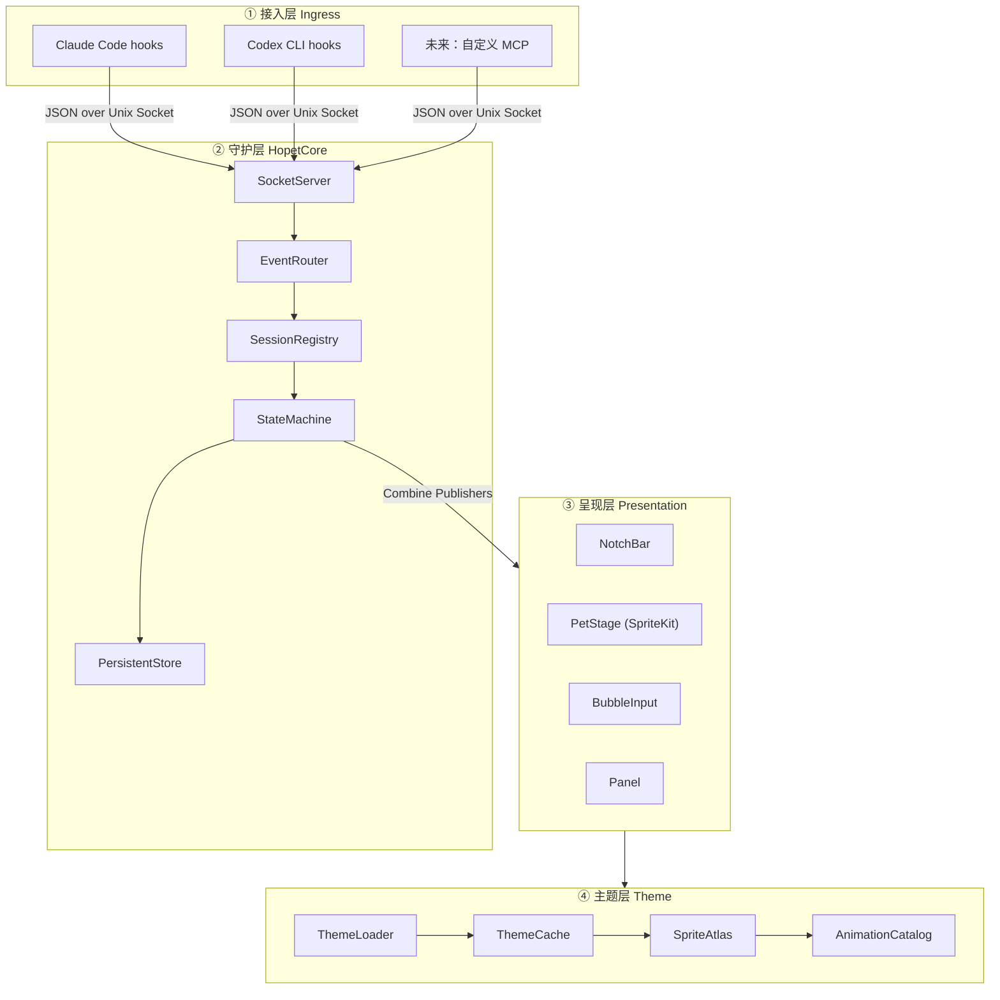
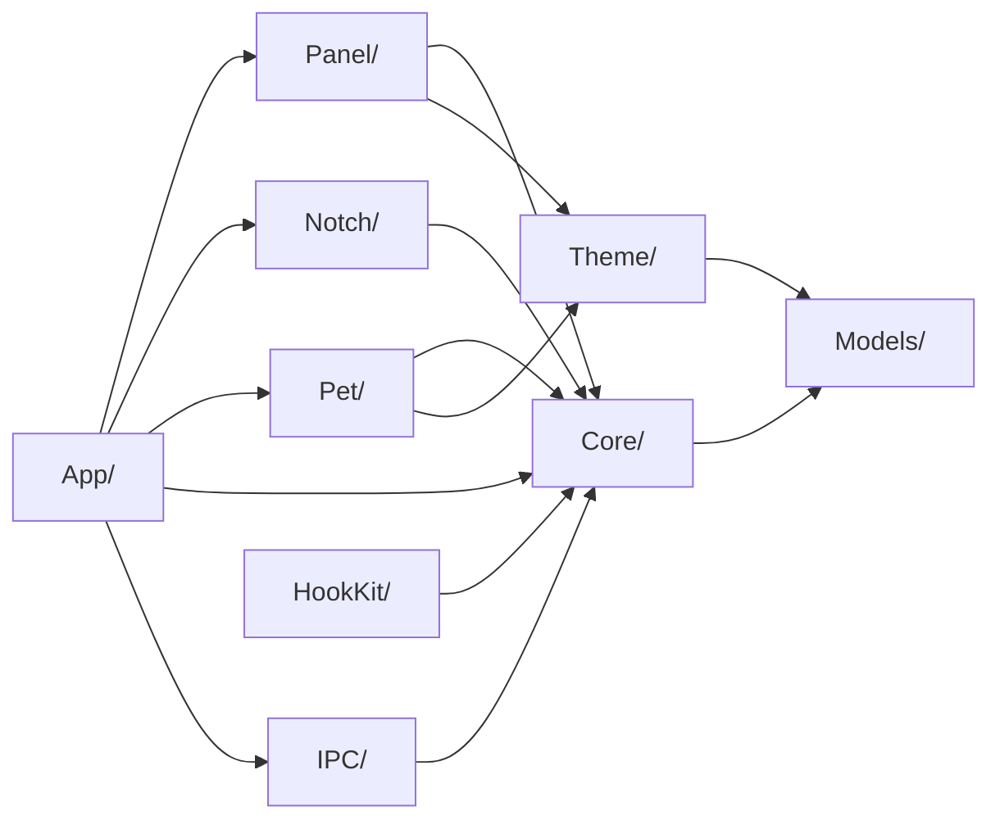
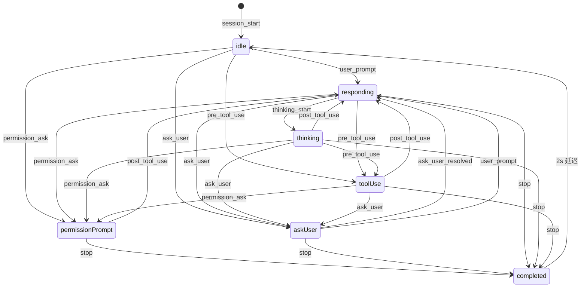

# Hopet 技术架构设计文档 v0.1

> 版本：0.1 (初版)
> 最后更新：2026-04-24
> 状态：Draft — 待评审后开始 v0.1 实现

---

## 1. 概述

### 1.1 项目定位

**Hopet** 是一款 macOS 原生桌面宠物软件，专为与 AI 命令行助手（Claude Code、Codex CLI 等）协作的开发者设计。它将 AI 会话的生命周期——从空闲、回复、工具调用，到需要用户确认或回答问题——转译成桌面上一只活着的小宠物的动作与表情，让用户在抬头的瞬间就能感知「AI 现在在做什么、是否需要我」。

### 1.2 核心能力

下表中 v0.1 即"MVP 必须交付"，v0.2+ 表示已设计、留接口、但本期不交付。

| 能力 | v0.1 | v0.2+ |
| --- | --- | --- |
| 状态感知动画（idle / responding / thinking / tool-use / permission-prompt / ask-user / completed；error-interrupted 枚举值保留但事件源已停用，见 §7.1 注） | ✅ Claude Code 全链路 + Codex 大部分（除 ask-user / error-interrupted） | — |
| Claude Code hooks 接入 | ✅ | ✅ |
| Codex CLI hooks 接入 | ✅ 6 hook（SessionStart / UserPromptSubmit / Pre&PostToolUse / PermissionRequest / Stop），通过 `~/.codex/hooks.json` | ✅ |
| 刘海屏 Dynamic Notch + 无刘海机型降级顶条 | ✅ | ✅ |
| 桌面宠物（**全局一只**：聚合所有 AI 工具、所有 session） | ✅ | ✅ |
| 会话气泡（**竖栈贴宠物头顶 + ScrollView 滚动**，每个气泡 = 1 个活跃 session） | ✅ 默认显示 cwd / 标题 / 最近回复 / 状态徽章 / 状态时长 | ✅ |
| 状态聚合（多会话 → 单宠物按优先级聚合，详见 [hooks-and-priority.md §2](./hooks-and-priority.md#2-petstate-优先级)） | ✅ | ✅ |
| 点击宠物本体 → 弹出"目录选择 + 输入"对话框 → 新开终端启动 CLI | ⛔ 已明确不做（详见 §12.5） | 视用户需求决定 |
| Permission 气泡 Allow / Deny / Ask 决策 | ✅ hook socket 同步回包，跨所有宿主 | ✅ |
| AskUserQuestion 气泡结构化答题 | ✅ 走 PermissionRequest hook + `updatedInput.answers` | ✅ |
| ExitPlanMode 气泡 plan-approval（plan markdown + 继续规划反馈） | ✅ | ✅ |
| 内置默认 Hopi 主题 | ✅ 8 状态 × 21 或 28 帧 | ✅ |
| 用户自定义主题导入（8 个 GIF 或 Codex pet 图集 + manifest，文件夹 / `.zip` 自动扫描） | ✅ | ✅ |
| `.hopettheme` zip 分发 + zip slip 防护 | ⛔ | ⛔ v0.3+ |
| 偏好面板（Overview / Themes / Appearance / Bindings / Hooks / Behavior / Notifs / About） | ✅ 8 Tab 全部实现 | ✅ |
| Hook 安装向导 + Doctor | ✅ | ✅ |
| Listener 软静音 toggle（不动 hook 文件，运行时丢事件） | ✅ | ✅ |
| 通知中心横幅 | ⚠️ Tab 仅有 Toggle 占位，未注册 UserNotifications | ✅ |
| `hopet` CLI 伴侣 | — | ✅ |
| Sparkle 自动更新 | — | ✅ |

### 1.3 非目标（v0.1）

- 不做云同步、账号系统、主题商店。
- 不做 Windows / Linux 跨端。
- 不内置语音、TTS、LLM 推理。
- 不替代 AI 工具的终端 UI，仅做"表情层"。

### 1.4 读者对象

- Hopet 项目的开发者与贡献者。
- 需要了解 hooks 协议以便接入新 AI 工具的集成者。
- 需要了解主题规范以便制作自定义主题的设计师。

---

## 2. 术语表

| 术语 | 含义 |
| --- | --- |
| **Hopet.app** | 用户可见的主 App，提供宠物渲染、管理面板、刘海条 UI。 |
| **HopetCore** | 内置在 App 主进程内的守护子系统，负责 IPC、会话状态机、事件分发。 |
| **Session** | 一个活跃的 AI CLI 会话（Claude Code / Codex 的一个运行实例），由 `sessionId` 唯一标识。 |
| **PetInstance** | 全局唯一的宠物渲染实例。状态由所有 AI 工具下的所有活跃 session 聚合得出。 |
| **SessionBubble** | 围绕宠物环绕的会话气泡，1:1 绑定一个 Session，承载 cwd / 标题 / 状态时长等元信息。 |
| **ThemePackage** | 一个主题包，包含动画资源与 manifest.json。 |
| **Hook 脚本** | AI 工具在状态转换点调用的 shell 脚本，把事件推送到 HopetCore。 |
| **IPC Socket** | HopetCore 暴露的 Unix Domain Socket，hooks 通过它投递事件。 |
| **StateEvent** | 一次状态转换事件，JSON 格式，包含 sessionId、新状态、payload 等。 |
| **Notch Bar** | 刘海条 UI，刘海区域吸附、展开的信息带。 |

---

## 3. 系统全景

### 3.1 四层架构



### 3.2 数据流（一次典型事件）

1. 用户在终端里向 Claude Code 发送消息。
2. Claude Code 触发 `UserPromptSubmit` hook → 调用 `~/.hopet/bin/hopet-emit --tool claude-code --event user_prompt`（详见 §8.4）。
3. `hopet-emit` 解析 stdin payload，把规范化的 JSON 事件写入 `$HOME/.hopet/run/hopetd.sock`。
4. **HopetCore.SocketServer** 解包 → **EventRouter** 根据 `sessionId` 定位 Session → **StateMachine** 状态变为 `responding`。
5. 状态变更通过 Combine `Publisher` 推送给订阅者。
6. **PetStage** 切换到 responding 动画；**NotchBar** 更新文案为「Claude 正在思考...」。
7. 当 Claude 回复完成触发 `Stop` hook，重复上述链路，状态回到 `completed` → 2 秒后回到 `idle`。

### 3.3 进程模型

- **单进程**：Hopet.app 是一个 macOS App Bundle，所有子系统运行在同一进程内。
- **无后台 launchd**：v0.1 不注册 LaunchAgent，用户关闭 App 即停止服务；App 随系统启动通过标准 "登录项" 实现。
- **子进程**：v0.1 无；hopet-emit 是 hook 触发的独立短命进程，不归 Hopet 管。

---

## 4. 技术选型

### 4.1 语言与框架

| 层 | 技术 | 理由 |
| --- | --- | --- |
| App 入口 / 偏好面板 / 宠物气泡 | **SwiftUI** (macOS 14+) | 声明式、组合式 UI；像素风外观由 `Theme/PixelChrome.swift` / `Theme/PixelControls.swift` 自绘部件统一承载。 |
| 宠物逐帧渲染 | **SwiftUI `Image` 帧序列 + `TimelineView`** | 内置 Hopi 主题由 `scripts/build-pet-animation.py` 切出 7×N 的 PNG 帧；GIF 用户主题经 `ImageIO` 解码并保留可变帧延迟；Codex pet 直接经 `ImageIO` 解码 v1 1536×1872 或 v2 1536×2288 的 PNG / WebP 图集，只裁切从左至右连续的可见标准帧，避免播放透明尾格。**不依赖 SpriteKit / SKView**——帧序列 + 像素风渲染对它的能力包用不上，反而带来 SKScene 生命周期与 NSPanel 透明窗口的 hit-test 复杂度。 |
| 刘海条 / 宠物窗口 | **AppKit** (`NSPanel`, `NSWindow`) + SwiftUI 嵌入 | 需要 `.nonactivatingPanel`、自定义 levels、跨 Space 行为，SwiftUI 场景不够。 |
| IPC | **Network.framework** `NWListener` (Unix path) | 苹果推荐、无第三方依赖、内建 TLS（本场景不需要但可选）。 |
| 并发 | **Swift Concurrency** + **Combine** 做状态广播 | `SessionRegistry` / `PetAggregator` 等核心组件标 `@MainActor`；UI 订阅用 Combine `PassthroughSubject` / `@Published`。 |
| 持久化 | `JSONEncoder` + 文件 | 仅 `~/.hopet/config.json`（偏好）与 `~/.hopet/themes/<id>/manifest.json`（用户主题元数据）。Session state 不落盘（见 §7.3）。 |
| 主题压缩 | 系统 `/usr/bin/ditto` (Process) | 用户主题 `.zip` 自动扫描时调用，避免引第三方 SPM 依赖。`ditto -x -k` 在 macOS 上的 zip 兼容性比 `/usr/bin/unzip` 更稳，对 macOS App 打包流派（含 `__MACOSX` 资源叉）兼容。 |
| 命令行参数（hopet-emit / 未来 hopet CLI 伴侣） | 自实现的 flag 解析（`Sources/hopet-emit/main.swift`） | 二进制要尽可能小、零依赖（hook 每次触发都会 fork-exec 一次），用不上 swift-argument-parser。 |

### 4.2 最低系统要求

- **macOS 14.0 Sonoma** 及以上。
  - SwiftUI `MenuBarExtra` 稳定；`NSPanel` 的 stage manager 行为成熟。
  - Sonoma 起 Dynamic Notch 相关 API（通过 `NSScreen.safeAreaInsets`）稳定可用。
- **Apple Silicon 优先**，同时兼容 Intel（不依赖 Neural Engine）。

### 4.3 构建与发布

- **Xcode 15+**，SwiftPM 管理三方依赖。
- **代码签名**：不申请 Apple Developer ID，CI 产物仅做 ad-hoc 签名 (`codesign -s -`)。作为开源项目，不走公证 (Notarization) 流程。
- **分发形式**：GitHub Releases 发布 `.dmg`。
- **Gatekeeper 限制**：未公证 App 在 macOS 14+ 默认会被 Gatekeeper 拦截。README 需明确告知用户两种打开方式：
  1. 终端执行 `xattr -dr com.apple.quarantine /Applications/Hopet.app`
  2. 或先尝试打开（被拦截后），到 "系统设置 → 隐私与安全性" 点 "仍要打开"
- **Homebrew 分发**：v0.2+ 视情况维护一个自有 tap (`brew install --cask <user>/hopet/hopet`)。**不承诺进入 Homebrew 官方 cask 仓库** —— 官方 cask 对未签名 App 的接收规则在变化，是否被接受取决于届时签名/公证状态。
- **已知限制（写入 README 与 8.1 Onboarding）**：未签名版本每次升级后 TCC (Transparency, Consent and Control，macOS 权限数据库) 会遗忘授权，用户需重新勾选 Accessibility / Automation / Notifications。
- **自动更新**（v0.2+）：Sparkle 2（注意：未签名的 Sparkle 更新流程需要额外配置 EdDSA 签名而非 code signing）。

### 4.4 依赖清单

`Package.swift` 的 `dependencies: []` 仍为空。Hopet 与 hopet-emit 都只依赖系统框架（AppKit / SwiftUI / Combine / Network / UserNotifications / ImageIO）。zip 解压走 `/usr/bin/ditto` 子进程，主题预览走 `ImageIO`，不引入 ZIPFoundation 或 Sparkle——零依赖是 v0.1 的硬约束，新增依赖须在 PR 描述中说明理由并经人类同意（见 AGENTS.md §3）。

---

## 5. 模块划分

Hopet 单 SPM target，目录按职责分层（见 AGENTS.md §2.1）。依赖方向自上而下、单向。下表 "实际目录" 列对应 `Sources/Hopet/` 下的子目录名。



### 5.1 Core/（守护核心，纯逻辑）

- `SessionRegistry` (@MainActor `ObservableObject`) — 所有活跃 Session 的注册表 + 全局唯一 `PetInstance`；通过 `PassthroughSubject<Mutation, Never>` 广播 `added/removed/stateChanged/fieldsUpdated`
- `SessionStateMachine` (caseless enum) — 纯函数 `nextState(from:event:)`
- `PetAggregator` — 订阅 `SessionRegistry.mutations`，按优先级聚合多 session → 单宠物（算法见 hooks-and-priority.md §3.2）
- `ThinkingTimer` — 每 500 ms 扫描，把停留 ≥ 8 s 的 `responding` 升级为 `thinking`
- `CompletedDecayTimer` — 每秒扫描，`completed` ≥ 2 s 后切回 `idle`；任意状态 `lastActivityAt` 距今 ≥ 10 min 时移除（VS Code Claude 插件等不发 `SessionEnd` 的宿主的兜底）
- `HopetConfig` (`Codable`) + `ConfigStore` (@MainActor `ObservableObject`) — 用户偏好的事实之源 + 落盘（`~/.hopet/config.json`）
- `HopetPaths` (caseless enum) — `~/.hopet/{bin,run,themes,logs,config.json}` 的统一计算
- `HopetLog` (caseless enum) — 结构化日志 + `trace(tag:_:)` 事件流追踪

> Session state 不落盘（无 `PersistentStore`）。重启即丢失所有 Session，等下一条事件冷启重建。

### 5.2 IPC/（事件入口）

- `SocketServer` — 基于 `NWListener` 的 Unix Socket 服务端
- `FrameCodec` — 长度前缀 JSON 帧编解码
- `EventRouter` (@MainActor) — 把 `StateEvent` 路由到 `SessionRegistry`；附带：
  - 同 `transcript_path` 子 agent → 主 session 重路由
  - `pruneStaleSiblings`：同 cwd / 同终端宿主 / `lastActivityAt` 距今 > 90 s 的躺尸 session 自动清理
  - `cancelPending` on `error` / `stop` 等终态事件

### 5.3 Pet/（宠物与气泡渲染）

- `PetWindowController` + 嵌套的 `PetWindow: NSPanel` — 置顶、非激活、跨 Space 的宿主窗口；可见性由 `SceneRouter` 绑定到 `UserDefaults pet.visible`
- `PetStageView` (SwiftUI) — 一只宠物 + 紧贴它头顶的会话气泡列（**竖栈 + ScrollView**，详见 §12.4）
- `PetBadgeView` — 宠物本体的占位徽章 / 动画容器
- `SessionBubbleView` — 单个会话气泡：默认卡 / Permission 决策卡 / AskUserQuestion 答题卡 / ExitPlanMode 卡 / 普通问询卡
- `FrameAnimationView` — `FrameAnimation` enum 的 dispatcher：`.bundlePNG` 走 `BundleFrameRenderer`（Bundle 内 PNG 帧序列 + `TimelineView`），`.gifFile` 走 `GIFAnimationView`，`.codexPetSpriteSheet` 走 PNG / WebP 图集裁帧渲染器
- `GIFAnimationView` — `ImageIO` 解码用户主题 GIF，保留可变帧延迟，缓存 key = `(URL.path, mtime)`
- `InputCoordinator` — 把气泡上的 Allow / Deny / AskUserQuestion 答题序列化成 `PermissionResponse` 写回挂起的 socket
- `PermissionPrompter` — 旧 fire-and-forget 通知通道的占位（v0.1 起所有 Permission/AskUser 都走同步回包，PermissionPrompter 只剩极少边角分支）

> 没有 SpriteKit / SKView / SKTextureAtlas；没有独立的 `AnimationController` / `PetPositionManager` / `HitTestProxy`——SwiftUI + 透明 NSPanel 直接承担。

### 5.4 Notch/（刘海条）

- `NotchDetector` — 通过 `NSScreen.auxiliaryTopLeftArea / safeAreaInsets` 判断机型
- `NotchWindow: NSPanel` — 吸附在刘海区域的无边框窗口；可见性由 `UserDefaults notch.enabled` 控制；无刘海机型 + `UserDefaults notch.fallbackBarEnabled = true` 时降级为顶部细条（同一个 `NotchWindow`，不再有独立的 `FallbackTopBarWindow` 类）
- `NotchView` (SwiftUI) — 三态：collapsed / expanded / fullBubble

### 5.5 Panel/（偏好面板）

实际 Tab：`Overview · Themes · Appearance · Bindings · Hooks · Behavior · Notifs · About`（顺序见 preferences.md §2）。

- `PreferencesWindowController` — 窗口 + SwiftUI HostingController
- `PreferencesView` — 根视图，自绘 `PixelTabBar` + 内容区
- `PreferencesPaneScaffold` — 每个 Tab 的统一外壳（标题、内边距、`PixelGridBackground` 透传）
- `OverviewTab` / `ThemesTab` / `AppearanceTab` / `BindingsTab` / `HooksTab` / `BehaviorTab` / `NotificationsTab` / `AboutTab`

### 5.6 Theme/（主题）

- `ThemePackage` (struct) — 运行时主题对象（详见 §6.6）
- `FrameAnimation` (enum) — `.bundlePNG(directory:framesPerSecond:)` / `.gifFile(url:)` / `.codexPetSpriteSheet(url:row:layout:framesPerSecond:)`
- `DefaultTheme` (caseless enum) — 内置 Hopi 主题的硬编码构造，资源指向 `Sources/Hopet/Resources/Themes/Hopi/seal-<state>/*.png`
- `ThemeStore` (@MainActor `ObservableObject`) — 主题列表 + active 主题 id；启动时扫描 `~/.hopet/themes/*/manifest.json`
- `UserThemeImporter` (caseless enum) — 校验 8 个 PetState GIF 或 Codex pet（`pet.json` + PNG / WebP 图集）、复制到 `~/.hopet/themes/<id>/`、写 manifest；支持文件夹 / `.zip` 自动扫描
- `UserThemeStore` — 用户主题元数据缓存
- `PixelChrome` / `PixelControls` — 像素风 SwiftUI 部件库（`PixelChrome`, `PixelRoundedRectangle`, `PixelButtonStyle`, `PixelPalette`, `PixelToggle`, `PixelSegmentedControl`, `PixelTabBar`, `PixelGridBackground`, `PixelCard`, `PixelDropSlot`, `PixelScrollThumb`）。设计规范见 preferences.md §11

> 没有 `ThemeValidator` / `SpriteAtlasBuilder` / `AnimationCatalog` / `ThemeCache`（LRU）—— 内置主题硬编码、用户主题数量有限，全部常驻内存即可。

### 5.7 HookKit/（Hook 工具）

- `HookScriptTemplates` (caseless enum) — Claude Code / Codex 的 hook 字典（in-process 生成，不再以 embedded resource 提供）
- `HookInstaller` — 写入 / 反向移除 `~/.claude/settings.json` 与 `~/.codex/hooks.json`；顺手清理 v0.1 在 `~/.codex/config.toml` 留下的 `[notify]` 块；卸载逻辑就在 `HookInstaller` 内（无独立 `HookUninstaller` 类）
- `HookDoctor` — 诊断 hooks 是否已正确安装与可执行

### 5.8 Models/（共享值类型）

`AITool` / `PetState` / `Session` / `SessionBubble` / `PetInstance` / `StateEvent` / `EventKind` / `AnyCodable`。详见 §6。

### 5.9 App/（入口）

- `HopetApp` / `AppDelegate` — NSApplication 生命周期
- `MenuBarItem` — 菜单栏入口
- `SceneRouter` — 协调各窗口（PetWindow / NotchWindow / Preferences）启动顺序与 `ConfigStore` / `ThemeStore` 注入

---

## 6. 数据模型

所有核心模型均为 `Codable` 的 Swift `struct`，可直接序列化进磁盘与 IPC。

### 6.1 AI 工具

```swift
enum AITool: String, Codable, CaseIterable {
    case claudeCode = "claude-code"
    case codex       = "codex"
    case custom      // 预留：用户自定义接入
}
```

### 6.2 Session

```swift
public struct Session: Codable, Identifiable, Hashable, Sendable {
    public let id: String                  // sessionId（hook 提供，或 hopet-emit 从 transcript_path 兜底）
    public let tool: AITool
    public var cwd: String                 // 会话工作目录（绝对路径）
    public var title: String?              // 会话标题派生（首条 prompt 截 40 字符）；无标题时回退 cwdLastComponent
    public var terminalApp: String?        // 已知所在终端 bundleId
    public var terminalTty: String?        // 已知 tty，用于 pruneStaleSiblings 同宿主识别
    public var terminalSessionId: String?  // 终端宿主自带的 session id（iTerm2 等）
    public let startedAt: Date
    public var currentState: PetState
    public var stateSince: Date            // 上次状态变更时刻
    public var lastActivityAt: Date        // 最近一次收到任何事件的时间；用于 10 min 陈旧 session 清理
    public var lastPromptSnippet: String?  // 最近一条 user prompt 摘要（≤256 字符）
    public var lastAssistantMessage: String? // Stop hook 抽到的回复开头（≤120 字符），下一次 UserPromptSubmit 清空

    // 同步类 hook 的待决策载荷——三者互斥（pendingKind 按优先级裁剪）：
    public var pendingQuestion: String?        // 旧 fire-and-forget AskUserQuestion 路径残留，仅展示
    public var pendingAskUser: PendingAskUser? // 结构化 AskUserQuestion，含 requestId，可同步回写 answers
    public var pendingPermission: PendingPermission? // PermissionRequest 待决策，含 requestId

    public var cwdLastComponent: String { /* 从 cwd 派生 */ }
    public var pendingKind: SessionPendingKind? { /* permission > planApproval > askUser > legacyQuestion */ }
}
```

`PendingPermission` 含 `requestId / toolName / command / filePath / plan`；其中 `toolName == "ExitPlanMode"` 时承载已 trim 的 plan markdown，气泡渲染 plan-approval 卡片（与普通 allow/deny 卡片展开高度差近 200 pt，所以 `SessionPendingKind` 把它单独列项）。

`PendingAskUser` 含 `requestId / questions: [AskUserQuestionItem] / originalToolInputJSON: Data`；用户作答后把 `answers = { 问题: 答案 }` 合进 `originalToolInputJSON` 作为 `updatedInput` 同步回写，Claude 把它当作 AskUserQuestion 工具的结果。

Codex VSCode / Cursor 插件不会触发 `~/.codex/hooks.json`；Hopet 通过 `CodexVscodeSessionWatcher` 只读监听本机 `~/.codex/sessions/**/rollout-*.jsonl`，把 `task_started / user_message / function_call / function_call_output / task_complete / turn_aborted` 映射成同一批 `StateEvent` 后交给 `EventRouter`。该路径只负责状态展示，不生成 `permission_ask`，也不提供权限审批同步回包；插件自己的审批弹窗仍由 Codex VSCode / Cursor 处理。

### 6.3 PetState

```swift
enum PetState: String, Codable {
    case idle
    case thinking
    case responding
    case toolUse          = "tool-use"
    case permissionPrompt = "permission-prompt"
    case askUser          = "ask-user"
    case completed
    case errorInterrupted = "error-interrupted"
}
```

### 6.4 StateEvent（IPC payload）

```swift
public struct StateEvent: Codable, Sendable {
    public let schema: Int                  // 协议版本，当前 1
    public let sessionId: String
    public let tool: AITool
    public let event: EventKind
    public let timestamp: Date
    public let cwd: String?
    public let terminalApp: String?
    public let terminalTty: String?
    public let terminalSessionId: String?
    public let payload: [String: AnyCodable]?
    public let requestId: String?           // 仅同步类 hook（permission_ask / ask_user 经 PermissionRequest）需要，用于反向回写
    public let isSubagent: Bool?            // hopet-emit 识别 parent_session_id / agent_id 等标记后设置；EventRouter 会重路由到主 session
}

public enum EventKind: String, Codable, Sendable {
    case sessionStart    = "session_start"
    case sessionEnd      = "session_end"        // SessionEnd hook，用于淘汰会话气泡
    case userPrompt      = "user_prompt"
    case preToolUse      = "pre_tool_use"
    case postToolUse     = "post_tool_use"
    case thinkingStart   = "thinking_start"     // 由 ThinkingTimer 注入，不来自 hook
    case permissionAsk   = "permission_ask"     // PermissionRequest hook（非 AskUserQuestion）
    case askUser         = "ask_user"           // AskUserQuestion：PreToolUse 路径（fire-and-forget 展示）/ PermissionRequest 路径（带 requestId 同步答题）
    case askUserResolved = "ask_user_resolved"  // PostToolUse + tool_name=AskUserQuestion
    case stop            = "stop"
    case error           = "error"              // PostToolUseFailure / StopFailure；EventRouter 仅做 cancelPending，不切 PetState
}
```

反向通道（Hopet → hopet-emit）只有一条 `PermissionResponse`：

```swift
public struct PermissionResponse: Codable, Sendable {
    public let schema: Int
    public let requestId: String
    public let decision: String            // "allow" | "deny" | "ask"
    public let reason: String?             // deny 时可选反馈文本（plan-approval 卡片用）
    public let updatedInput: AnyCodable?   // AskUserQuestion 同步回写时填，承载 { questions, answers }
}
```

### 6.5 PetInstance 与 SessionBubble

**关键变化（v0.x 起）**：宠物**全局唯一**——所有 AI 工具的所有活跃 session 共用同一只宠物。宠物状态由全部 session 聚合得出（最高优先级胜出，见 §7.4）。`SessionBubble.tool` 字段保留作为来源元信息，但不再决定归属哪只宠物。

```swift
struct PetInstance: Identifiable {
    let id: UUID                       // 渲染实例 id
    var themeId: String
    var screenPosition: CGPoint        // 宠物本体的中心坐标
    var visible: Bool
    var aggregatedState: PetState      // 全体活跃 session 中最高优先级状态（见 §7.4）
    var drivenBySessionId: String?     // 当前驱动动画的那个 session（高亮该气泡）
}

public struct SessionBubble: Identifiable, Sendable {
    public let id: String                  // = sessionId
    public let tool: AITool                // 来源元信息（视图层目前不显式渲染 tool chip，但未来按工具区分时可用）
    public var displayTitle: String        // 派生自 Session.title 或 cwdLastComponent，截至 40 字符
    public var hasTitle: Bool              // false 表示 displayTitle 是 cwd 回退占位，视图避免重复渲染"标题行"
    public var displayCwd: String
    public var state: PetState
    public var lastAssistantMessage: String?    // 默认卡片第二行
    public var pendingQuestion: String?
    public var pendingAskUser: PendingAskUser?
    public var pendingPermission: PendingPermission?
}
```

> 旧字段 `orbitAngle / orbitRing / displayElapsed / expanded` 已删除：v0.x 后气泡列改为**竖栈 + ScrollView**（详见 §12.4），不再环绕宠物排列；耗时由视图层基于 `Session.stateSince` 实时计算并通过 `stateDurationPhrase` 渲染，不进数据模型；"展开态"由是否存在 `pendingPermission / pendingAskUser / pendingQuestion` 隐式决定，不需要单独的 expanded 标志。

**气泡生命周期**：
- **创建**：任意事件遇到新 `sessionId` → `EventRouter` 创建 Session 并随之产生 SessionBubble
- **更新**：`Session` 任意字段变化 → `SessionRegistry.mutations` 广播 → `PetStageView` 重新渲染列表
- **淘汰**：`SessionEnd` hook、用户在气泡右上角点 ✕（`InputCoordinator.dismissSession`）、`CompletedDecayTimer` 检测到 `lastActivityAt` 距今 ≥ 10 min、或 `EventRouter.pruneStaleSiblings` 检测到同 cwd / 同终端宿主下出现新 session 且旧 session `lastActivityAt` 距今 > 90 s

### 6.6 ThemePackage

实际运行时模型已大幅简化。内置 Hopi 主题在 `Sources/Hopet/Theme/DefaultTheme.swift` 硬编码构造，**不读 manifest**；用户主题用 `~/.hopet/themes/<id>/manifest.json` + 8 个 GIF 文件（详见 preferences.md §5）。

```swift
public struct ThemePackage: Identifiable, Hashable, Sendable {
    public let id: String
    public let name: String
    public let version: String
    public let author: String?
    public let description: String?
    public let glyphs: [PetState: String]                  // 主题未挂动画时的占位文字（如 "💤 Idle"）
    public let animations: [PetState: FrameAnimation]
    public let accentOverrides: [PetState: ColorToken]
    public let isUserProvided: Bool                        // true 时 ThemesTab 显示 Delete
    public let sourceDirectory: URL?                       // 用户主题目录绝对路径；内置为 nil
}

/// 逐帧动画来源。
public enum FrameAnimation: Hashable, Sendable {
    case bundlePNG(directory: String, framesPerSecond: Double) // 内置主题：Bundle.module 内 PNG 帧目录
    case gifFile(url: URL)                                     // 用户主题：单个 GIF 文件
    case codexPetSpriteSheet(
        url: URL,
        row: CodexPetAnimation,
        layout: CodexPetSpriteLayout,
        framesPerSecond: Double
    )
}

public struct ColorToken: Hashable, Sendable { /* RGB */ }
```

**用户主题 GIF manifest 默认 4 个字段**（preferences.md §5.2）：

```json
{ "schemaVersion": 1, "id": "user.<slug>.<uuid8>", "name": "<用户输入>", "createdAt": "2026-05-09T12:34:56Z" }
```

GIF 主题的 8 个 GIF 文件按 `PetState.rawValue` 命名（`idle.gif` / `tool-use.gif` / `permission-prompt.gif` …），任一缺失视为非法。Codex pet 主题改为存储一个 `spritesheet.png` 或 `spritesheet.webp`，其源 `pet.json` 的元数据保存在 Hopet manifest 的可选字段；两种格式均沿用 schemaVersion 1，旧 GIF 主题不受影响。

**约定**：
- 内置 Hopi 主题无 manifest，资源路径硬编码到 `Resources/Themes/Hopi/seal-<state>/*.png`
- 用户主题任一 GIF 缺失 / UTI 不是 `public.gif` / 帧数 0 → 拒绝导入，半成品目录回滚
- 没有过渡动画模型（`TransitionStyle` 已删除）：SwiftUI 渲染层用极短直线动画即可
- 没有 `loop` 字段：默认全部循环；`completed` 等非循环语义由视图层根据 `PetState` 自行处理

### 6.7 主题选择（全局单一）

v0.x 起宠物全局唯一，主题也只有一个全局值——`HopetConfig.activeThemeId`。`ToolThemeBinding` 结构已废弃，未来若引入按 cwd / session 切主题，会单独建模，不会回到"按 AI 工具绑定"。

---

## 7. 会话状态机

### 7.1 状态图



> `error` 事件**不在状态图中**：`PostToolUseFailure` 在实际 Claude 使用中包含 `grep` / `head` / `ls` 等命令的非零退出，发得过于频繁；状态机收到 `error` 时只触发 `EventRouter.cancelPending` 清掉挂起的权限 / 答题气泡，**当前 `PetState` 保持不变**。`errorInterrupted` 状态值仍保留，等未来出现真正的"会话级错误"事件源再启用。

### 7.2 转换表

| 当前状态 | 事件 | 下一状态 | 事件来源 / 备注 |
| --- | --- | --- | --- |
| *（任意）* | `session_start` | idle | Claude `SessionStart` hook，注册 Session、创建对应气泡 |
| *（任意）* | `session_end` | *（移除）* | Claude `SessionEnd` hook，从 Registry 移除 Session、淘汰气泡、触发宠物聚合重算 |
| idle / errorInterrupted / askUser | `user_prompt` | responding | Claude `UserPromptSubmit` hook，记录 lastPromptSnippet |
| responding | `thinking_start` | thinking | **由 `ThinkingTimer` 主动判定**（responding 持续 ≥ 8s），无对应 hook |
| idle / responding / thinking | `pre_tool_use` | toolUse | Claude `PreToolUse` hook，**且 `tool_name != "AskUserQuestion"`**（AskUserQuestion 走下面的 `ask_user` 行）。`idle → toolUse` 用于冷启动场景（subagent reroute / 缺 SessionStart 的宿主） |
| toolUse | `post_tool_use` | responding | Claude `PostToolUse` hook，**且 `tool_name != "AskUserQuestion"`** |
| idle / responding / thinking / toolUse | `permission_ask` | permissionPrompt | Claude `PermissionRequest` hook（不再做 Notification 回退，见 hooks-and-priority.md §1）。`idle → permissionPrompt` 兜底未注册 session 上首条就是权限请求的冷启路径 |
| permissionPrompt | `post_tool_use` | responding | 用户点 Allow → Claude 继续工具调用 → 触发 PostToolUse |
| permissionPrompt | `stop` | completed | 用户决策落地后 Claude 结束这一轮 |
| idle / responding / thinking / toolUse | `ask_user` | askUser | Claude `PreToolUse` hook 且 `tool_name == "AskUserQuestion"` |
| askUser | `ask_user_resolved` | responding | Claude `PostToolUse` hook 且 `tool_name == "AskUserQuestion"` |
| askUser | `user_prompt` | responding | 兜底：若用户主动新发 prompt 而 PostToolUse 漏触发 |
| askUser | `stop` | completed | 若 Claude 在 askUser 期间直接结束（罕见，但保留兜底） |
| responding / toolUse / thinking | `stop` | completed | Claude `Stop` hook |
| completed | *（2s timeout）* | idle | `CompletedDecayTimer` 处理 |
| *（任意）* | `error` | *（不切，仅 cancelPending）* | 见 §7.1 注 |

### 7.3 超时与降级

| 规则 | 描述 |
| --- | --- |
| **Thinking 自动升级** | `ThinkingTimer` 每 500 ms 扫描，把 `responding` 停留 ≥ 8 s 的 session 切到 `thinking`。`thinking` 状态本身不再二次降级 |
| **Completed 自然回 idle** | `CompletedDecayTimer` 每秒扫描，`completed` 停留 ≥ 2 s 切回 `idle` |
| **toolUse 长执行** | `toolUse` **不做自动 idle 降级**——必须严格等待 `post_tool_use` / `error` / `stop`，避免 `npm install` / `pytest` 等长任务中途被误判为空闲 |
| **陈旧 Session 清理（10 min）** | `CompletedDecayTimer` 顺手检查 `Session.lastActivityAt`，距今 ≥ 10 min 无任何事件即从 Registry 移除。给 VS Code Claude 插件等不发 `SessionEnd` hook 的宿主兜底 |
| **同宿主躺尸清理（90 s）** | `EventRouter.pruneStaleSiblings`：每当一条事件触发新建 Session，扫同 cwd / 同终端宿主（tty / terminalApp / terminalSessionId 匹配）的其它 Session，`lastActivityAt` 距今 > 90 s 的直接移除。处理"同一个终端 tab 里反复 `claude` 启动"的情况 |
| **App 重启恢复** | 不做。Session state 不落盘，App 重启即丢失全部 Session，下一条事件冷启重建（Registry 在 `idle → permission_ask` / `idle → pre_tool_use` 等转换上有兜底） |
| **动画过渡** | 由 SwiftUI 视图层 `withAnimation` 控制，模型层不去重 |

> Hopet **不假设** hook 脚本会发 heartbeat。Core 不基于"x 秒无事件"做主动状态推断（thinking 升级除外，因为它只发生在 `responding` 内）。

### 7.4 Subagent 重路由

Claude Code 子 agent 触发同步类 hook（permission_ask / ask_user）时，`hopet-emit` 根据 stdin 中 `parent_session_id` / `agent_id` / `subagent_id` / `subagent_type` / `agent_type` 任一存在即视为 subagent，给 `StateEvent.isSubagent = true`。`EventRouter` 收到带 subagent 标记的同步 hook 时：

1. 用 `transcript_path` 找到该 transcript 上首个见到的"主 session id"
2. 调用 `StateEvent.reroute(toSessionId:)` 把 sessionId 改写成主 session 的 id
3. 重新走一遍状态机 → 气泡挂在主 session 上

子 agent 自身不创建 Session、不显示气泡——从用户视角看是"主会话在等你回答"。`StateEvent.isSubagent` 字段在状态类（非同步）事件上也用于直接丢弃，避免主气泡被子 agent 的 toolUse 闪烁。

### 7.4 宠物聚合状态（多 session → 单宠物）

宠物全局唯一，其 `aggregatedState` 等于所有活跃 session（跨工具）的最高优先级状态。

**优先级表、聚合算法、tie-break 规则、边界情况** —— 单一权威来源在 [hooks-and-priority.md §2 与 §3](./hooks-and-priority.md#2-petstate-优先级)。本节仅描述触发与广播的 Combine 链路：

```
Session.currentState 变化
    │
    ▼
SessionRegistry.didMutate(.session(id, newState))
    │
    ▼
PetAggregator.recompute()           ← 同步执行
    │
    ▼
PetInstance.aggregatedState 改变
    │
    ▼  Combine: petStatePublisher
    ▼
HopetPet.AnimationController        ← 切换宠物动画
HopetNotch.NotchView                ← 更新刘海条文案
HopetPet.SessionBubbleHost          ← 更新被高亮的 leader 气泡
```

`PetAggregator` 实现于 HopetCore；订阅者使用 `.removeDuplicates()` 防止冗余动画切换。

---

## 8. 附录 A：IPC 协议

### 8.1 传输

- **类型**：Unix Domain Socket（STREAM）
- **路径**：`$HOME/.hopet/run/hopetd.sock`
- **权限**：`0600`，仅当前用户可读写
- **可用性**：Hopet.app 启动时创建，退出时删除；启动若发现残留 socket 先尝试连接，连接失败则 unlink 重建

### 8.2 帧格式

长度前缀 JSON，单向：hook → HopetCore。

```
┌─────────── 4 bytes ───────────┬──────── N bytes ────────┐
│  payload length (UInt32 BE)    │   UTF-8 JSON payload    │
└───────────────────────────────┴────────────────────────┘
```

Hopet 不强制要求 ack；hook 脚本 fire-and-forget 即可，失败静默不阻塞 AI 主流程。

### 8.3 StateEvent JSON Schema（v1）

```json
{
  "$schema": "http://json-schema.org/draft-07/schema#",
  "type": "object",
  "required": ["schema", "sessionId", "tool", "event", "timestamp"],
  "properties": {
    "schema":      { "const": 1 },
    "sessionId":   { "type": "string", "minLength": 1 },
    "tool":        { "enum": ["claude-code", "codex", "custom"] },
    "event":       {
      "enum": [
        "session_start", "session_end",
        "user_prompt",
        "pre_tool_use", "post_tool_use",
        "thinking_start", "permission_ask",
        "ask_user", "ask_user_resolved",
        "stop", "error"
      ]
    },
    "timestamp":   { "type": "string", "format": "date-time" },
    "cwd":         { "type": "string" },
    "terminalApp": { "type": "string" },
    "payload":     { "type": "object" }
  }
}
```

### 8.4 Claude Code Hook 脚本样例

#### 8.4.1 `hopet-emit` Helper

为避免 shell 字符串拼接 JSON 时的引号/换行/反斜杠注入风险，HopetHookKit 在 App 安装时把一个 **静态链接的 Swift CLI 小工具** `hopet-emit` 拷贝到 `~/.hopet/bin/hopet-emit`。它的职责单一：

1. 读 stdin 上的 Claude/Codex 原始 hook JSON
2. 与命令行参数合并为合法 `StateEvent` JSON（用 `JSONEncoder`，绝不字符串拼接）
3. 长度前缀帧写入 `~/.hopet/run/hopetd.sock`
4. socket 不存在或写入失败时静默退出 0，绝不阻塞 AI 主流程

调用接口：

```text
hopet-emit --tool <claude-code|codex> --event <event-kind>
            [--require <field>=<value> ...]
            [--exclude <field>=<value> ...]
            < hook_payload.json
```

`--require` 与 `--exclude` 用于在 helper 内部对 stdin JSON 做条件过滤（字段路径支持点号嵌套，如 `tool_input.command`）：

- 所有 `--require` 必须**全部满足**才发送事件
- 任一 `--exclude` 条件**满足**则**不**发送事件
- 不满足时 helper 静默退出 0，**不发送事件**，绝不阻塞 hook 主流程

典型用法：

```text
# 仅 permission 类 Notification 触发 permission_ask
hopet-emit --tool claude-code --event permission_ask \
           --require notification_type=permission_prompt

# AskUserQuestion 是普通 tool，但要单独走 ask_user 而非 pre_tool_use
hopet-emit --tool claude-code --event ask_user \
           --require tool_name=AskUserQuestion

# 普通 tool 调用：排除 AskUserQuestion，避免和上面的 ask_user 双发
hopet-emit --tool claude-code --event pre_tool_use \
           --exclude tool_name=AskUserQuestion
```

把"哪些 hook 子类型算什么状态"的决策放在 settings.json 与 helper flag 中，shell 端保持零脚本，规则可随 App 升级随时修订。

#### 8.4.2 `~/.claude/settings.json` 片段（HopetHookKit 自动 merge）

```json
{
  "hooks": {
    "SessionStart": [
      { "hooks": [{ "type": "command", "command": "~/.hopet/bin/hopet-emit --tool claude-code --event session_start" }] }
    ],
    "SessionEnd": [
      { "hooks": [{ "type": "command", "command": "~/.hopet/bin/hopet-emit --tool claude-code --event session_end" }] }
    ],
    "UserPromptSubmit": [
      { "hooks": [{ "type": "command", "command": "~/.hopet/bin/hopet-emit --tool claude-code --event user_prompt" }] }
    ],
    "PreToolUse": [
      { "hooks": [{ "type": "command", "command": "~/.hopet/bin/hopet-emit --tool claude-code --event ask_user --require tool_name=AskUserQuestion" }] },
      { "hooks": [{ "type": "command", "command": "~/.hopet/bin/hopet-emit --tool claude-code --event pre_tool_use --exclude tool_name=AskUserQuestion" }] }
    ],
    "PostToolUse": [
      { "hooks": [{ "type": "command", "command": "~/.hopet/bin/hopet-emit --tool claude-code --event ask_user_resolved --require tool_name=AskUserQuestion" }] },
      { "hooks": [{ "type": "command", "command": "~/.hopet/bin/hopet-emit --tool claude-code --event post_tool_use --exclude tool_name=AskUserQuestion" }] }
    ],
    "PostToolUseFailure": [
      { "hooks": [{ "type": "command", "command": "~/.hopet/bin/hopet-emit --tool claude-code --event error" }] }
    ],
    "PermissionRequest": [
      { "hooks": [{ "type": "command", "command": "~/.hopet/bin/hopet-emit --tool claude-code --event permission_ask" }] }
    ],
    "Stop": [
      { "hooks": [{ "type": "command", "command": "~/.hopet/bin/hopet-emit --tool claude-code --event stop" }] }
    ],
    "StopFailure": [
      { "hooks": [{ "type": "command", "command": "~/.hopet/bin/hopet-emit --tool claude-code --event error" }] }
    ]
  }
}
```

**两点关键路由设计**：

1. **AskUserQuestion 路由**：`AskUserQuestion` 是 Claude Code 的内置 tool，每次调用都走标准 `PreToolUse` / `PostToolUse` hook，payload 中 `tool_name == "AskUserQuestion"` 是非常可靠的判别字段。Hopet 把这两个 hook 各拆成两条注册：用 `--require` 抓 AskUserQuestion 单独路由到 `ask_user` / `ask_user_resolved`，用 `--exclude` 在普通 `pre_tool_use` / `post_tool_use` 中排除掉 AskUserQuestion，避免双发。
   > AskUserQuestion 的**同步答题**（带 `requestId`、用 `updatedInput.answers` 回包）实际走的是 **`PermissionRequest`** hook——`AskUserQuestion` 调用本身在 Claude 内部经过权限系统，触发同名 hook 且 `tool_name == "AskUserQuestion"`。`PreToolUse` 的 `ask_user` 路径只用于让气泡尽早展示提问文案（fire-and-forget）。两条路径并存：先 `PreToolUse` 让 UI 提前进入答题态，再 `PermissionRequest` 带来真正的 `requestId` 和 `originalToolInputJSON` 等待用户作答回写。
2. **PermissionRequest 路由**：只注册 `PermissionRequest`。早期版本同时注册 `Notification + --require notification_type=permission_prompt` 作为兼容回退，实测两条 hook 会同步并发触发，把同一次权限事件双发，所以彻底删除（见 hooks-and-priority.md §1 注 1）。

#### 8.4.3 关于 `--require` 与 `payload` 字段

`hopet-emit` 在向 socket 发送的 `StateEvent.payload` 中，**仅保留以下白名单字段**（来自 Claude hook stdin），其它字段丢弃以减少敏感数据暴露：

- `tool_name`、`tool_input`、`tool_input.command`（截断 256 字符）、`tool_input.file_path`、`tool_input.question`
- `notification_type`、`message`（截断 256 字符）
- `session_id`、`cwd`、`transcript_path`
- `parent_session_id`、`agent_id`、`subagent_id`、`subagent_type`、`agent_type`（subagent 判据）
- `assistant_message`（Stop hook 触发时由 hopet-emit 从 `transcript_path` 抽取出来的本轮 Claude 回复开头，已 trim + 截断 120 字符）

权威源：`Sources/hopet-emit/main.swift` 的 `payloadKeyAllowlist`。这与 §10.3 隐私边界一致。

### 8.5 Codex Hook 脚本样例（v0.2 起接入官方 hooks）

Codex CLI 0.129.0-alpha 起公开了与 Claude 几乎一致的细粒度生命周期 hook 体系。启用方式：`~/.codex/config.toml` 设 `[features] codex_hooks = true`，hook 注册写入 `~/.codex/hooks.json`，顶层结构与 Claude `settings.json.hooks` 字典完全同形（`{ "hooks": { <EventName>: [{ "hooks": [{ "type": "command", "command": "...", "timeout": <s> }] }] } }`）。Hopet v0.2 起直接接入这套 hook，取代 v0.1 的 `[notify]` 完成通知。

#### 8.5.1 `~/.codex/hooks.json` 片段（HopetHookKit 自动 merge）

```json
{
  "hooks": {
    "SessionStart": [
      { "hooks": [{ "type": "command", "command": "~/.hopet/bin/hopet-emit --tool codex --event session_start", "timeout": 30 }] }
    ],
    "UserPromptSubmit": [
      { "hooks": [{ "type": "command", "command": "~/.hopet/bin/hopet-emit --tool codex --event user_prompt", "timeout": 30 }] }
    ],
    "PreToolUse": [
      { "hooks": [{ "type": "command", "command": "~/.hopet/bin/hopet-emit --tool codex --event pre_tool_use", "timeout": 30 }] }
    ],
    "PostToolUse": [
      { "hooks": [{ "type": "command", "command": "~/.hopet/bin/hopet-emit --tool codex --event post_tool_use", "timeout": 30 }] }
    ],
    "PermissionRequest": [
      { "hooks": [{ "type": "command", "command": "~/.hopet/bin/hopet-emit --tool codex --event permission_ask", "timeout": 590 }] }
    ],
    "Stop": [
      { "hooks": [{ "type": "command", "command": "~/.hopet/bin/hopet-emit --tool codex --event stop", "timeout": 30 }] }
    ]
  }
}
```

合并策略与 Claude 一致：append Hopet 的 marker 条目、保留其它工具（clawd-on-desk 等）已经注册的条目；卸载时只剔除 hopet marker 的命令。`PermissionRequest` 的 timeout 给足够大的值（≈10 分钟）允许用户慢决策。

#### 8.5.2 `hopet-emit` 对 Codex payload 的差异处理

详细字段差异表见 [hooks-and-priority.md §1.2](./hooks-and-priority.md#12-codex-cli-实际订阅的-6-个-hook-v02)。`hopet-emit` 在 `--tool codex` 路径上额外做两件事：

1. **`stop_hook_active=true` 静默退出**：Codex 的 Stop hook 同 Claude 一样有自递归保护标志，必须早退避免无限递归
2. **`session_id` 兜底**：Codex 经常发空 `session_id`，但 `transcript_path` 形如 `rollout-<isoDateUtc>-<uuid>.jsonl`，文件名 UUID 稳定唯一。空 sid 时从 transcript_path 抽 uuid 拼成 `codex-<uuid>` 写回 payload，避免被 EventRouter 的 `anon-` 前缀逻辑当 subagent 丢弃

#### 8.5.3 Codex 能力边界

| 状态 | 是否可识别 | 事件源 |
| --- | --- | --- |
| `idle` | ✅ | SessionStart |
| `responding` / `thinking` | ✅ | UserPromptSubmit + `ThinkingTimer` 8 s 升级 |
| `tool-use` | ✅ | PreToolUse / PostToolUse |
| `permission-prompt` | ✅ | PermissionRequest（同步回包） |
| `completed` | ✅ | Stop |
| `ask-user` | ❌ | Codex 无 AskUserQuestion 内置 tool |
| `error-interrupted` | ❌ | Codex 不分流错误 hook（Claude 上也已停用，见 §7.1 注） |

**迁移：旧版 Hopet 写入的 `~/.codex/config.toml [notify]` 块** 在 install 时会被自动清理（识别 `# >>> hopet-managed >>>` / `# <<< hopet-managed <<<` 守卫行），避免 stop 事件被双发。

#### 8.5.4 Codex VSCode / Cursor 本地 rollout 监听

Codex VSCode / Cursor 插件主会话不触发 `~/.codex/hooks.json`。Hopet App 启动时额外通过 `CodexVscodeSessionWatcher` 扫描并增量读取 `~/.codex/sessions/**/rollout-*.jsonl`，只接入 `session_meta.originator == "codex_vscode"` 或 `source == "vscode"` 且 `thread_source != "subagent"` 的主会话。

映射范围限定为非阻塞状态：`task_started / user_message` → `user_prompt`，`function_call / custom_tool_call` → `pre_tool_use`，最后一个 `function_call_output / custom_tool_call_output` → `post_tool_use`，`task_complete / turn_aborted` → `stop`。初始化扫描只读取文件头部 metadata 与尾部近期事件，避免大 rollout 文件在主线程全量解码。

权限审批不在这条路径内：rollout 中的 `exec_command` 可能携带 `sandbox_permissions = "require_escalated"` 和 `justification`，但没有同步 decision channel。Hopet 因此不展示 Codex VSCode / Cursor 插件的可交互审批气泡，Allow / Deny / Handoff 仍由插件自身 UI 处理。

---

## 9. 附录 B：主题包规范

> 实际实现见 [preferences.md §5](./preferences.md)。本节只描述当前形态与未来扩展计划。

### 9.1 当前形态：用户自定义主题

用户主题位于 `~/.hopet/themes/<id>/`：

```
~/.hopet/themes/<id>/
├── manifest.json
├── idle.gif
├── thinking.gif
├── responding.gif
├── tool-use.gif
├── permission-prompt.gif
├── ask-user.gif
├── completed.gif
└── error-interrupted.gif
```

文件名严格对齐 `PetState.rawValue`。8 个 GIF 文件**任一缺失即视为非法**。

```json
{
  "schemaVersion": 1,
  "id": "user.<slug>.<uuid8>",
  "name": "<用户输入>",
  "createdAt": "2026-05-09T12:34:56Z"
}
```

`id` 由 App 生成：slug 来自用户输入名经规整（小写、ASCII、空格转连字符），uuid8 防止重名碰撞，前缀 `user.` 与内置 `hopi.default` 命名空间隔离。

### 9.2 导入流程

详见 [preferences.md §5.3](./preferences.md)。导入入口支持两条路径：

1. **8 槽手填**：用户在 sheet 上为 8 个 PetState 各拖入 / 选择一个 GIF
2. **GIF 文件夹 / .zip 自动扫描**：`UserThemeImporter.DirectoryScan` 按文件名（忽略大小写与 `-`/`_`/空格）匹配 `PetState.rawValue`，自动填好 8 槽并报告缺失项 / 重复项 / 不识别的文件
3. **Codex pet 文件夹 / .zip**：识别 `pet.json` 与 `spritesheet.png` / `spritesheet.webp`，校验 v1 的 8×9 或当前 v2 的 8×11（均为 192×208 单格）格式和连续可见帧后直接复制原图集；不生成 GIF 中间文件

校验：
- UTI 必须是 `public.gif`（避免改名 `.gif` 绕过）
- `CGImageSourceCreateWithURL` 必须成功且帧数 ≥ 1
- 任一校验失败 → 删除半成品目录回滚

Codex pet 的状态映射在 `CodexPetStateMapping` 固定：`idle→idle`、`thinking→review`、`responding→running`、`tool-use→runRight`、`permission-prompt→waiting`、`ask-user→waving`、`completed→jumping`、`error-interrupted→failed`。`runLeft` 仅表达桌面移动方向，Hopet 不从会话状态推导方向，故不映射。

### 9.3 内置 Hopi 主题

不写盘，不读 manifest——`Sources/Hopet/Theme/DefaultTheme.swift` 硬编码构造 `ThemePackage`，每个 `PetState` 指向 `Resources/Themes/Hopi/seal-<state>/` 目录下的 PNG 帧序列。帧序列由 `scripts/build-pet-animation.py` 从 `DevDocs/assets/seal-<state>-spritesheet.png` 切出（详见 AGENTS.md §5.1）。

### 9.4 未来计划（v0.3+）

- `.hopettheme` zip 分发 + 解压安全校验（zip slip 防护：拒绝绝对路径 / `..` / symlink / 总体积上限 / staging UUID 目录 / realpath 二次校验）
- 主题包内自带 chrome 配色 / glyphs override
- 主题商店签名校验

这些都不在当前 v0.1/v0.2 范围。

---

## 10. 安全与隐私

### 10.1 沙盒

- v0.1 **不启用 App Sandbox**（需写入 `~/.claude/settings.json`、`~/.codex/config.toml`、创建 socket），以未公证的 ad-hoc 签名形态分发。
- v0.2 考虑 Sandbox + User-Selected File Access；Hook 安装改为引导用户拖入配置文件。

### 10.2 网络

- v0.1 全离线：不发起任何出站网络请求。
- v0.2 可选：检查更新（Sparkle）、主题商店（需用户显式开启）。

### 10.3 数据边界

#### 10.3.1 是否离开本机

| 数据 | 是否离开本机 |
| --- | --- |
| Session 元数据（sessionId / cwd / 时间戳） | 否 |
| 用户 prompt 内容 | 否（仅存最近一条 256 字符摘要用于气泡 tooltip，可在偏好里关闭） |
| 主题资源 | 否（v0.1 仅本地） |
| 崩溃日志 | 否（v0.1 不上报；留本地 `~/.hopet/logs/`） |

#### 10.3.2 完整 payload 不落盘

Hook 输入的原始 JSON 可能包含**完整 prompt、tool_input、tool_response、文件路径、transcript path** 等敏感数据。Hopet 必须遵守以下硬规则：

| 数据流 | 允许在内存处理？ | 允许写日志/state？ |
| --- | --- | --- |
| 完整 hook payload（stdin） | ✅ 临时 | ❌ |
| `tool_input.command / file_path` 截断 256 字符 | ✅ | ⚠️ 仅在 debug 日志级别，且需用户在 Behavior 里显式开启 |
| `tool_response` | ✅ 临时（仅用于刘海条文案） | ❌ |
| `lastPromptSnippet` 256 字符 | ✅ | ✅ 写入 `state/sessions.json`，可在偏好里关闭 |
| 完整 prompt | ✅ 临时（仅用于注入 session，v0.2） | ❌ |

**默认日志只记录**：`event_kind`、`sessionId` 的前 8 位短 id、`tool`、`timestamp`、错误类型、错误码。**不记录 message body**。

debug 日志（`advanced.logLevel = debug`）可记录截断后的 payload 字段子集；菜单栏需显示一个红色 debug 徽章提示用户当前正在记录敏感数据。

### 10.4 权限

- **Permission / AskUserQuestion 答题**：完全走 hook socket 同步回包通道，**不需要任何 macOS 权限**（不依赖 Accessibility / Automation）。
- **Apple Events / Automation**：v0.1 不需要（不再调用 `open -a Terminal`）。
- **通知**：横幅提醒需 User Notifications 授权（v0.x 未打包成 .app 时降级到 NSLog）。
- **气泡里自由打字往 session 发消息：v0.1 不做**（详见 §12.5）。

---

## 11. 存储布局

```
~/.hopet/
├── config.json                 # HopetConfig：version / appearance / activeThemeId / listeners
├── themes/
│   └── <user-theme-id>/        # 用户导入主题；内置 hopi.default 不写盘，运行时硬编码
│       ├── manifest.json       # { schemaVersion, id, name, createdAt }
│       └── {idle,thinking,...}.gif  # 8 个 PetState 各一个 GIF
├── bin/
│   └── hopet-emit              # Swift CLI helper，所有 hook 都通过它发事件
├── run/
│   └── hopetd.sock             # IPC Unix socket（运行时）
└── logs/                       # 滚动日志（HopetLog 落盘）
```

- 内置 Hopi 主题不写盘——`DefaultTheme.swift` 直接构造 `ThemePackage`，资源走 `Bundle.module` 内的 `Resources/Themes/Hopi/`。`hopi.default` 在文件系统上不存在对应目录。
- 没有 `bindings.json`——v0.x 起宠物全局唯一，主题也只有一个 `HopetConfig.activeThemeId` 全局值。
- 没有 `state/sessions.json`——Session state 不落盘（见 §7.3）。
- `logs/` 默认按日轮转；可在偏好中关闭或清空。

---

## 12. 可扩展点

### 12.1 接入新的 AI 工具

1. 在 `AITool` 枚举增加 case（或使用 `.custom(identifier:)`）
2. 在 `HopetHookKit` 下实现 `HookInstaller` 协议的子类型，描述配置文件路径与字段
3. 在 settings.json / config.toml 中注册 `hopet-emit --tool <new-tool> --event <kind>`，无需写 shell 脚本（统一走 §8.4.1 的 helper）
4. 在 `HopetPanel` 的 HookInstallerView 注册新工具

整个过程无需修改 `HopetCore`，因为 Core 只关心 `StateEvent` 协议。

### 12.2 替换渲染器

`HopetPet` 的 `PetScene` 与 `AnimationController` 被封装在 `PetRenderer` 协议后：

```swift
protocol PetRenderer {
    func play(_ state: PetState, in theme: ThemePackage)
    var rendererView: NSView { get }
}
```

SpriteKit 实现为 `SpriteKitPetRenderer`，后续可新增 `Live2DPetRenderer`、`LottiePetRenderer`，主题 manifest 声明 `renderer` 字段即可动态选择。

### 12.3 云同步预留

- `bindings.json`、主题包均为自包含文件，v0.3 可简单地通过 iCloud Drive 或用户指定的同步目录做同步。
- Session 状态不同步（属于运行时数据）。

### 12.4 会话气泡布局算法

宠物全局唯一，气泡列**竖栈贴宠物头顶 + ScrollView 滚动**——不再环绕（环绕方案在屏幕边缘极易越界、Leader 弧线视觉指向无法 hit-test，且单只海豹周围摆 6+ 个气泡视觉拥挤）。实现在 `Sources/Hopet/Pet/PetStageView.swift`。

**布局参数**（与代码常量对应）：

| 参数 | 默认值 |
| --- | --- |
| 默认卡片估算高度 `defaultBubbleHeight` | 76 pt |
| Permission 卡片估算高度 | 260 pt |
| Plan-approval 卡片估算高度 | 430 pt |
| AskUserQuestion 卡片估算高度 | 390 pt |
| 旧 fire-and-forget 问询卡 | 120 pt |
| 默认场景同时可见 `maxVisibleBubbles` | 5（第 6 条起进入滚动） |
| 气泡间距 `interBubbleSpacing` | 6 pt |
| 气泡-宠物间距 `bubbleToPetGap` | 6 pt |
| 宠物窗口高度 | `PetWindow.stageSize.height`（PetWindowController 内常量） |

**排列规则**：

1. 按 `Session.startedAt` 倒序排列：最新会话在列表头（最上方），最旧会话在末尾（紧贴宠物头顶）
2. 视口高度 = `min(estimate, expandedBubbleAreaMaxHeight)`，其中 estimate 是按 `pendingKind` 加总每个气泡的估算高度
3. 视口未满时所有气泡贴底显示，紧贴宠物头顶
4. 视口超过 `defaultBubbleAreaMaxHeight`（约 5 张默认卡）后顶部溢出，由右侧 `PixelScrollThumb` 提示并往上滚查看
5. pending 卡片（permission / plan-approval / askUser）出现时视口直接顶到 `expandedBubbleAreaMaxHeight`（宠物窗口可用空间），下一帧 GeometryReader 量到真实高度后回稳

**Leader 高亮**：`PetInstance.drivenBySessionId` 对应的气泡 `isLeader = true`，由 `SessionBubbleView` 自行渲染（描边加粗 + 状态色），其它气泡使用普通描边。

**默认卡片**：标题（或 cwd 占位） + `lastAssistantMessage` 第二行 + 状态徽章 + `stateDurationPhrase`（"running 3s" / "5m ago"）。右上角始终有 ✕ 用于手动清掉僵尸气泡——真活会话被误关时下一次状态事件会冷启重建。

**Permission 触发时**：气泡自适应渲染为决策卡，显示工具名 + 命令/路径预览 + Allow / Deny / Ask（Ask 即"交给终端"，让 Claude 走自身 TUI 弹窗）。`ExitPlanMode` 工具走单独的 plan-approval 卡片，承载已 trim 的 plan markdown 与"自定义反馈"输入框（作为 deny 的 reason 回写）。决策通过挂起的 hook socket 同步回写。

**AskUserQuestion 触发时**：气泡自适应渲染为答题卡，显示 Claude 的提问 + 选项按钮（来自 `tool_input.options`）+ 自定义文本框，多问题时分页填写、`multiSelect` 时维护勾选集合并在提交时拼接。最后一页提交时一次性回包 `{ behavior: "allow", updatedInput: { questions, answers } }`，Claude 直接拿到结果（不依赖 PTY 注入或终端自动化，跨所有宿主工作）。

### 12.5 关于"在气泡里自由输入消息"——v0.1 不做的功能

宠物气泡**不提供**"在 idle session 上自由打字然后注入到 Claude/Codex"的入口。原因是 macOS 上没有干净通用的反向 stdin 注入路径：

| 候选方案 | 现状 |
| --- | --- |
| TIOCSTI ioctl | macOS 11+ 限制 controlling tty，第三方进程 `errno=EACCES` |
| AppleScript（iTerm2 `write text` / Apple Terminal `keystroke`） | 仅 iTerm / Apple Terminal 适用，VS Code / Cursor / Ghostty / Warp 等都没接口 |
| CGEvent 全局键盘模拟 | 需 Accessibility 权限 + 把目标窗口切前台，对 IDE 多 pane 场景定位极脆弱、抢用户键盘焦点体验糟糕 |
| 写 PTY slave 文件 | slave write 走输出方向，不进 stdin |
| 拿到 IDE 扩展 spawn 的 claude 子进程 PTY master fd | 由 IDE 扩展进程持有，第三方进程不可访问 |

**唯一两条工程上能闭环的路径**，都要求改启动方式或加额外组件，超出 v0.1 范围：

- **PTY wrapper（hopet-pty）**：用户用 `hopet-pty claude` 替代 `claude`，Hopet 自己持 PTY master fd，注入随便注入。需要 alias 进 shell rc。Cursor / VS Code 扩展自己 spawn 的 claude 子进程绕开 alias，**这条路径对 IDE 内置 Claude 扩展场景不适用**。
- **配套 IDE 扩展**：写一个 Hopet 扩展，通过 `vscode.window.activeTerminal.sendText(...)` 注入。要求用户额外装组件，且要研究目标扩展是否暴露了"发消息到当前对话"的公开命令。

两条都留待后续版本评估。v0.1 的边界明确：

- ✅ Permission Allow / Deny / 交给终端 — 走 hook socket，跨所有宿主
- ✅ AskUserQuestion 结构化答题 — 走 hook socket + `updatedInput.answers`，跨所有宿主
- ❌ 在已有 session 的气泡上自由打字注入消息（即本节讨论的功能）
- ❌ 点击宠物本体 → 选目录 + 输入首条命令 → 启动新终端会话（与"自由输入"是同类问题：Hopet 无法持有新 session 的 stdin，最多只能复制命令到剪贴板让用户粘贴；这种"看似引导实则脱节"的体验已经从 v0.1 移除）

---

## 13. 里程碑路线

> 范围与 §1.2 能力表一致；任何范围调整须同步改这两处。

### v0.1（MVP — 已完成）

**Must-have**：

- [x] Core：SocketServer + FrameCodec + EventRouter + SessionRegistry + SessionStateMachine + PetAggregator + ThinkingTimer + CompletedDecayTimer
- [x] `hopet-emit` Swift CLI helper：长度前缀 JSON 帧、白名单字段过滤、Codex `stop_hook_active` / `session_id` 兜底、Stop hook 从 transcript 抽 `assistant_message`
- [x] Claude Code hooks：SessionStart / SessionEnd / UserPromptSubmit / Pre&PostToolUse（含 AskUserQuestion `--require` / `--exclude` 路由）/ PostToolUseFailure / PermissionRequest / Stop / StopFailure（权威清单见 [hooks-and-priority.md §1.1](./hooks-and-priority.md#11-实际订阅的-claude-code-hook)；不再注册 Notification）
- [x] Codex CLI hooks：SessionStart / UserPromptSubmit / Pre&PostToolUse / PermissionRequest / Stop（写入 `~/.codex/hooks.json`，install 时清掉 `~/.codex/config.toml` 历史 `[notify]` 块）
- [x] Codex VSCode / Cursor 插件状态监听：只读 `~/.codex/sessions/**/rollout-*.jsonl`，仅展示非阻塞生命周期；插件权限审批不接管
- [x] 内置 Hopi 主题（8 种状态动画 21 或 28 帧；`scripts/build-pet-animation.py` 切 sprite sheet）
- [x] PetInstance 全局唯一 + SwiftUI 帧动画 + 聚合状态切换
- [x] SessionBubble 渲染：**竖栈贴宠物头顶 + ScrollView 滚动**、cwd / title / state / stateDurationPhrase、leader 高亮、Permission / AskUser / ExitPlanMode 自动展开
- [x] NotchWindow 三态 + 无刘海机型降级顶条（`notch.fallbackBarEnabled`）
- [x] **PermissionRequest 气泡决策**：Allow / Deny / Ask（hook socket 同步回包）
- [x] **AskUserQuestion 气泡答题**：选项按钮 + 自定义文本 + multiSelect 集合（hook 回包带 `updatedInput.answers`）
- [x] **ExitPlanMode 气泡 plan-approval**：plan markdown 展示 + Approve / 继续规划（自定义反馈作为 deny reason）
- [x] 偏好面板 8 Tab：Overview / Themes / Appearance / Bindings / Hooks / Behavior / Notifs / About
- [x] HopetConfig 持久化（version / appearance / activeThemeId / listeners）
- [x] 用户主题导入（manifest.json + 8 个 GIF；支持文件夹 / `.zip` 自动扫描）
- [x] 像素风视觉系统（PixelChrome / PixelPalette / PixelTabBar / PixelToggle / PixelSegmentedControl / PixelDropSlot / PixelScrollThumb / PixelGridBackground）
- [x] Hook 一键安装 / 卸载 + HookDoctor
- [x] Listener 软静音 toggle（hooks 不动文件，仅在 EventRouter 静默丢事件）

**v0.1 暂未交付（不阻塞 release，但记录）**：

- ⛔ Onboarding 向导（features.md §8.1 规划，未实现）
- ⛔ 通知中心横幅（NotificationsTab 当前只有 Toggle 占位，未真正注册 UserNotifications）
- ⛔ 快捷键录制 / 全局快捷键（features.md §7）
- ⛔ App 重启时 Session 恢复（已明确放弃，见 §7.3）

**Explicit out（架构上明确不做）**：

- ⛔ **气泡里自由打字往已有 session 注入消息**（详见 §12.5；macOS 无干净通用注入路径，需 PTY wrapper 或 IDE 扩展）
- ⛔ MCP `Elicitation` / `ElicitationResult` 路由（v0.2 评估）
- ⛔ `.hopettheme` zip 分发（v0.3+）
- ⛔ Sparkle 自动更新（v0.2+）
- ⛔ `hopet` CLI 伴侣（v0.2+）
- ⛔ `error-interrupted` 状态的有效事件源（保留枚举值；`PostToolUseFailure` 太常态，已停用对应转换，见 §7.1 注）

### v0.2（增强）

- [ ] MCP `Elicitation` / `ElicitationResult` 路由到 ask_user / ask_user_resolved
- [ ] 评估"气泡注入消息到已有 session"两条候选路径（PTY wrapper / IDE 扩展），择一落地
- [ ] 通知中心横幅真正联通（Permission / AskUser / Completed / Error 分类）
- [ ] Onboarding 向导 + 权限引导
- [ ] `hopet` CLI 伴侣（doctor / theme / send）
- [ ] Sparkle 2 + EdDSA 签名

### v0.3（打磨）

- [ ] `.hopettheme` zip 分发 + 解压安全校验（见 §9.4）
- [ ] 主题制作指南 + 示例工程
- [ ] 用户自定义状态 → 动画映射（偏好里编辑）
- [ ] 声音反馈（完成 / 权限请求）
- [ ] iCloud Drive 配置同步（可选）
- [ ] 考虑 App Sandbox 化

---

## 文档关联

- 本文档聚焦"如何构建"；面向用户的"做了什么"请见 [features.md](./features.md)。
