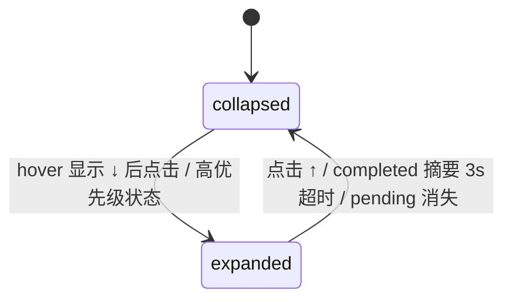
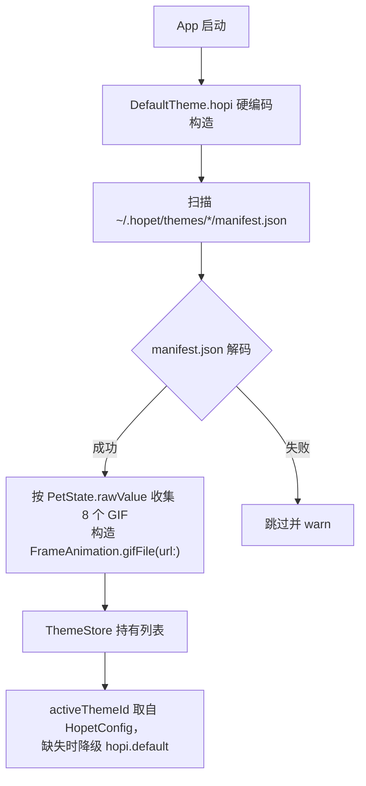

# Hopet 详细功能文档 v0.1

> 版本：0.1 (初版)
> 最后更新：2026-04-24
> 状态：Draft — 与 [architecture.md](./architecture.md) 同步交付

---

## 1. 用户画像与使用场景

### 1.1 核心用户

- **AI Pair Programmer**：长时间与 Claude Code / Codex 配合工作的开发者，常开多个终端多个会话。
- **Side-by-Side 工作者**：在 IDE 或浏览器工作时，AI 会话窗口被遮盖，希望不切换窗口就能知道 AI 状态。
- **Ritual 偏好者**：享受桌面陪伴物的开发者，把工具装饰化作为工作仪式感的一部分。

### 1.2 典型场景

| 场景 | 现状痛点 | Hopet 解决方式 |
| --- | --- | --- |
| AI 正在跑一个长任务，用户去看文档 | 不时切回终端检查进度 | 宠物一直"回复中"动画；完成时播放"完成"动画并可弹通知 |
| AI 问用户 AskUserQuestion | 用户没注意到终端已停等待 | 宠物切到"询问"专属动画 + 刘海条文字提醒 + （可选）通知 |
| 需要权限确认（Bash/Edit） | 长任务里夹杂多次权限弹窗，容易错过 | hook-backed CLI 会话切到"权限请求"动画并展示决策卡；Codex VSCode / Cursor 插件审批仍用插件自己的 UI |
| 多个会话并发（`cc-1` / `cc-2` / codex） | 哪个在跑、哪个卡住不清楚 | 每个会话独立宠物，位置互不重叠 |

---

## 2. 功能总览

### 2.1 功能矩阵

| 模块 | v0.1 | v0.2 | v0.3 |
| --- | --- | --- | --- |
| 状态感知动画（Claude Code，idle / responding / thinking / tool-use / permission-prompt / ask-user / completed） | ✅ 含 ask-user（通过 AskUserQuestion tool 路由） | ✅ | ✅ |
| 状态感知动画（Codex CLI 0.129+，无 ask-user 和 error-interrupted） | ✅ 6 hook 完整生命周期（`~/.codex/hooks.json`） | ✅ | ✅ |
| 状态感知动画（Codex VSCode / Cursor 插件） | ✅ 只读本地 rollout，会话 / 回复 / 工具 / 完成状态；不接管插件权限审批 | ✅ | ✅ |
| 状态感知动画（其他兼容平台，字段级对齐 Claude Code 的全生命周期 hook） | ⛔ | ⛔ | ✅ 含可决策权限审批 + 交互式 ask-user（`Elicitation` → `permission_ask`） |
| `error-interrupted` 状态有事件源 | ⛔ 枚举值保留，但 `PostToolUseFailure` 太常态已停用；见 [hooks-and-priority.md §1.1 注 2](./hooks-and-priority.md#11-实际订阅的-claude-code-hook) | 视未来真"会话级错误"事件出现而定 | TBD |
| 刘海屏 Dynamic Notch | ✅ 三态：collapsed / expanded / fullBubble | ✅ | ✅ |
| 顶部悬浮条降级（无刘海机型，`notch.fallbackBarEnabled`） | ✅ | ✅ | ✅ |
| 桌面宠物（**全局唯一**，聚合所有 AI 工具、所有 session） | ✅ | ✅ | ✅ |
| 会话气泡（**竖栈贴宠物头顶 + ScrollView 滚动**，每气泡 = 1 个活跃 session） | ✅ 显示 cwd 末层 / 标题 / 最近回复摘要 / 状态徽章 / 状态时长 | ✅ | ✅ |
| 状态聚合（多 session → 单宠物按优先级） | ✅ 详见 [hooks-and-priority.md](./hooks-and-priority.md) | ✅ | ✅ |
| Subagent 同步类 hook 重路由到主 session | ✅ `EventRouter` 通过 `transcript_path` 找主 session，子 agent 不创建气泡 | ✅ | ✅ |
| 点击宠物本体 → 启动新会话 | ⛔ 已明确不做（详见 [architecture.md §12.5](./architecture.md#125-关于在气泡里自由输入消息v01-不做的功能)） | TBD | TBD |
| 气泡上 PermissionRequest 决策（Allow / Deny / Ask） | ✅ hook socket 同步回包，跨所有宿主 | ✅ | ✅ |
| AskUserQuestion 自动展开答题（选项 + 自定义文本 + multiSelect） | ✅ hook 回包 `updatedInput.answers`，跨所有宿主 | ✅ | ✅ |
| ExitPlanMode plan-approval 卡片（plan markdown + 继续规划反馈） | ✅ | ✅ | ✅ |
| **气泡里自由打字注入消息**（在 idle / 任意状态 session 上） | ⛔ macOS 无干净通用注入路径，详见 [architecture.md §12.5](./architecture.md#125-关于在气泡里自由输入消息v01-不做的功能) | 评估 PTY wrapper / IDE 扩展 | TBD |
| 偏好面板 8 Tab（Overview / Themes / Appearance / Bindings / Hooks / Behavior / Notifs / About） | ✅ 全部实现 | ✅ | ✅ |
| 主题系统 — 内置 Hopi 主题 | ✅ | ✅ | ✅ |
| 主题系统 — 用户自定义主题（8 个 GIF + manifest，文件夹 / `.zip` 自动扫描） | ✅ | ✅ | ✅ |
| 主题系统 — `.hopettheme` zip 分发 | ⛔ | ⛔ | ✅ 含 zip slip 防护 |
| 主题切换（全局单一） | ✅ `HopetConfig.activeThemeId` | ✅ | ✅ |
| Hook 安装向导 + Doctor | ✅ | ✅ | ✅ |
| Listener 软静音 toggle（不动 hook 文件，运行时丢事件） | ✅ | ✅ | ✅ |
| 通知中心横幅 | ⚠️ NotificationsTab 仅有 Toggle 占位，未真正注册 UserNotifications | ✅ 联通 | ✅ + 主题声音 |
| Onboarding 向导 + 权限引导 | ⛔ | ✅ | ✅ |
| 快捷键录制 / 全局快捷键 | ⛔ | TBD | ✅ |
| `hopet` CLI | ⛔ | ✅ | ✅ |
| 自动更新（Sparkle + EdDSA） | ⛔ | ✅ | ✅ |

> 标注约定：`✅` = 已交付；`⚠️` = 实现中 / 受限；`⛔` = 本期明确不交付（已与 architecture.md §1.2 / §13 对齐）。

### 2.2 非功能需求

- **启动时间** ≤ 1.5s 到宠物可见
- **单宠物闲置 CPU** ≤ 1%（Apple Silicon M1）
- **单宠物闲置内存** ≤ 80 MB
- **动画帧率**：60 fps；低电量模式自动降到 30 fps
- **IPC 端到端延迟** ≤ 50ms（hook 脚本 exec 到动画切换）

---

## 3. 核心功能详述

### 3.1 状态感知与动画映射

八种状态的完整映射（以内置 "Hopi" 小海豹主题为例）。**优先级**列用于多 session 聚合到单宠物时决定显示哪个状态（数字小=优先级高，详见 [hooks-and-priority.md §2](./hooks-and-priority.md#2-petstate-优先级)）：

| 优先级 | PetState | 触发事件 | 宠物动画（Hopi） | 刘海条文案 | 通知 | v0.1 |
| --- | --- | --- | --- | --- | --- | --- |
| **P0** | `ask-user` | Claude `PreToolUse` hook（`tool_name == AskUserQuestion`，fire-and-forget 让 UI 提前展示）+ `PermissionRequest` hook（同一调用，带 `requestId`，挂起等用户作答） | 歪头 + 双鳍捧问号牌 | `❓ Waiting for your answer` | ⛔ 横幅占位 | ✅ + 该 session 气泡自动展开为对话气泡 |
| **P1** | `permission-prompt` | Claude `PermissionRequest` hook（Notification 兼容回退已删除，避免双发） | 警觉抬身瞪眼 + 红色感叹号闪烁 | `⚠️ Permission needed` | ⛔ 横幅占位 | ✅ |
| **P2** | `error-interrupted` | **当前无事件源**——`PostToolUseFailure` 在 Claude 上太常态（`grep` / `head` 等命令的非零退出），改为只触发 `cancelPending` 不切状态。枚举值保留 | 瘫软成一块麻薯 + 小闪电 | `Interrupted` | 可配置 | ⛔（枚举可用，但不会被触发）|
| **P3** | `tool-use` | Claude `PreToolUse` hook（`tool_name != AskUserQuestion`），Codex 同 | 戴圆眼镜翻书 / 工具 icon 漂浮在鳍旁 | `Running tool…` | — | ✅ |
| **P4** | `thinking` | responding 持续 ≥ 8 s（`ThinkingTimer` 主动判定，无对应 hook） | 前鳍托腮，头顶省略号气泡闪烁 | `Thinking deeply…` | — | ✅ |
| **P5** | `responding` | Claude `UserPromptSubmit` hook，Codex 同 | 两只前鳍交替拍小键盘 | `Responding…` | — | ✅ |
| **P6** | `completed` | Claude `Stop` hook，Codex 同 | 开心拍鳍 + 小跳（非循环，1 s） | `Done ✓` | 可配置 | ✅ |
| **P7** | `idle` | 无活跃 session / completed 后 2 s（`CompletedDecayTimer`） | 趴坐眨眼，身体随呼吸起伏，偶尔轻拍短尾鳍 | `Idle` | — | ✅ |

**聚合规则**：宠物展示的是所有活跃 session（跨所有 AI 工具）中**优先级最高**的那个状态（权威定义见 [hooks-and-priority.md §2](./hooks-and-priority.md#2-petstate-优先级)）。Hopet 全局只有一只宠物，不再随 session 数量或工具数量增加。**leader session 的气泡边框会高亮**，让用户一眼看出当下宠物状态来自哪个 session。

动画切换由 SwiftUI 视图层 `withAnimation` 直接承担，没有独立的 `AnimationController`。

**优先级**：同一时刻若有多个候选状态，按 `ask-user > permission-prompt > error-interrupted > tool-use > thinking > responding > completed > idle` 的优先级选择，刘海条始终只显示最高优先级的那一条。

### 3.2 刘海屏 Dynamic Notch

#### 3.2.1 三态设计



各态的视觉呈现：

| 态 | 尺寸 | 内容 | 触发 |
| --- | --- | --- | --- |
| **collapsed** | 贴近物理刘海宽度的黑色区域（有刘海机型约 160–220 pt，无刘海降级 184 pt），高度 = 顶部刘海保留区 + 26 pt 状态条 | 底部状态条显示小色点 + 最高优先级状态文案（`Idle` / `Thinking…` / `Responding…` 等）；hover 时右侧显示 ↓ | 默认态 |
| **expanded** | 最大宽度 560 pt，高度按内容包裹且不超过屏幕高度 1/4；completed 摘要独立停留 3s 后收起（不受 completed→idle 2s 降级影响） | 顶部预留 ↑ 收起控制区，正文从其下方开始；权限 / AskUser / 完成摘要卡片；手动展开时显示当前会话详情（状态 / cwd / 最近提问 / 最近回复，耗时每秒刷新）；不再显示独立关闭按钮 | 点击 collapsed 的 ↓ 或 出现 permission-prompt / ask-user / completed |
| **fullBubble** | 视气泡内容自适应 | 把活跃气泡内容直接嵌进刘海下方（实验态，仅 `NotchView.swift` 内含） | 内部用 |

#### 3.2.2 吸附与动效

- 定位：使用 `NSScreen.safeAreaInsets` 与 `auxiliaryTopLeftArea / auxiliaryTopRightArea`（macOS 14+）推导主屏刘海 gap；有刘海屏从屏幕顶端开始渲染纯黑区域，高度覆盖顶部安全区并在底部追加 26 pt 状态条，状态文案只放在底部状态条。无刘海降级条吸附菜单栏下沿。
- 伸展动效：窗口顶部锚定，expanded 与 collapsed 共用同一个屏幕中心点，宽度从中点向两侧撑开到最大 560，高度从上往下按内容展开；`spring(response: 0.44, damping: 0.92)`，窗口 frame 使用 0.42s ease-in-out。
- Level：`.statusBar + 1`，确保菜单栏不会盖住刘海下沿补黑区域；窗口宽度限制在刘海中心 gap，跨所有 Space、不进入 Mission Control。
- 多屏：优先在带刘海的内建屏幕渲染刘海条；没有刘海屏时才使用主屏幕降级条。外接显示器上宠物本体正常显示。

#### 3.2.3 降级策略（无刘海机型）

- 无 `safeAreaInsets.top > 0` 的 Mac → 启用 `FallbackTopBarWindow`：
  - 屏幕顶部中央悬浮一条 184×26 的黑色下沿
  - 与刘海条具备相同的三态能力
  - 默认关闭，可在偏好中开启（避免遮挡菜单栏）
- 用户亦可在偏好里强制切换为"仅宠物，不要顶部条"。

---

### 3.3 桌面宠物本体

Hopet **全局只有一只**宠物，所有 AI 工具（Claude / Codex / 未来其它）的所有活跃 session 共用之。宠物状态 = 所有活跃 session 中最高优先级的那个 session 状态（聚合规则见 [hooks-and-priority.md §2-3](./hooks-and-priority.md#2-petstate-优先级)）。

#### 3.3.1 窗口行为

- `NSPanel` + `.nonactivatingPanel` + `.fullSizeContentView`：点击宠物不抢走当前 App 焦点
- `collectionBehavior = [.canJoinAllSpaces, .stationary, .ignoresCycle]`：跨所有 Space、不出现在 `⌘Tab`
- `level = .floating + 1`：浮于普通窗口之上，但低于系统弹窗
- 背景完全透明；宠物本体与气泡分别响应点击（HitTestProxy 按 alpha > 0.1 判定）

#### 3.3.2 位置与拖拽

- 启动时从 `config.json` 读取 `lastPosition`；首次启动宠物默认在主屏右下
- 长按 0.2s 进入拖拽态；松开吸附到最近的屏幕边缘（可关闭吸附）
- 拖动宠物时**会话气泡跟随移动**（保持环绕几何）
- 拖出屏幕时自动 clamp 回可见区

#### 3.3.3 无活跃 session 时

宠物保持显示为 idle（作为"看一眼当前状态"的窗口），可在偏好里设为"无 session 时隐藏"。

#### 3.3.4 交互反馈

| 操作 | 反馈 |
| --- | --- |
| 鼠标悬停 | 视图层尚未做 tooltip（计划项） |
| 左键单击宠物本体 | v0.1 无操作（曾用于"新开 session"，已移除） |
| 右键点击宠物 | 视图层尚未做 context menu（计划项；菜单栏图标作为兜底入口） |
| 长按（≥ 0.2 s） | 进入拖拽（窗口位置跟随，气泡 ScrollView 同步移动） |
| **左键单击气泡** | 不做"展开为大卡片"——气泡的展开态完全由 `Session.pendingKind`（Permission / AskUserQuestion / ExitPlanMode）自动驱动，无 pending 时是固定的默认卡片（标题 / cwd / 最近回复 / 状态徽章 / 状态时长） |
| 气泡右上角 ✕ | 手动 dismiss 这条会话气泡（真活会话被误关时下一次状态事件会冷启重建） |

---

### 3.4 输入入口

v0.1 只有两个用户输入入口，都建立在 **Claude 主动开口**（hook 同步等待）的前提上。**不**提供"在 idle 气泡上打字给 Claude"，也**不**提供"点击宠物本体启动新会话"——后者本质是同一类问题（详见 [architecture.md §12.5](./architecture.md#125-关于在气泡里自由输入消息v01-不做的功能)）。

| 触发 | 含义 | 走的路径 |
| --- | --- | --- |
| **PermissionRequest 自动展开**（Claude 主动） | 回答工具调用是否允许 | §3.4.1 |
| **AskUserQuestion 自动展开**（Claude 主动） | 回答 Claude 的提问 | §3.4.2 |

启动新会话的方式：用户照常在自己的终端 / Cursor / VS Code / IDE 内嵌终端里打 `claude` / `codex`，Hopet 通过 hook 自动感知，新气泡随 SessionStart 事件出现。

Codex VSCode / Cursor 插件主会话不触发 `~/.codex/hooks.json`；Hopet 通过本地 rollout watcher 只读感知其状态。该路径没有同步审批回包，因此插件弹出的权限审批不展示 Hopet 决策卡。

#### 3.4.1 PermissionRequest 自动展开

当 Claude 触发 `PermissionRequest` hook（如要执行 Bash/Edit 等需要权限的工具）：

1. hopet-emit 通过 socket 把请求转给 Hopet，**Claude 进程被挂起等响应**（30s 超时）
2. 该 session 的气泡**自动从环绕态展开**为 360×160 的决策卡，显示工具名 + 命令/路径预览
3. 用户点 **Allow** / **Deny** / **Handoff**
4. 决策通过同一条挂起的 socket 回写：`{ "hookSpecificOutput": { "hookEventName": "PermissionRequest", "decision": { "behavior": "allow"|"deny" } } }`
5. Claude 拿到决策继续工具调用循环；如选"交给终端"则回 `{}`，Claude 自走它的 TUI 弹窗

跨 iTerm / Apple Terminal / VS Code / Cursor 内嵌终端 / Ghostty / Warp 等所有宿主工作——这条路是协议级的，跟终端注入路径无关。

Codex VSCode / Cursor 插件自己的审批弹窗不走这条 hook socket；Hopet 不接管其 Allow / Deny / Handoff，审批期间最多展示普通工具执行状态。

#### 3.4.2 AskUserQuestion 自动展开

`AskUserQuestion` 是 Claude Code 的内置工具，每次调用走标准 `PermissionRequest` hook（Hopet 通过 `tool_name=="AskUserQuestion"` 在该 hook 上分流）。

1. hopet-emit 把 `tool_input.questions` 透传给 Hopet
2. 气泡**自动展开**为 360×220 的答题卡：标题/序号 + 提问 + 选项按钮（来自 `tool_input.options`） + 自定义文本框
3. 多问题时分页填写，每题必填一项再下一页
4. 最后一页提交时一次性回包：

   ```json
   {
     "hookSpecificOutput": {
       "hookEventName": "PermissionRequest",
       "decision": {
         "behavior": "allow",
         "updatedInput": {
           "questions": [...原 questions],
           "answers": { "问题文案 A": "回答 A", "问题文案 B": "回答 B" }
         }
       }
     }
   }
   ```

5. Claude 用 `updatedInput` 重跑 AskUserQuestion 工具，工具识别 `answers` 字段直接把它当结果返回

宠物动画同步切到 `ask-user` 态。**这条路同样跨所有宿主工作**——不依赖 PTY 注入或终端自动化。

#### 3.4.3 关于"自由打字给 Claude"和"点击宠物启动新会话"

两个看起来理应有的功能，v0.1 都不做：

- **气泡里自由打字给 Claude**：macOS 没有可靠的反向 stdin 注入路径（详见 [architecture.md §12.5](./architecture.md#125-关于在气泡里自由输入消息v01-不做的功能)）
- **点击宠物本体启动新会话**：本质是同一类问题——即使弹一个目录选择器 + 输入框，命令也只能复制到剪贴板让用户自己粘贴，Hopet 没有持有这个新 session 的 stdin。这种"看似引导实则脱节"的体验已从 v0.1 移除

两类都不打算用 PTY wrapper / IDE 扩展暴力实现——前者要求改启动方式，后者要求装额外组件，都偏离了 Hopet "感知层 + 协议层"的定位。

要给 Claude 发新消息：照常在自己的终端 / Cursor / VS Code / IDE 内嵌终端里打字。Hopet 只负责通过 hook 把状态变化映射成桌面动画，不替代输入 UI。

---

### 3.5 会话气泡（Session Bubbles）

气泡**竖栈贴宠物头顶 + ScrollView 滚动**，每个气泡 = 一个活跃 session（跨 AI 工具）。气泡是宠物身份信息的最小载体，提供 cwd / 标题 / 最近回复摘要 / 状态徽章 / 状态时长等关键元信息。

> 旧设计是围绕宠物环绕排布，问题是宠物靠近屏幕边缘时气泡越界、Leader 弧线视觉指向无法 hit-test、6+ 气泡时视觉拥挤。竖栈方案让气泡顺序按 `startedAt` 倒序明确（最新在最上）、可滚动、可承载 plan-approval / askUser 这类高大卡片。

#### 3.5.1 默认显示内容

默认卡片（无 pending 时）按行展示：

```
┌────────────────────────────────────────┐
│ Title                          [×]     │  ← 会话标题（≤ 40 字符）；无标题时不渲染此行（避免和下行 cwd 重复）
│ 📁 Hopet · Responding · running 3s     │  ← cwd 最后一层 / 状态徽章 / stateDurationPhrase
│ "Looking at PetStageView.swift…"       │  ← lastAssistantMessage（Stop hook 抽取的本轮回复开头，≤ 120 字符）
└────────────────────────────────────────┘
```

`stateDurationPhrase` 在 running 态显示 `running 5m`，在终态（idle / completed / errorInterrupted）显示 `5m ago`。

气泡边框颜色 = 该 session 当前状态色（leader 加粗，其它常规）。

#### 3.5.2 视觉规格

| 元素 | 估算值 |
| --- | --- |
| 默认卡片高度 | 76 pt |
| Permission 决策卡 | 260 pt |
| Plan-approval 卡（ExitPlanMode） | 430 pt |
| AskUserQuestion 答题卡 | 390 pt |
| 旧 fire-and-forget 问询卡（legacyQuestion） | 120 pt |
| 单可见默认卡数（超出滚动） | 5 |
| 气泡间距 | 6 pt |
| 气泡-宠物间距 | 6 pt |
| 字体 | 系统等宽（monospaced），按 preferences.md §11.4 |
| 描边 | 硬黑 1.5 pt（普通）/ 2.5 pt（leader） |
| 阴影 | 块状偏移（不模糊），与气泡 PixelChrome 同语言 |

布局算法见 [architecture.md §12.4](./architecture.md#124-会话气泡布局算法)。

#### 3.5.3 Leader 高亮

宠物的聚合状态由"最高优先级 session"驱动（详见 [hooks-and-priority.md §3](./hooks-and-priority.md#3-聚合算法)）。`PetInstance.drivenBySessionId` 对应的气泡：

- 描边加粗
- 描边色 = 当前宠物状态色

用户因此能一眼看出"哪个 session 是当下宠物状态的来源"。

#### 3.5.4 展开行为（pendingKind 驱动）

气泡的形态完全由 `Session.pendingKind` 决定，无需用户点击：

| pendingKind | 形态 | 触发 |
| --- | --- | --- |
| `nil` | 默认卡片 | 无挂起的同步类 hook |
| `permission` | Permission 决策卡（Allow / Deny / Ask） | `PermissionRequest` hook（详见 [§3.4.1](#341-permissionrequest-自动展开)） |
| `planApproval` | Plan-approval 卡（plan markdown + 继续规划反馈） | `PermissionRequest` hook 且 `tool_name == ExitPlanMode` |
| `askUser` | AskUserQuestion 答题卡（选项按钮 + 自定义文本 + multiSelect） | `PermissionRequest` hook 且 `tool_name == AskUserQuestion`（详见 [§3.4.2](#342-askuserquestion-自动展开)） |
| `legacyQuestion` | 旧 fire-and-forget 问询卡（仅展示问句，无答题入口） | `PreToolUse` 路径上 `tool_name == AskUserQuestion`（让 UI 提前进入答题态；真正的同步答题靠 `PermissionRequest` 路径） |

每个气泡右上角有 ✕ 用于手动 dismiss。

#### 3.5.5 屏幕边缘适应

宠物窗口高度由 `PetWindow.stageSize.height` 限定；气泡 ScrollView 视口上限按窗口可用空间裁剪。宠物靠近屏幕底时 `clamp` 回可见区，气泡仍然贴宠物头顶。

#### 3.5.6 气泡数量

无硬上限——超出可见区即滚动。实践中很少同时跑超过 5 个活跃 session，多余的靠 ScrollView 兜底。

---

### 3.6 偏好面板

自绘 `PixelTabBar` 顶部分段（不用系统 `TabView`），整体跑在 `PixelGridBackground` 上，与宠物气泡 / 刘海条同语言。详细像素风设计见 [preferences.md §11](./preferences.md)。

Tab 顺序：**Overview · Themes · Appearance · Bindings · Hooks · Behavior · Notifs · About**。

#### 3.6.1 Overview

- 全局宠物卡片：状态 glyph + 活跃 session 数 + Locate 按钮（让宠物闪烁定位）
- Display 快捷卡片：`Show notch bar` 写入 `UserDefaults notch.enabled`，实时显示 / 隐藏刘海条；`Show pet` 写入 `UserDefaults pet.visible`，实时显示 / 隐藏宠物窗口
- Sessions 列表：每个 session 一行（工具名 / 标题 / state / badgeLabel / 用时 / `×` 删除按钮）
- 空状态提示

#### 3.6.2 Themes

- 已安装主题列表，每条 `PixelCard` 展示 56×56 预览首帧 + 名称 + 描述 + Apply / Delete 按钮
- 顶部 "Import Theme…" 按钮：弹出 sheet
  - 主题名输入框 + 8 个 `PixelDropSlot`（按 `PetState.allCases` 排列）
  - 或拖入文件夹 / `.zip`，`UserThemeImporter.DirectoryScan` 自动按文件名匹配 PetState 并报告缺失 / 重复 / 不识别的文件
- 用户主题显示 `[user]` 角标；内置 `hopi.default` 不显示 Delete 按钮

#### 3.6.3 Appearance

- 三选一 `PixelSegmentedControl`：Light / Dark / System
- 实时生效（`NSApp.appearance = NSAppearance(named: ...)`），偏好同步写入 `HopetConfig.appearance`

#### 3.6.4 Bindings（全局主题）

- 单个 `PixelCard`：全局主题 `Picker(.menu)`，写入 `HopetConfig.activeThemeId`
- v0.x 起宠物全局唯一，主题也只有一个全局值——表格形态的"按 AI 绑定"已废弃；如未来引入按 cwd / session 切主题会单独建模

#### 3.6.5 Hooks

- 每个识别的 AI 工具一张 `PixelCard`：工具名 + `Listening on/off` 状态 + `PixelToggle`（软静音）
- Toggle 不动 hook 文件——启动时已无条件落盘，off 只让 EventRouter 静默丢事件并清掉无 pending 的气泡
- 底部 `PixelCard`：Doctor "Run" 按钮 + monospaced ScrollView 显示诊断输出

#### 3.6.6 Behavior

四块 `PixelCard`（General / Notch / Terminal / Diagnostics）。Notch 区的 `Show notch bar` 与 Overview 的同名开关共享 `UserDefaults notch.enabled`，实时控制刘海条可见性；`Show top bar on non-notch displays` 写入 `UserDefaults notch.fallbackBarEnabled`，只影响无物理刘海屏幕上的降级顶条。其它 Behavior 项仍是偏好 UI 骨架，未全部接入运行时。

#### 3.6.7 Notifications

两块 `PixelCard`（Banners 分类 Toggle / Sound 占位说明）。当前只有 UI 占位，未真正注册 UserNotifications（v0.2 才会联通）。

#### 3.6.8 About

居中 `PixelCard`：项目标题 + 版本 + 一句话描述 + feedback Link。

---

### 3.7 主题系统

#### 3.7.1 主题加载流程



GIF 渲染走 `GIFAnimationView`：`ImageIO` 解码所有帧，保留 GIF 内嵌可变帧延迟，`TimelineView` 按 `(elapsed % totalDuration)` 二分定位当前帧；帧图缓存 key = `(URL.path, mtime)`，删除 / 重导入主题后 mtime 变化自动失效。

#### 3.7.2 导入用户主题

详见 [preferences.md §5.3](./preferences.md)。入口：ThemesTab 的 "Import Theme…" 按钮。两种填法：

- **8 槽手填**：为每个 `PetState` 拖入或选择一个 GIF
- **文件夹 / .zip 自动扫描**：拖入一整个目录或 `.zip`，`UserThemeImporter.DirectoryScan` 按文件名（忽略大小写、忽略 `-` / `_` / 空格）匹配 PetState

校验：
1. UTI 必须是 `public.gif`（避免改名 `.gif` 绕过）
2. `CGImageSourceCreateWithURL` 必须成功且帧数 ≥ 1
3. 任一校验失败 → 删除半成品目录、报错红字、保留 sheet 供修正

> v0.1 不支持 `.hopettheme` zip 分发（含 zip slip 防护，留 v0.3+）。当前 zip 仅作为"一次性导入容器"用，导入完成立刻解到 `~/.hopet/themes/<id>/` 并丢弃 staging。

#### 3.7.3 自定义主题简要指南

1. 准备 8 个 GIF，按 `PetState.rawValue` 命名：`idle.gif` / `responding.gif` / `thinking.gif` / `tool-use.gif` / `permission-prompt.gif` / `ask-user.gif` / `completed.gif` / `error-interrupted.gif`
2. 把它们放进一个文件夹或打成 `.zip`
3. 在 ThemesTab 点 Import Theme…，填主题名，拖入文件夹 / zip
4. 点 Apply 即生效

**帧规范**：
- 透明背景 GIF；每个 state 建议 8–24 帧；loop 自然衔接
- 8 个文件**必须齐全**——缺任一帧整个主题非法

---

## 4. 内置主题清单（v0.1）

### 4.1 Hopi — 圆滚滚的小海豹

- `id`：`hopi.default`
- 风格：像素 + 轻微抗锯齿，Cute 向；主体是一只身体呈水滴形、胖乎乎、短尾鳍的小海豹
- 动画总量：8 种状态 × 平均 12 帧 ≈ 96 PNG
- 单只宠物纹理总体积 ≤ 3 MB（打包后）
- 色调：主色 `#B8C7D4`（海豹灰蓝），腹白 `#F5F7FA`，描边 `#2A3A4A`，强调色 `#F4A258`（用于眼睛高光与完成动画）
- 动画设计要点：
  - `idle`：趴坐姿，身体随呼吸轻微起伏，每 3s 眨一次大眼睛，偶尔轻拍一下短尾鳍
  - `responding`：两只前鳍交替拍打虚拟键盘，1s 一个循环，脑袋轻微左右摆
  - `thinking`：用一只前鳍抵着下巴做托腮状，头顶问号/省略号气泡忽明忽暗
  - `tool-use`：戴上小圆眼镜，鳍边漂浮扳手/书本等工具图标
  - `permission-prompt`：警觉抬身、瞪大眼睛，头顶红色感叹号闪烁
  - `ask-user`：歪头，两只前鳍合捧起一枚黄色问号牌
  - `completed`：开心拍鳍 + 原地小跳一下，头顶撒出小星星（非循环 1s）
  - `error-interrupted`：整只软塌塌摊成一块麻薯，上方飘着小黑电雷

### 4.2 设计文件组织

- 源文件：Figma（交付时随主题包附 `.fig` 链接 README）
- 导出：每帧 PNG + `manifest.json` 由 `scripts/build-theme.sh` 自动生成

---

## 5. Hook 安装与卸载流程

### 5.1 首次安装（Claude Code）

面板"Hooks → Claude Code → 安装"时：

1. 检测 `~/.claude/settings.json` 是否存在，不存在则创建空 `{}`
2. 备份为 `~/.claude/settings.json.hopet.bak`（带时间戳）
3. Merge 架构文档 8.4 所列的 hook 条目；遇到已有同名 hook 则 **append**（保留用户既有 hook）
4. 将 `hopet-emit` 从 bundle 资源拷贝到 `~/.hopet/bin/hopet-emit` 并 `chmod +x`
5. 调用 `HookDoctor`：
   - settings.json 语法正确
   - `~/.hopet/bin/hopet-emit` 存在且可执行
   - socket 路径能被触达（App 正在运行）
6. UI 显示 Healthy 勾

### 5.2 卸载

- 反向移除 Hopet 添加的条目，保留用户其它 hook
- 可选择恢复到最近一次 `.hopet.bak`
- 保留 `~/.hopet/bin/hopet-emit` 以便随时重装；彻底卸载选项删除整个 `~/.hopet/bin/`

### 5.3 升级

- App 升级时如 `hopet-emit` 版本低于 bundle 版本，自动替换二进制（不改 settings.json）

### 5.4 故障排查（HookDoctor 输出示例）

```
✓ ~/.claude/settings.json 存在且合法
✓ 已发现 7 个 Hopet 注入的 hook 条目
✗ ~/.hopet/run/hopetd.sock 不存在
  → 请确认 Hopet.app 正在运行
✓ ~/.hopet/bin/hopet-emit 可执行 (mode 0755, 1.4 MB)
```

---

## 6. 偏好设置项一览

实际落盘 schema 在 `Sources/Hopet/Core/HopetConfig.swift`，与 [preferences.md §4.3](./preferences.md) 一致。`~/.hopet/config.json` 当前只承载这些键：

| 键 | 类型 | 默认 | 说明 |
| --- | --- | --- | --- |
| `version` | Int | 1 | schema 版本号；未知版本整体降级到默认值并 warn |
| `appearance` | Enum | `system` | `light` / `dark` / `system`；切换实时生效（`NSApp.appearance`） |
| `activeThemeId` | String | `hopi.default` | 当前主题 id；启动时若指向不存在主题（用户删目录后）降级到 `hopi.default` 并写回 |
| `listeners.claudeCode` | Bool | `true` | Claude Code listener 软静音；off 时 EventRouter 静默丢事件、SceneRouter 清掉无 pending 的气泡，hook 文件不动 |
| `listeners.codex` | Bool | `true` | Codex CLI listener 软静音；与上同义 |

以下 UI 可见性偏好刻意保留在 `UserDefaults`，不进入 `~/.hopet/config.json`：

| 键 | 类型 | 默认 | 说明 |
| --- | --- | --- | --- |
| `pet.visible` | Bool | `true` | Overview / 菜单栏 Toggle 的单一真相源；`SceneRouter` 实时 show/hide 宠物窗口 |
| `notch.enabled` | Bool | `true` | Overview / Behavior Notch 的单一真相源；`SceneRouter` 实时 show/hide 刘海条 |
| `notch.fallbackBarEnabled` | Bool | `false` | 无物理刘海显示器的降级顶条开关；只有 `notch.enabled = true` 时才可能显示，切换后由 `SceneRouter` 立即重算 |

其它过去文档列出的 `general.launchAtLogin` / `pet.maxConcurrent` / `bubble.preferredTerminal` / `notifications.*` / `advanced.logLevel` 等键，BehaviorTab / NotificationsTab 当前只是 UI 占位骨架，**未全部联通到运行时行为，也未写入 config.json**。这些项会在 v0.2 真正落地时补入 HopetConfig schema。

---

## 7. 快捷键

> v0.1 未实现快捷键录制与全局快捷键注册——以下表格是规划态。当前的兜底入口是菜单栏图标（左键展开菜单：显示宠物 / 打开偏好 / 退出）。

| 快捷键 | 作用 | 范围 | v0.1 状态 |
| --- | --- | --- | --- |
| `⌘⇧H` | 显示/隐藏宠物 | 全局 | ⛔ |
| `⌘,` | 打开偏好面板 | App active 时 | ⛔ |
| `⌘W` | 关闭当前窗口 | App active 时 | ⛔ |
| `Esc` | 关闭气泡展开 / 取消拖拽 | 气泡 active | ⛔ |
| `↩` | 提交 Permission 决策 / AskUserQuestion 答题 | 对应卡片 active | ⛔（按钮可达） |

### 7.1 录制与冲突处理

- **录制 UI**：Behavior Tab 提供快捷键录制器（基于 `KeyboardShortcuts` 库或自实现），用户可自定义两个全局快捷键
- **保留快捷键禁止**：禁止录制系统级保留键（`⌘Q` / `⌘Tab` / `⌘Space` 等），录制时实时反馈"已被系统占用"
- **注册失败处理**：调用 `RegisterEventHotKey` 失败（通常因被其它 App 抢占）时：
  1. 菜单栏图标显示 warning 小角标
  2. Behavior Tab 该快捷键行高亮黄色 + 提示文案 "已被其它 App 占用，建议改键"
  3. 提供「重新录制」「禁用此快捷键」两个按钮
  4. 不重试注册（避免循环），直到用户手动操作
- **冲突可观测**：偏好底部"诊断"按钮的输出包含两个全局快捷键的当前注册状态
- **关闭**：每个全局快捷键都可独立关闭，关闭后菜单栏入口与 App 内的"打开偏好"按钮仍然可达

### 7.2 终极兜底

无论全局快捷键状态如何，菜单栏图标始终是 100% 可达入口：左键单击展开菜单（"快速询问…" / "显示宠物" / "偏好…" / "退出"）。

---

## 8. 权限与首次引导

> v0.1 未实现 Onboarding 向导，以下是 v0.2 的规划态；当前首次启动直接进入主界面，用户需自行打开偏好面板的 Hooks Tab 完成安装。

### 8.1 Onboarding 页面（v0.2 规划）

流程为 5 步向导：

1. **欢迎** — 短动画演示一次完整状态流
2. **选择默认 AI 工具** — Claude Code / Codex（可多选）
3. **安装 Hooks** — 一键安装，失败给出手动指引
4. **授予权限**（按需请求）：通知（必选推荐）
5. **完成** — 显示第一只宠物，触发一次 `completed` 动画作为 welcome

### 8.2 权限缺失时的降级

- Permission / AskUserQuestion 答题不依赖任何 macOS 权限（hook 通道是协议级）
- 通知中心横幅 v0.1 未真正注册（NotificationsTab 仅有 Toggle 占位）
- 任一关键权限缺失时的菜单栏小红点提示属于 v0.2 规划项

---

## 9. 错误与降级处理

### 9.1 运行时错误

| 错误场景 | 行为 |
| --- | --- |
| Socket 创建失败（地址被占） | 自动 unlink 残留 socket 重试 3 次；仍失败则菜单栏红点 + 日志 |
| Hook 事件 JSON 解析失败 | 记录 warn 日志，丢弃该事件，不影响其它事件 |
| 主题加载失败 | 回退到内置 `hopi.default`；弹窗提示用户 |
| 帧图缺失 | 该状态动画用静态首帧兜底 |
| 多显示器变化（外接拔插） | 0.5s debounce 后重新计算刘海 rect 与宠物位置 |
| 深色/浅色模式切换 | 刘海条与面板自动跟随；宠物主题可自行声明 `variantDark` |
| 系统省电模式 | 动画降到 30fps；刘海条动效弱化 |
| Accessibility 权限被撤销 | 下次使用 A 模式时降级并提示 |
| App 升级后所有权限被系统遗忘 | 未签名分发的固有限制（TCC 按签名绑定）；首次启动检测到权限全失时，显示一次性的再次引导页，一键跳转至对应系统设置 |

### 9.2 用户可见错误

- 偏好面板 Behavior Tab 底部有"诊断"按钮，一键执行 HookDoctor、socket 自检、权限自检、主题校验，结果可复制到剪贴板便于 issue 提交
- `~/.hopet/logs/hopet.log` 始终保留最近 3 天日志，可在 Advanced 中打开日志目录

### 9.3 崩溃恢复

- App 崩溃后重启：从 `state/sessions.json` 恢复最近 10 分钟内的会话，显示为 `idle` 灰度；后续事件触发时自动"醒来"
- 超过 10 分钟则视为过期不恢复

---

## 10. 后续版本功能规划

v0.2 / v0.3 完整范围由 [architecture.md §13](./architecture.md#13-里程碑路线) 维护，本节不重复列举。从用户视角的关键期待：

- **v0.2**：外部启动的 session 也能原位输入（Accessibility 路径）；首批第三方主题导入；Codex 细粒度状态；自动更新与声音反馈
- **v0.3**：主题作者工具链与文档；可自定义"状态 → 动画"映射；多显示器；iCloud 同步偏好

### 长期愿景（v1.0+）

- 主题商店（需要后端）
- 跨机器"宠物形象"跟随（扫码配对）
- 与 IDE 插件联动（Cursor / VS Code），展示 AI 侧边栏状态
- 社区协作：多只宠物之间的互动（例如一只完成时把任务交给另一只）

---

## 文档关联

- 技术实现细节请见 [architecture.md](./architecture.md)
- 协议/schema/脚本样例在 architecture.md 第 8、9 章附录
