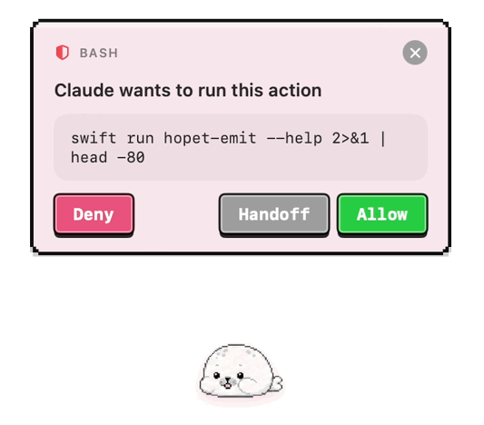

<p align="center">
  <a href="./README.md">简体中文</a> · <b>English</b>
</p>

<p align="center">
  
</p>

<h1 align="center">Hopet</h1>

<p align="center">
  A macOS desktop AI pet that mirrors the live state of your
  <a href="https://claude.com/claude-code">Claude Code</a> and
  <a href="https://github.com/openai/codex">Codex CLI</a> sessions.
</p>

<p align="center">
  <a href="./LICENSE"></a>
  
  
  
  
  
</p>

---

## About

Hopet is a desktop AI coding companion for macOS that turns the live
session state of Claude Code / Codex CLI into something you can actually
see: thinking, calling tools, awaiting confirmation, requesting
permission, completing, or failing — every transition is expressed
through pet animations, inline bubbles, and the menu-bar indicator.

It is not another chat window, but a lightweight companion layer that
lets you stay in your editor and still know, at a glance, what the agent
is doing, whether it needs you to step in, and whether the session is
making progress — without switching back to the terminal.

Hopet lifts the agent lifecycle out of the command line and makes it
clearer, and a little friendlier — adding a touch of order, and warmth,
to the long hours you spend pairing with an AI.

The release ships with the built-in **Hopi** theme: a hand-drawn pixel
seal with one animation per state. Prefer a different pet? Bring your own
with a name and eight GIFs.

## Supported AI tools

Hopet works through the lifecycle hooks of the agent CLIs, so the
following four entry points are covered:

- **Claude Code** — the `claude` CLI in any terminal
- **Claude Code for VS Code** — the official VS Code extension
- **Codex CLI** — the `codex` CLI in any terminal
- **Codex VS Code Extension** — the official VS Code extension

Because everything runs through the same `~/.claude/settings.json` and
`~/.codex/hooks.json` hooks, the host on top doesn't matter: Apple
Terminal, iTerm2, Ghostty, Warp, the embedded terminal of VS Code or
Cursor — they all behave the same.

Not supported: the browser version of Claude at claude.ai, and any
agent that isn't Claude Code or Codex (GitHub Copilot Chat, Gemini CLI,
Aider, etc.).

## Features

### Session awareness

- **Eight-state machine** covering every meaningful agent transition:
  `idle`, `responding`, `thinking`, `tool-use`, `permission-prompt`,
  `ask-user`, `completed`, and `error-interrupted`
- **Multi-session aggregation** — every active session feeds into a single
  pet, and the pet always reflects the highest-priority state across all
  of them (AskUser > Permission > Error > Tool > Thinking > Responding >
  Completed > Idle)
- **Leader highlight** — the session driving the current pet state is
  visually distinguished, so the answer to "which one is asking?" is
  always one glance away

### Hook integration

- **One-click install / uninstall** for both Claude Code and Codex CLI hook
  settings, performed via safe JSON merge so your existing hooks are kept
  intact
- **Unix Domain Socket IPC** with length-prefixed JSON framing for every
  event delivered from the CLI helper into the app
- **`hopet-emit` CLI helper** with full flag support (`--require`,
  `--exclude`, dotted field paths) — installed at `~/.hopet/bin/` and
  invoked by the registered hooks
- **Synchronous reply path** for `PermissionRequest` and
  `AskUserQuestion` — answers travel back through the same suspended hook
  socket, so Allow/Deny decisions and structured AskUser answers work
  uniformly across iTerm, Apple Terminal, VS Code, Cursor, Ghostty, and
  Warp embedded shells

### Desktop pet

- **Floating `NSPanel`** that lives above your windows without stealing
  focus, joins every Space, and stays out of `⌘Tab` cycling
- **Sprite animations** driven by the active theme — eight bundled
  animations for the Hopi theme, swapped via a short cross-dissolve on
  state changes
- **Drag-to-move** with persisted position
- **Inline interaction bubbles** — permission prompts expand into an
  Allow / Deny / Defer-to-terminal card; AskUserQuestion expands into a
  per-question answer card with options plus a free-text fallback

### Theme system

- **Built-in Hopi theme** — eight pixel-art seal animations bundled in the
  app
- **Custom themes** — drop in your own pet by importing a name and eight
  GIFs (one per `PetState`); imports are validated by UTI and frame count,
  copied to `~/.hopet/themes/<id>/` with a `manifest.json`, and any failed
  import rolls back so the directory never contains a half-installed
  theme
- **Apply / delete from the preferences panel**; user themes coexist with
  the built-in Hopi theme and survive app upgrades

### Preference panel

A standard macOS preferences window with seven tabs:

| Tab | Purpose |
| --- | --- |
| Overview | Pet status snapshot and active session list |
| Themes | Built-in + user themes, import / apply / delete |
| Appearance | Pet rendering options |
| Hooks | Claude Code / Codex hook install state and doctor |
| Behavior | Drag snapping, idle visibility, FPS, etc. |
| Notifications | Per-category banner toggles |
| About | Version, build, and credits |

## Showcase

The Hopi theme covers all eight `PetState` values. Each GIF below is the
exact animation shipped with the app, in priority order.

<table width="100%">
  <tr>
    <td align="center" width="25%"></td>
    <td align="center" width="25%"></td>
    <td align="center" width="25%"></td>
    <td align="center" width="25%"></td>
  </tr>
  <tr>
    <td align="center" width="25%"><b>Ask User</b></td>
    <td align="center" width="25%"><b>Permission Prompt</b></td>
    <td align="center" width="25%"><b>Error / Interrupted</b></td>
    <td align="center" width="25%"><b>Tool Use</b></td>
  </tr>
  <tr>
    <td align="center" width="25%"></td>
    <td align="center" width="25%"></td>
    <td align="center" width="25%"></td>
    <td align="center" width="25%"></td>
  </tr>
  <tr>
    <td align="center" width="25%"><b>Thinking</b></td>
    <td align="center" width="25%"><b>Responding</b></td>
    <td align="center" width="25%"><b>Completed</b></td>
    <td align="center" width="25%"><b>Idle</b></td>
  </tr>
</table>

<p align="center">
  
</p>

## Install

Requirements: macOS 14+ on Apple Silicon. (Intel builds are not shipped
in 0.1.0 — build from source if you need one.)

1. Download the latest `Hopet-<version>.dmg` from the
   [Releases page](https://github.com/BinaryFroggy/Hopet/releases/latest).
2. Open the DMG and drag **Hopet** into **Applications**.
3. The release is **ad-hoc signed** (no Apple Developer ID). On first
   launch macOS will block it with _"Hopet" can't be opened because Apple
   cannot check it for malicious software._ To bypass:
   - **Right-click** Hopet.app in Applications → **Open** → **Open** in
     the confirmation dialog, **or**
   - run once from Terminal: `xattr -dr com.apple.quarantine /Applications/Hopet.app`

On first launch the app automatically installs hooks for every
recognized AI tool (Claude Code, Codex CLI) and copies the
`hopet-emit` helper to `~/.hopet/bin/`. The merge is non-destructive
— existing hooks in `~/.claude/settings.json` and `~/.codex/hooks.json`
are preserved. Subsequent launches skip the step if the hooks are
already in place.

The **Hooks** tab in Preferences shows install status, runs the
diagnostic Doctor, and offers per-tool listener toggles for soft-muting
events without touching the hook files.

Want a custom pet? Open the **Themes** tab, click _Import Theme…_, give
it a name, and supply the matching animation GIFs. Single files, a
folder, or a zip archive are all accepted. The imported theme lands in
`~/.hopet/themes/<id>/` and is selectable alongside Hopi.

## Build from source

Requirements: macOS 14+, Swift 5.10+ (Command Line Tools is enough).

```bash
swift run Hopet                  # build both targets and launch
swift build                      # compile only
swift run hopet-emit --help      # inspect the CLI helper's flags
```

## Architecture & protocol

- [DevDocs/architecture.md](./DevDocs/architecture.md) — state machine,
  aggregator, IPC framing, and module boundaries
- [DevDocs/features.md](./DevDocs/features.md) — feature inventory and UI
  behavior in depth
- [DevDocs/hooks-and-priority.md](./DevDocs/hooks-and-priority.md) — hook
  event schema and priority resolution
- [DevDocs/preferences.md](./DevDocs/preferences.md) — preference keys
  and theme import contract

## License

Released under the [MIT License](./LICENSE). © 2026 BinaryFroggy.
