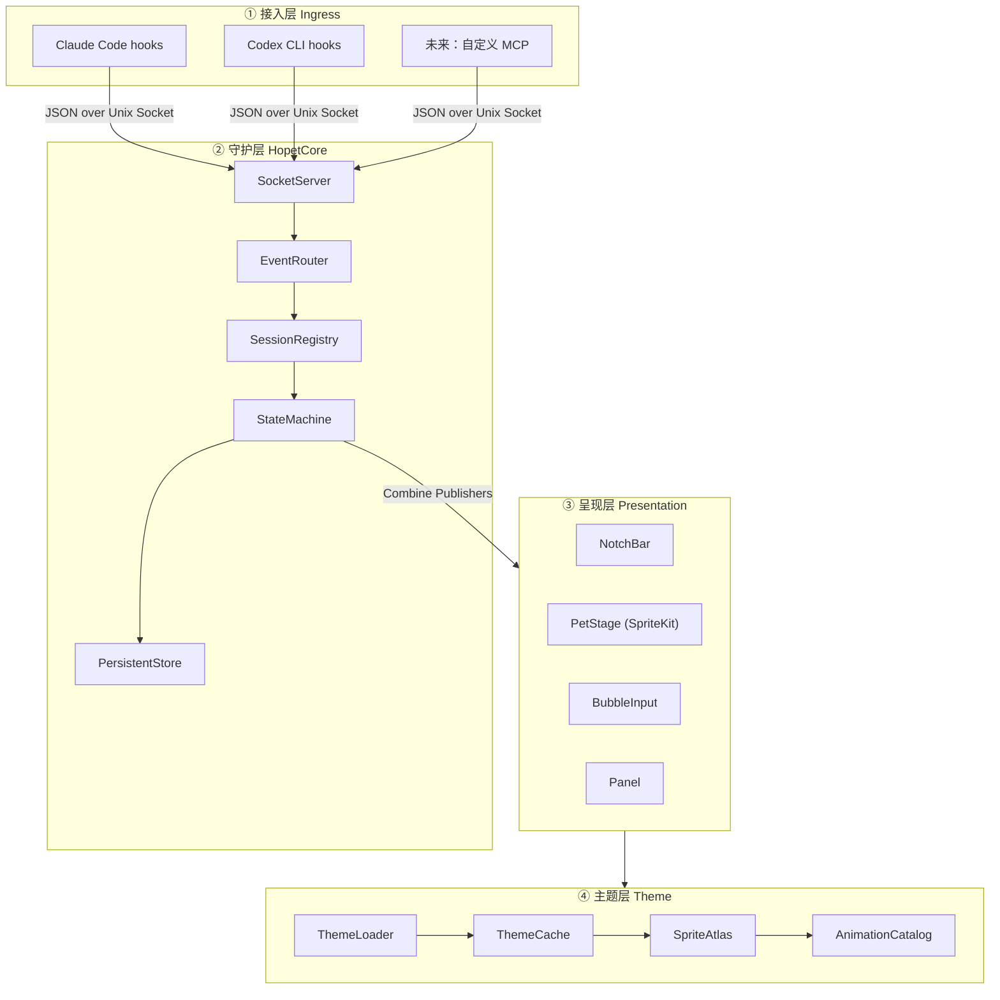
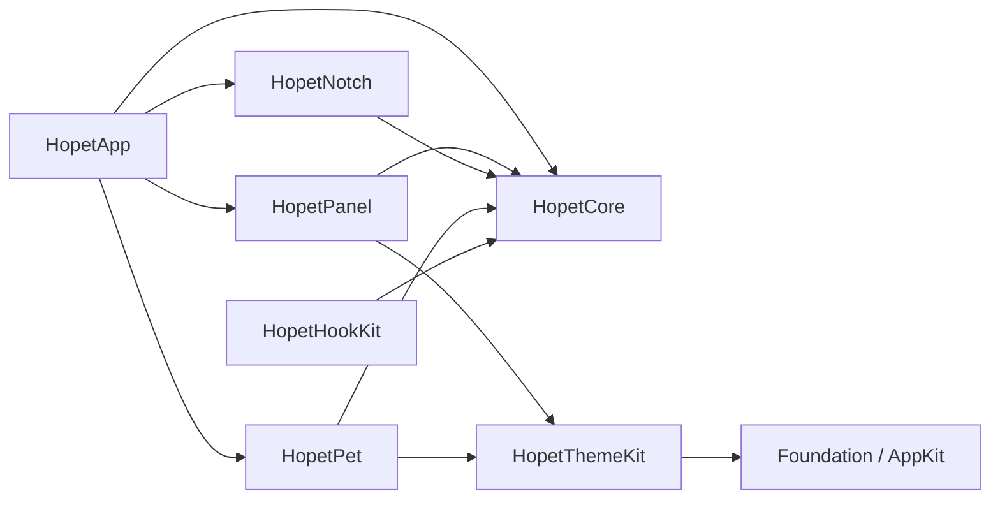
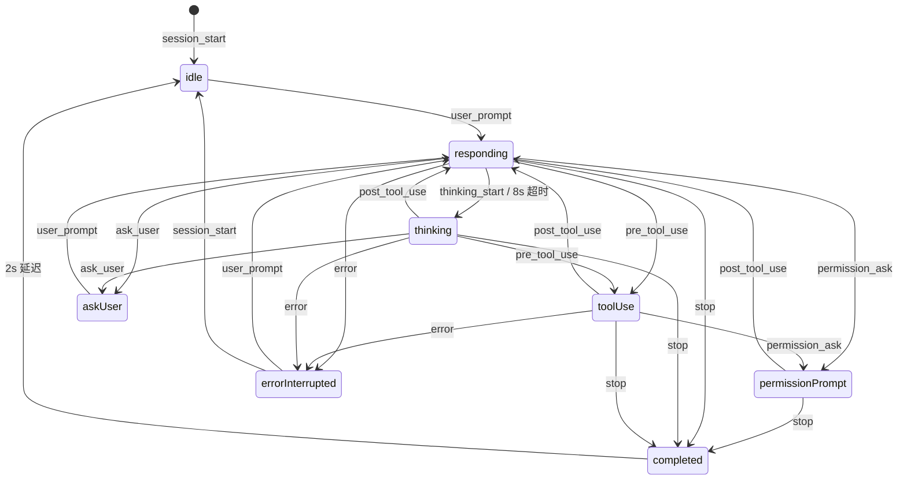

# Hopet 技术架构设计文档 v0.1

> 版本：0.1 (初版)
> 最后更新：2026-04-24
> 状态：Draft — 待评审后开始 v0.1 实现

---

## 1. 概述

### 1.1 项目定位

**Hopet** 是一款 macOS 原生桌面宠物软件，专为与 AI 命令行助手（Claude Code、Codex CLI 等）协作的开发者设计。它将 AI 会话的生命周期——从空闲、回复、工具调用，到需要用户确认或回答问题——转译成桌面上一只活着的小宠物的动作与表情，让用户在抬头的瞬间就能感知「AI 现在在做什么、是否需要我」。

### 1.2 核心能力

下表中 v0.1 即"MVP 必须交付"，v0.2+ 表示已设计、留接口、但本期不交付。

| 能力 | v0.1 | v0.2+ |
| --- | --- | --- |
| 状态感知动画（idle / responding / thinking / tool-use / permission-prompt / completed / error-interrupted） | ✅ Claude Code 全链路 | — |
| 状态感知动画（ask-user） | ✅ 通过 Claude 内置 `AskUserQuestion` tool 的 `PreToolUse` / `PostToolUse` hook + `tool_name` 过滤识别 | — |
| Claude Code hooks 接入 | ✅ | ✅ |
| Codex 接入 | ⚠️ 实验性"完成通知"（基于 `notify` 字段） | ✅ 完整生命周期 |
| 刘海屏 Dynamic Notch + 无刘海机型降级顶条 | ✅ | ✅ |
| 桌面宠物（**每个 AI 工具一只**：Claude / Codex 各 1，含拖拽、位置记忆） | ✅ | ✅ |
| 会话气泡（每只宠物周围环绕，每个气泡 = 1 个活跃 session） | ✅ 默认显示一层 cwd / 标题 / 距上次状态变更耗时 | ✅ + 拖拽重排 |
| 状态聚合（多会话 → 单宠物按优先级聚合，详见 [hooks-and-priority.md §2](./hooks-and-priority.md#2-petstate-优先级)） | ✅ | ✅ |
| 点击宠物本体 → 弹出"目录选择 + 输入"对话框 → 新开终端启动 CLI | ✅ | ✅ |
| 点击会话气泡 → 展开输入框 → 注入到该 session | ✅ 通过 PTY (pseudo-terminal，伪终端) wrapper 路径（Hopet 启动的 session）；外部启动 session 退化为剪贴板复制 | ✅ + Accessibility (AX) 注入兼容外部 session |
| AskUserQuestion 触发 → 该 session 气泡自动展开为对话气泡，原位回答 | ✅ | ✅ |
| 内置默认 Hopi 主题 | ✅ | ✅ |
| `.hopettheme` 第三方主题导入 | — | ✅ |
| AI 工具 ↔ 主题绑定 | 全局单一主题 | 按 AI 工具分别绑定 |
| 宠物管理面板（Overview / Themes / Bindings / Hooks / Behavior / Notifications / About） | ✅ 骨架 | ✅ 完整 |
| Hook 安装向导 + Doctor | ✅ | ✅ |
| `hopet` CLI 伴侣 | — | ✅ |
| Sparkle 自动更新 | — | ✅ |

### 1.3 非目标（v0.1）

- 不做云同步、账号系统、主题商店。
- 不做 Windows / Linux 跨端。
- 不内置语音、TTS、LLM 推理。
- 不替代 AI 工具的终端 UI，仅做"表情层"。

### 1.4 读者对象

- Hopet 项目的开发者与贡献者。
- 需要了解 hooks 协议以便接入新 AI 工具的集成者。
- 需要了解主题规范以便制作自定义主题的设计师。

---

## 2. 术语表

| 术语 | 含义 |
| --- | --- |
| **Hopet.app** | 用户可见的主 App，提供宠物渲染、管理面板、刘海条 UI。 |
| **HopetCore** | 内置在 App 主进程内的守护子系统，负责 IPC、会话状态机、事件分发。 |
| **Session** | 一个活跃的 AI CLI 会话（Claude Code / Codex 的一个运行实例），由 `sessionId` 唯一标识。 |
| **PetInstance** | 一只宠物的渲染实例，1:1 绑定一个 `AITool`（v0.1 即 Claude / Codex 各一只），状态由该 AI 下所有活跃 session 聚合得出。 |
| **SessionBubble** | 围绕宠物环绕的会话气泡，1:1 绑定一个 Session，承载 cwd / 标题 / 状态时长等元信息。 |
| **ThemePackage** | 一个主题包，包含动画资源与 manifest.json。 |
| **Hook 脚本** | AI 工具在状态转换点调用的 shell 脚本，把事件推送到 HopetCore。 |
| **IPC Socket** | HopetCore 暴露的 Unix Domain Socket，hooks 通过它投递事件。 |
| **StateEvent** | 一次状态转换事件，JSON 格式，包含 sessionId、新状态、payload 等。 |
| **Notch Bar** | 刘海条 UI，刘海区域吸附、展开的信息带。 |

---

## 3. 系统全景

### 3.1 四层架构



### 3.2 数据流（一次典型事件）

1. 用户在终端里向 Claude Code 发送消息。
2. Claude Code 触发 `UserPromptSubmit` hook → 调用 `~/.hopet/bin/hopet-emit --tool claude-code --event user_prompt`（详见 §8.4）。
3. `hopet-emit` 解析 stdin payload，把规范化的 JSON 事件写入 `$HOME/.hopet/run/hopetd.sock`。
4. **HopetCore.SocketServer** 解包 → **EventRouter** 根据 `sessionId` 定位 Session → **StateMachine** 状态变为 `responding`。
5. 状态变更通过 Combine `Publisher` 推送给订阅者。
6. **PetStage** 切换到 responding 动画；**NotchBar** 更新文案为「Claude 正在思考...」。
7. 当 Claude 回复完成触发 `Stop` hook，重复上述链路，状态回到 `completed` → 2 秒后回到 `idle`。

### 3.3 进程模型

- **单进程**：Hopet.app 是一个 macOS App Bundle，所有子系统运行在同一进程内。
- **无后台 launchd**：v0.1 不注册 LaunchAgent，用户关闭 App 即停止服务；App 随系统启动通过标准 "登录项" 实现。
- **子进程**：仅在点击气泡"新开会话"时 `NSWorkspace.open` 拉起终端 App + CLI，子进程与 Hopet.app 解耦。

---

## 4. 技术选型

### 4.1 语言与框架

| 层 | 技术 | 理由 |
| --- | --- | --- |
| App 入口 / 偏好面板 | **SwiftUI** (macOS 14+) | 声明式、组合式 UI，适合偏好面板与管理列表。 |
| 宠物渲染 | **SpriteKit** + `SKView` | 帧动画原生支持、GPU 加速、轻量。 |
| 刘海条 / 气泡 | **AppKit** (`NSPanel`, `NSWindow`) + SwiftUI 嵌入 | 需要 `.nonactivatingPanel`、自定义 levels、跨 Space 行为，SwiftUI 场景不够。 |
| IPC | **Network.framework** `NWListener` (Unix path) | 苹果推荐、无第三方依赖、内建 TLS（本场景不需要但可选）。 |
| 并发 | **Swift Concurrency** (async/await, actors) + **Combine** 做状态广播 | 状态机天然适合 actor；UI 订阅用 Combine Publishers。 |
| 持久化 | `JSONEncoder` + 文件 (`~/.hopet/state/*.json`) | 数据量小，无需 Core Data / SQLite。 |
| 主题压缩 | `Foundation` 的 `FileManager` + **ZIPFoundation** (SPM) | ZIP 解包。 |
| 命令行参数（hopet CLI 伴侣，后续版本） | **swift-argument-parser** | 官方标准。 |

### 4.2 最低系统要求

- **macOS 14.0 Sonoma** 及以上。
  - SwiftUI `MenuBarExtra` 稳定；`NSPanel` 的 stage manager 行为成熟。
  - Sonoma 起 Dynamic Notch 相关 API（通过 `NSScreen.safeAreaInsets`）稳定可用。
- **Apple Silicon 优先**，同时兼容 Intel（不依赖 Neural Engine）。

### 4.3 构建与发布

- **Xcode 15+**，SwiftPM 管理三方依赖。
- **代码签名**：不申请 Apple Developer ID，CI 产物仅做 ad-hoc 签名 (`codesign -s -`)。作为开源项目，不走公证 (Notarization) 流程。
- **分发形式**：GitHub Releases 发布 `.dmg`。
- **Gatekeeper 限制**：未公证 App 在 macOS 14+ 默认会被 Gatekeeper 拦截。README 需明确告知用户两种打开方式：
  1. 终端执行 `xattr -dr com.apple.quarantine /Applications/Hopet.app`
  2. 或先尝试打开（被拦截后），到 "系统设置 → 隐私与安全性" 点 "仍要打开"
- **Homebrew 分发**：v0.2+ 视情况维护一个自有 tap (`brew install --cask <user>/hopet/hopet`)。**不承诺进入 Homebrew 官方 cask 仓库** —— 官方 cask 对未签名 App 的接收规则在变化，是否被接受取决于届时签名/公证状态。
- **已知限制（写入 README 与 8.1 Onboarding）**：未签名版本每次升级后 TCC (Transparency, Consent and Control，macOS 权限数据库) 会遗忘授权，用户需重新勾选 Accessibility / Automation / Notifications。
- **自动更新**（v0.2+）：Sparkle 2（注意：未签名的 Sparkle 更新流程需要额外配置 EdDSA 签名而非 code signing）。

### 4.4 依赖清单（v0.1）

| 依赖 | 用途 | 许可 |
| --- | --- | --- |
| ZIPFoundation | 主题 `.hopettheme` 解压 | MIT |
| (可选) Sparkle | 自动更新 | MIT |

保持依赖极简是 v0.1 的硬约束。

---

## 5. 模块划分

Hopet 按职责划分为 7 个 Swift 模块（以 SPM target 或 Xcode framework 组织）。依赖方向自上而下、单向：



### 5.1 HopetCore（守护核心）

核心职责：接收 hook 事件、维护会话状态机、广播给 UI。

- `SocketServer` — 基于 `NWListener` 的 Unix Socket 服务端
- `EventDecoder` — 长度前缀 JSON 帧解码
- `SessionRegistry: actor` — 所有活跃 Session 的注册表
- `SessionStateMachine` — 单个 Session 的状态转换逻辑
- `StatePublisher` — `PassthroughSubject<StateSnapshot, Never>` 广播器
- `PersistentStore` — 将 Session 最近状态落盘，重启可恢复

### 5.2 HopetPet（宠物渲染）

- `PetWindow: NSPanel` — 置顶、非激活、跨 Space 的宿主窗口
- `PetScene: SKScene` — SpriteKit 场景，含动画播放机
- `AnimationController` — 根据状态订阅切换 clip；管理过渡（fade / cross-dissolve）
- `PetPositionManager` — 多实例避让、屏幕边缘吸附、位置持久化
- `HitTestProxy` — 透明窗口的精准点击区域（只在宠物像素上响应）

### 5.3 HopetNotch（刘海条）

- `NotchDetector` — 通过 `NSScreen.auxiliaryTopLeftArea / safeAreaInsets` 判断机型
- `NotchWindow: NSPanel` — 吸附在刘海区域的无边框窗口
- `NotchView: SwiftUI` — 三态：collapsed / expanded / fullBubble
- `FallbackTopBarWindow` — 无刘海机型降级为顶部细条
- `BubbleInputController` — 展开输入气泡、接管键盘焦点、提交回调

### 5.4 HopetPanel（管理面板）

- `PreferencesWindow` — 标准 macOS 偏好窗口（Tabs）
- `PetListView` — 当前活跃宠物与已配置宠物
- `BindingEditor` — AI 工具 ↔ 主题映射
- `ThemeGallery` — 已安装主题缩略图 + 导入入口
- `HookInstallerView` — 一键安装/卸载 hooks 到用户的 Claude/Codex 配置

### 5.5 HopetThemeKit（主题）

- `ThemeLoader` — 从目录加载 manifest + 资源；支持 `.hopettheme` 解压
- `ThemeValidator` — 校验 manifest schema、必需动画帧完整性
- `SpriteAtlasBuilder` — 把 PNG 序列打包为运行时 `SKTextureAtlas`
- `AnimationCatalog` — 状态 → clip 的映射表
- `ThemeCache` — 主题对象的内存缓存（LRU，限 3 个同时加载）

### 5.6 HopetHookKit（Hook 工具）

- `HookScriptTemplates` — Claude Code / Codex 的 hook 脚本模板（embedded resources）
- `HookInstaller` — 写入到 `~/.claude/settings.json` 或 `~/.codex/config.toml` 的对应字段
- `HookUninstaller` — 逆向清理
- `HookDoctor` — 诊断 hooks 是否已正确安装与可执行

### 5.7 HopetApp（入口）

- `AppDelegate` — NSApplication 生命周期、登录项注册
- `MenuBarItem` — `MenuBarExtra` 快捷入口（显示/隐藏宠物、打开面板、退出）
- `SceneRouter` — 协调各窗口（PetWindow / NotchWindow / Preferences）显示

---

## 6. 数据模型

所有核心模型均为 `Codable` 的 Swift `struct`，可直接序列化进磁盘与 IPC。

### 6.1 AI 工具

```swift
enum AITool: String, Codable, CaseIterable {
    case claudeCode = "claude-code"
    case codex       = "codex"
    case custom      // 预留：用户自定义接入
}
```

### 6.2 Session

```swift
struct Session: Codable, Identifiable {
    let id: String              // sessionId (UUID or hook 提供)
    let tool: AITool
    let cwd: String             // 会话工作目录（绝对路径）
    let cwdLastComponent: String // cwd 仅最后一层（如 "Hopet"），用于气泡显示
    var title: String?          // 会话标题：从首条 prompt 截断 32 字符派生；无 prompt 时使用 cwdLastComponent
    let terminalApp: String?    // 已知所在终端 bundleId
    let startedAt: Date
    var currentState: PetState
    var stateSince: Date        // 上次状态变更时刻，气泡展示"距今"用
    var lastPromptSnippet: String? // 最近一条 user prompt 摘要（截断 256 字符，可关闭）
    var ptyHandle: PTYHandle?   // 仅 Hopet 通过 PTY wrapper 启动的 session 持有；外部 session 为 nil
}
```

### 6.3 PetState

```swift
enum PetState: String, Codable {
    case idle
    case thinking
    case responding
    case toolUse          = "tool-use"
    case permissionPrompt = "permission-prompt"
    case askUser          = "ask-user"
    case completed
    case errorInterrupted = "error-interrupted"
}
```

### 6.4 StateEvent（IPC payload）

```swift
struct StateEvent: Codable {
    let schema: Int            // 协议版本，当前 1
    let sessionId: String
    let tool: AITool
    let event: EventKind
    let timestamp: Date
    let cwd: String?
    let terminalApp: String?
    let payload: [String: AnyCodable]?
}

enum EventKind: String, Codable {
    case sessionStart     = "session_start"
    case sessionEnd       = "session_end"        // SessionEnd hook，用于淘汰会话气泡
    case userPrompt       = "user_prompt"
    case preToolUse       = "pre_tool_use"
    case postToolUse      = "post_tool_use"
    case thinkingStart    = "thinking_start"
    case permissionAsk    = "permission_ask"
    case askUser          = "ask_user"           // Claude 调用 AskUserQuestion tool 时（PreToolUse 触发）
    case askUserResolved  = "ask_user_resolved"  // AskUserQuestion 完成（PostToolUse 触发）
    case stop             = "stop"
    case error            = "error"              // PostToolUseFailure / StopFailure 共用
}
```

### 6.5 PetInstance 与 SessionBubble

**关键变化（v0.1 起）**：宠物按 **AI 工具** 实例化（Claude 一只、Codex 一只），不再按 session。每只宠物周围环绕若干 `SessionBubble`，每个气泡对应该 AI 下的一个活跃 session。

```swift
struct PetInstance: Identifiable {
    let id: UUID                       // 渲染实例 id
    let tool: AITool                   // 关键：宠物绑定的是 AI 工具
    var themeId: String
    var screenPosition: CGPoint        // 宠物本体的中心坐标
    var visible: Bool
    var aggregatedState: PetState      // 所有 session 中最高优先级状态（见 §7.4）
    var drivenBySessionId: String?     // 当前驱动动画的那个 session（高亮该气泡）
}

struct SessionBubble: Identifiable {
    let id: String                     // = sessionId
    let tool: AITool                   // 用于定位归属哪只宠物
    var orbitAngle: Double             // 气泡在宠物周围的角度位置 (0–360°)
    var orbitRing: Int                 // 第几环（默认 0；超过 6 个气泡时第二环为 1，依此类推）
    var displayTitle: String           // 派生自 Session.title，再次截断到 18 字符
    var displayCwd: String             // 派生自 Session.cwdLastComponent
    var displayElapsed: String         // 由 stateSince 实时计算（"3s" / "2m" / "1h"）
    var state: PetState                // 该 session 自身状态
    var expanded: Bool                 // 是否展开为输入气泡
}
```

气泡布局算法、视觉规格见 §[12.4](#124-会话气泡布局算法)。

**气泡生命周期**：
- **创建**：`session_start` → 在该 AI 的宠物周围插入新气泡，按 `startedAt` 顺序顺时针排列
- **更新**：`stateSince` 变化 → 重算 `displayElapsed`；`title` 变化 → 重算 `displayTitle`
- **淘汰**：`session_end` 或 60 分钟无事件 → 气泡淡出动画 0.3s 后移除，剩余气泡重排

### 6.6 ThemePackage

> 设计要点：磁盘 manifest 与运行时 model 分两层。manifest 允许 `frames` 是 glob 字符串（用户友好），运行时 `ThemeLoader` 展开为有序数组后构造 `ThemePackage`。

**磁盘 manifest（与 manifest.json 一一对应，仅在导入/加载时使用）：**

```swift
struct ThemeManifest: Codable {
    let id: String
    let name: String
    let version: String
    let author: String?
    let description: String?
    let minAppVersion: String
    let defaultSize: CGSize
    let anchorPoint: CGPoint
    /// JSON key 为 PetState rawValue（如 "tool-use"、"permission-prompt"），用 [String: ManifestClip]
    /// 而非 [PetState: ...]，避免自定义 KeyDecodingStrategy。
    let animations: [String: ManifestClip]
}

struct ManifestClip: Codable {
    let frames: ManifestFrames   // glob 字符串 或 路径数组
    let fps: Double
    let loop: Bool
    let transition: TransitionStyle?
}

enum ManifestFrames: Codable {
    case glob(String)            // "sprites/idle/*.png"
    case explicit([String])      // ["sprites/idle/0001.png", ...]
    // 自定义 init(from:)/encode(to:) 自动判断
}
```

**运行时 model（HopetCore 与 HopetThemeKit 内部使用）：**

```swift
struct ThemePackage {
    let id: String
    let name: String
    let version: String
    let author: String?
    let description: String?
    let minAppVersion: String
    let defaultSize: CGSize
    let anchorPoint: CGPoint
    /// ThemeLoader 已经把 glob 展开、把 String key 映射为 PetState 枚举。
    /// 若 manifest 缺少某个 state，用 .idle 兜底，并在加载日志里记录 fallback。
    let animations: [PetState: AnimationClip]
}

struct AnimationClip {
    let frames: [URL]            // 已绝对路径化，可直接交给 SKTextureAtlasBuilder
    let fps: Double
    let loop: Bool
    let transition: TransitionStyle
}

enum TransitionStyle: String, Codable {
    case cut, fade, crossDissolve = "cross-dissolve"
}
```

**约定**：
- manifest 解析失败 → 整个主题导入失败
- 单个 state 缺帧 → 该 state fallback 到 `idle`，导入成功但 UI 显示警告徽章
- `ThemePackage` 不实现 `Codable`，避免与 manifest 来回切换的混乱

### 6.7 Binding（AI ↔ 主题）

```swift
struct ToolThemeBinding: Codable {
    var tool: AITool
    var themeId: String
}
```

---

## 7. 会话状态机

### 7.1 状态图



### 7.2 转换表

| 当前状态 | 事件 | 下一状态 | 事件来源 / 备注 |
| --- | --- | --- | --- |
| *（任意）* | `session_start` | idle | Claude `SessionStart` hook，注册 Session、创建对应气泡 |
| *（任意）* | `session_end` | *（移除）* | Claude `SessionEnd` hook，从 Registry 移除 Session、淘汰气泡、触发宠物聚合重算 |
| idle | `user_prompt` | responding | Claude `UserPromptSubmit` hook，记录 lastPromptSnippet |
| responding | `thinking_start` | thinking | **由 Core 定时器主动判定**（responding 持续 ≥ 8s），无对应 hook |
| responding / thinking | `pre_tool_use` | toolUse | Claude `PreToolUse` hook，**且 `tool_name != "AskUserQuestion"`**（AskUserQuestion 走上面的 `ask_user` 行） |
| toolUse | `post_tool_use` | responding | Claude `PostToolUse` hook，**且 `tool_name != "AskUserQuestion"`** |
| toolUse / responding | `permission_ask` | permissionPrompt | **优先使用 Claude `PermissionRequest` hook**（若可用）；否则使用 `Notification` hook 并在脚本侧判断 `notification_type == "permission_prompt"`，不再无条件映射所有 Notification |
| permissionPrompt | `post_tool_use` / `stop` | responding / completed | 视后续事件 |
| responding / thinking / toolUse | `ask_user` | askUser | Claude `PreToolUse` hook 且 `tool_name == "AskUserQuestion"`（hopet-emit 用 `--require tool_name=AskUserQuestion` 路由） |
| askUser | `ask_user_resolved` | responding | Claude `PostToolUse` hook 且 `tool_name == "AskUserQuestion"`（用户完成回答，AskUserQuestion tool 返回） |
| askUser | `user_prompt` | responding | 兜底：若用户主动新发 prompt 而 PostToolUse 漏触发 |
| *（任意）* | `error` | errorInterrupted | Hook 显式 `error` 或 stderr 解析（v0.2+） |
| errorInterrupted | `user_prompt` / `session_start` | responding / idle | 由后续事件恢复 |
| responding / toolUse / thinking | `stop` | completed | Claude `Stop` hook |
| completed | *（2s timeout）* | idle | 自然回到待命 |

### 7.3 超时与降级

| 规则 | 描述 |
| --- | --- |
| **Thinking 自动升级** | Core 定时器（每 500ms 扫描）若 `responding` 停留超过 8s 则主动切 `thinking`，无需 hook 显式上报 |
| **toolUse 长执行** | `toolUse` **不做自动 idle 降级**。`npm install` / `xcodebuild` / `pytest` 等长任务可能在 `pre_tool_use` 后数分钟无任何事件，必须严格等待 `post_tool_use` / `error` / `stop`。当 toolUse 持续 ≥ 30s，刘海条文案追加 elapsed timer（如「执行 Bash · 02:13」）作为视觉提示 |
| **responding 长执行** | 类似 toolUse，超过 8s 切 `thinking`；`thinking` 状态本身不再二次降级 |
| **孤儿 Session 清理** | 60 分钟无任何事件 → 从 Registry 移除（释放宠物窗口） |
| **App 重启恢复** | 启动时 `state/sessions.json` 中 10 分钟内的 Session 恢复为 `idle` 灰度态，等待新事件唤醒 |
| **动画过渡最小间隔** | 连续状态变更间隔 < 300ms 时合并，避免抖动 |

> 注意：Hopet **不假设** hook 脚本会发 heartbeat。Core 不基于"x 秒无事件"做主动状态推断（thinking 升级除外，因为它只发生在 `responding` 内）。

### 7.4 宠物聚合状态（多 session → 单宠物）

宠物按 AI 工具实例化（每个 AI 一只），其 `aggregatedState` 等于该 AI 下所有活跃 session 的最高优先级状态。

**优先级表、聚合算法、tie-break 规则、边界情况** —— 单一权威来源在 [hooks-and-priority.md §2 与 §3](./hooks-and-priority.md#2-petstate-优先级)。本节仅描述触发与广播的 Combine 链路：

```
Session.currentState 变化
    │
    ▼
SessionRegistry.didMutate(.session(id, newState))
    │
    ▼
PetAggregator.recompute(tool: ..)   ← 同步执行
    │
    ▼
PetInstance.aggregatedState 改变
    │
    ▼  Combine: petStatePublisher
    ▼
HopetPet.AnimationController        ← 切换宠物动画
HopetNotch.NotchView                ← 更新刘海条文案
HopetPet.SessionBubbleHost          ← 更新被高亮的 leader 气泡
```

`PetAggregator` 实现于 HopetCore；订阅者使用 `.removeDuplicates()` 防止冗余动画切换。

---

## 8. 附录 A：IPC 协议

### 8.1 传输

- **类型**：Unix Domain Socket（STREAM）
- **路径**：`$HOME/.hopet/run/hopetd.sock`
- **权限**：`0600`，仅当前用户可读写
- **可用性**：Hopet.app 启动时创建，退出时删除；启动若发现残留 socket 先尝试连接，连接失败则 unlink 重建

### 8.2 帧格式

长度前缀 JSON，单向：hook → HopetCore。

```
┌─────────── 4 bytes ───────────┬──────── N bytes ────────┐
│  payload length (UInt32 BE)    │   UTF-8 JSON payload    │
└───────────────────────────────┴────────────────────────┘
```

Hopet 不强制要求 ack；hook 脚本 fire-and-forget 即可，失败静默不阻塞 AI 主流程。

### 8.3 StateEvent JSON Schema（v1）

```json
{
  "$schema": "http://json-schema.org/draft-07/schema#",
  "type": "object",
  "required": ["schema", "sessionId", "tool", "event", "timestamp"],
  "properties": {
    "schema":      { "const": 1 },
    "sessionId":   { "type": "string", "minLength": 1 },
    "tool":        { "enum": ["claude-code", "codex", "custom"] },
    "event":       {
      "enum": [
        "session_start", "session_end",
        "user_prompt",
        "pre_tool_use", "post_tool_use",
        "thinking_start", "permission_ask",
        "ask_user", "ask_user_resolved",
        "stop", "error"
      ]
    },
    "timestamp":   { "type": "string", "format": "date-time" },
    "cwd":         { "type": "string" },
    "terminalApp": { "type": "string" },
    "payload":     { "type": "object" }
  }
}
```

### 8.4 Claude Code Hook 脚本样例

#### 8.4.1 `hopet-emit` Helper

为避免 shell 字符串拼接 JSON 时的引号/换行/反斜杠注入风险，HopetHookKit 在 App 安装时把一个 **静态链接的 Swift CLI 小工具** `hopet-emit` 拷贝到 `~/.hopet/bin/hopet-emit`。它的职责单一：

1. 读 stdin 上的 Claude/Codex 原始 hook JSON
2. 与命令行参数合并为合法 `StateEvent` JSON（用 `JSONEncoder`，绝不字符串拼接）
3. 长度前缀帧写入 `~/.hopet/run/hopetd.sock`
4. socket 不存在或写入失败时静默退出 0，绝不阻塞 AI 主流程

调用接口：

```text
hopet-emit --tool <claude-code|codex> --event <event-kind>
            [--require <field>=<value> ...]
            [--exclude <field>=<value> ...]
            < hook_payload.json
```

`--require` 与 `--exclude` 用于在 helper 内部对 stdin JSON 做条件过滤（字段路径支持点号嵌套，如 `tool_input.command`）：

- 所有 `--require` 必须**全部满足**才发送事件
- 任一 `--exclude` 条件**满足**则**不**发送事件
- 不满足时 helper 静默退出 0，**不发送事件**，绝不阻塞 hook 主流程

典型用法：

```text
# 仅 permission 类 Notification 触发 permission_ask
hopet-emit --tool claude-code --event permission_ask \
           --require notification_type=permission_prompt

# AskUserQuestion 是普通 tool，但要单独走 ask_user 而非 pre_tool_use
hopet-emit --tool claude-code --event ask_user \
           --require tool_name=AskUserQuestion

# 普通 tool 调用：排除 AskUserQuestion，避免和上面的 ask_user 双发
hopet-emit --tool claude-code --event pre_tool_use \
           --exclude tool_name=AskUserQuestion
```

把"哪些 hook 子类型算什么状态"的决策放在 settings.json 与 helper flag 中，shell 端保持零脚本，规则可随 App 升级随时修订。

#### 8.4.2 `~/.claude/settings.json` 片段（HopetHookKit 自动 merge）

```json
{
  "hooks": {
    "SessionStart": [
      { "hooks": [{ "type": "command", "command": "~/.hopet/bin/hopet-emit --tool claude-code --event session_start" }] }
    ],
    "SessionEnd": [
      { "hooks": [{ "type": "command", "command": "~/.hopet/bin/hopet-emit --tool claude-code --event session_end" }] }
    ],
    "UserPromptSubmit": [
      { "hooks": [{ "type": "command", "command": "~/.hopet/bin/hopet-emit --tool claude-code --event user_prompt" }] }
    ],
    "PreToolUse": [
      { "hooks": [{ "type": "command", "command": "~/.hopet/bin/hopet-emit --tool claude-code --event ask_user --require tool_name=AskUserQuestion" }] },
      { "hooks": [{ "type": "command", "command": "~/.hopet/bin/hopet-emit --tool claude-code --event pre_tool_use --exclude tool_name=AskUserQuestion" }] }
    ],
    "PostToolUse": [
      { "hooks": [{ "type": "command", "command": "~/.hopet/bin/hopet-emit --tool claude-code --event ask_user_resolved --require tool_name=AskUserQuestion" }] },
      { "hooks": [{ "type": "command", "command": "~/.hopet/bin/hopet-emit --tool claude-code --event post_tool_use --exclude tool_name=AskUserQuestion" }] }
    ],
    "PostToolUseFailure": [
      { "hooks": [{ "type": "command", "command": "~/.hopet/bin/hopet-emit --tool claude-code --event error" }] }
    ],
    "PermissionRequest": [
      { "hooks": [{ "type": "command", "command": "~/.hopet/bin/hopet-emit --tool claude-code --event permission_ask" }] }
    ],
    "Notification": [
      { "hooks": [{ "type": "command", "command": "~/.hopet/bin/hopet-emit --tool claude-code --event permission_ask --require notification_type=permission_prompt" }] }
    ],
    "Stop": [
      { "hooks": [{ "type": "command", "command": "~/.hopet/bin/hopet-emit --tool claude-code --event stop" }] }
    ],
    "StopFailure": [
      { "hooks": [{ "type": "command", "command": "~/.hopet/bin/hopet-emit --tool claude-code --event error" }] }
    ]
  }
}
```

**两点关键路由设计**：

1. **AskUserQuestion 路由**：`AskUserQuestion` 是 Claude Code 的内置 tool，每次调用都走标准 `PreToolUse` / `PostToolUse` hook，payload 中 `tool_name == "AskUserQuestion"` 是非常可靠的判别字段。Hopet 把这两个 hook 各拆成两条注册：用 `--require` 抓 AskUserQuestion 单独路由到 `ask_user` / `ask_user_resolved`，用 `--exclude` 在普通 `pre_tool_use` / `post_tool_use` 中排除掉 AskUserQuestion，避免双发。
2. **PermissionRequest 路由**：同时注册 `PermissionRequest`（精确，主路径）与 `Notification + --require notification_type=permission_prompt`（兼容回退）。以 `PermissionRequest` 为主；若运行的 Claude Code 版本未实现该 hook，回退路径仍能正确识别，**避免对所有 Notification 误报为权限请求**。

#### 8.4.3 关于 `--require` 与 `payload` 字段

`hopet-emit` 在向 socket 发送的 `StateEvent.payload` 中，**仅保留以下白名单字段**（来自 Claude hook stdin），其它字段丢弃以减少敏感数据暴露：

- `tool_name`、`tool_input.command`（截断 256 字符）、`tool_input.file_path`
- `notification_type`、`message`（截断 256 字符）
- `session_id`、`cwd`

这与 §10.3 隐私边界一致。

### 8.5 Codex Hook 脚本样例（v0.1 实验性）

Codex CLI 当前没有 Claude Code 那种细粒度生命周期 hook 体系，主要通过 `~/.codex/config.toml` 的 `notify` 字段在每次 turn 完成时调用一个外部命令。

**v0.1 仅实现"完成通知实验支持"**，而非完整状态链路：

```toml
# ~/.codex/config.toml （HopetHookKit 自动 merge）
[notify]
command = ["~/.hopet/bin/hopet-emit", "--tool", "codex", "--event", "stop"]
```

**v0.1 Codex 的能力边界**（写入 README 与 Onboarding）：

| 状态 | 是否可识别 | 备注 |
| --- | --- | --- |
| `stop` / `completed` | ✅ | 来自 `notify` |
| `idle` | ✅ | `completed → 2s → idle` 自然回到 |
| `responding` / `thinking` / `tool-use` / `permission-prompt` | ❌ v0.1 | 无可靠事件源 |
| `ask-user` | ❌ v0.1 | 同上 |
| `error-interrupted` | ⚠️ | 仅当 `notify` payload 显式带 `status=error` 时识别 |

**v0.2+ 升级路径**：
- 若 Codex 增加细粒度 hooks，由 `hopet-emit` 直接消费
- 否则提供 `hopet codex` wrapper：以子进程方式包裹 `codex`，从 stdout/stderr 解析状态变化（实验性）

> v0.1 不承诺 Codex 的"正在回复"动画。在 Codex session 期间，宠物会处于 idle，直到 `notify` 触发 `completed` 动画。这是已知限制，需在功能矩阵 (features.md 2.1) 显式标注。

---

## 9. 附录 B：主题包规范

### 9.1 目录结构

解压后的主题形如：

```
hopi.default/
├── manifest.json
├── preview.png            # 主题列表缩略图 (240×240)
├── sprites/
│   ├── idle/              # 帧序列，按文件名排序播放
│   │   ├── 0001.png
│   │   ├── 0002.png
│   │   └── ...
│   ├── responding/
│   ├── thinking/
│   ├── tool-use/
│   ├── permission-prompt/
│   ├── ask-user/
│   ├── completed/
│   └── error-interrupted/
└── audio/                 # 可选，v0.2 启用
    └── notify.caf
```

分发形式：将整个目录打包为 `.hopettheme`（本质 zip），双击或拖入管理面板即可导入。

### 9.2 manifest.json 示例

`frames` 字段接受两种等价写法（参见 §6.6 `ManifestFrames`）：
- **glob 字符串**（推荐，主题作者友好）：如 `"sprites/idle/*.png"`，按文件名升序展开
- **路径数组**（精细控制顺序时使用）：如 `["sprites/idle/0001.png", "sprites/idle/0002.png", ...]`

```json
{
  "id": "hopi.default",
  "name": "Hopi",
  "version": "1.0.0",
  "author": "Hopet Team",
  "description": "内置默认主题：一只圆滚滚的小海豹",
  "minAppVersion": "0.1.0",
  "defaultSize": { "width": 128, "height": 128 },
  "anchorPoint": { "x": 0.5, "y": 0.0 },
  "animations": {
    "idle":              { "fps": 8,  "loop": true,  "frames": "sprites/idle/*.png" },
    "responding":        { "fps": 12, "loop": true,  "frames": "sprites/responding/*.png" },
    "thinking":          { "fps": 6,  "loop": true,  "frames": "sprites/thinking/*.png" },
    "tool-use":          { "fps": 14, "loop": true,  "frames": "sprites/tool-use/*.png" },
    "permission-prompt": { "fps": 10, "loop": true,  "frames": "sprites/permission-prompt/*.png" },
    "ask-user":          { "fps": 10, "loop": true,  "frames": "sprites/ask-user/*.png" },
    "completed":         { "fps": 12, "loop": false, "frames": ["sprites/completed/0001.png", "sprites/completed/0002.png"], "transition": "fade" },
    "error-interrupted": { "fps": 10, "loop": true,  "frames": "sprites/error-interrupted/*.png" }
  }
}
```

> 运行时 `ThemeLoader` 把上述 manifest 转换为 §6.6 的 `ThemePackage`，glob 在加载时一次性展开为 `[URL]`。运行时不再持有 glob 字符串。

### 9.3 校验规则

#### 9.3.1 解压前的安全校验（防 zip slip）

`.hopettheme` 解压**必须**在写盘前对每个 zip entry 执行：

1. **拒绝绝对路径**：entry path 不可以 `/` 开头或包含盘符
2. **拒绝路径穿越**：normalized path 不能包含 `..` 段
3. **拒绝 symlink / hard link entry**：v0.1 主题不允许任何符号链接，遇到直接拒绝
4. **拒绝特殊文件**：仅允许常规文件与目录，拒绝 device file、FIFO 等
5. **路径白名单后缀**：仅允许 `.json`、`.png`、`.apng`、`.caf`（v0.2 音频用）
6. **总体积 ≤ 50 MB，单文件 ≤ 10 MB，entry 数量 ≤ 5000**
7. **staging 目录使用随机 UUID**：`~/.hopet/themes/_staging/<uuid>/`
8. **move 前二次校验**：解压完成后，对每个文件再用 `realpath` 做一次校验，**所有文件最终绝对路径必须仍位于 `~/.hopet/themes/_staging/<uuid>/` 之内**，否则全量回滚

任一项失败 → 立即清理 staging 目录、终止导入、向用户显示具体错误码。

#### 9.3.2 主题语义校验

通过解压安全校验后，`ThemeValidator` 继续按顺序执行：

1. `manifest.json` 存在且通过 schema 校验（参考 §6.6 `ThemeManifest`）
2. `id` 不与已安装主题冲突（或提示升级 / 共存）
3. 8 种 `PetState` 动画键必须全部存在；任一缺失则该 state fallback 到 `idle`，并在导入结果里标注降级项
4. 所有 `frames` 引用的文件存在、宽高一致、格式为 PNG 或 APNG (Animated PNG)
5. `minAppVersion` ≤ 当前 App 版本
6. `id` 形如 `<author-id>.<theme-id>`（小写字母、数字、`-`、`.`），长度 ≤ 64

校验失败列出具体错误，导入终止，不影响已安装主题。

### 9.4 签名（预留，v0.2+）

为未来的主题商店预留 manifest 顶层 `signature` 字段。v0.1 只做本地导入，不做签名验证。

---

## 10. 安全与隐私

### 10.1 沙盒

- v0.1 **不启用 App Sandbox**（需写入 `~/.claude/settings.json`、`~/.codex/config.toml`、创建 socket），以未公证的 ad-hoc 签名形态分发。
- v0.2 考虑 Sandbox + User-Selected File Access；Hook 安装改为引导用户拖入配置文件。

### 10.2 网络

- v0.1 全离线：不发起任何出站网络请求。
- v0.2 可选：检查更新（Sparkle）、主题商店（需用户显式开启）。

### 10.3 数据边界

#### 10.3.1 是否离开本机

| 数据 | 是否离开本机 |
| --- | --- |
| Session 元数据（sessionId / cwd / 时间戳） | 否 |
| 用户 prompt 内容 | 否（仅存最近一条 256 字符摘要用于气泡 tooltip，可在偏好里关闭） |
| 主题资源 | 否（v0.1 仅本地） |
| 崩溃日志 | 否（v0.1 不上报；留本地 `~/.hopet/logs/`） |

#### 10.3.2 完整 payload 不落盘

Hook 输入的原始 JSON 可能包含**完整 prompt、tool_input、tool_response、文件路径、transcript path** 等敏感数据。Hopet 必须遵守以下硬规则：

| 数据流 | 允许在内存处理？ | 允许写日志/state？ |
| --- | --- | --- |
| 完整 hook payload（stdin） | ✅ 临时 | ❌ |
| `tool_input.command / file_path` 截断 256 字符 | ✅ | ⚠️ 仅在 debug 日志级别，且需用户在 Behavior 里显式开启 |
| `tool_response` | ✅ 临时（仅用于刘海条文案） | ❌ |
| `lastPromptSnippet` 256 字符 | ✅ | ✅ 写入 `state/sessions.json`，可在偏好里关闭 |
| 完整 prompt | ✅ 临时（仅用于注入 session，v0.2） | ❌ |

**默认日志只记录**：`event_kind`、`sessionId` 的前 8 位短 id、`tool`、`timestamp`、错误类型、错误码。**不记录 message body**。

debug 日志（`advanced.logLevel = debug`）可记录截断后的 payload 字段子集；菜单栏需显示一个红色 debug 徽章提示用户当前正在记录敏感数据。

### 10.4 权限

- **辅助功能**：气泡输入"注入到当前 session"功能需要 Accessibility 权限（向终端窗口发键盘事件）；首次使用时引导授权，未授权则降级为"新开会话"。
- **Apple Events / Automation**：识别终端前台窗口 / 打开新标签页需要 Automation 权限（针对 Terminal.app / iTerm / Ghostty / Warp 等常见终端，已在 Info.plist 声明用途）。
- **通知**：权限请求状态的横幅提醒需 User Notifications 授权。

---

## 11. 存储布局

```
~/.hopet/
├── config.json                 # 全局配置（启动项、刘海样式、默认主题、终端偏好）
├── bindings.json               # AI 工具 ↔ 主题绑定
├── themes/
│   ├── hopi.default/           # 内置主题（首次启动从 bundle 拷贝）
│   └── <user-theme-id>/        # 用户导入主题
├── bin/
│   ├── hopet-emit              # Swift CLI helper，所有 hook 都通过它发事件
│   └── hopet-pty               # PTY wrapper，由"点击宠物启动新 session"使用
├── state/
│   └── sessions.json           # 最近 Session 快照（启动时恢复 registry）
├── run/
│   └── hopetd.sock             # IPC Unix socket（运行时）
└── logs/
    └── hopet.log               # 滚动日志，≤10 MB，保留 3 份
```

- `themes/hopi.default/` 在 App 升级时如用户未修改则覆盖，用户修改过则跳过（用文件哈希判断）。
- `logs/` 默认按日轮转；可在偏好中关闭或清空。

---

## 12. 可扩展点

### 12.1 接入新的 AI 工具

1. 在 `AITool` 枚举增加 case（或使用 `.custom(identifier:)`）
2. 在 `HopetHookKit` 下实现 `HookInstaller` 协议的子类型，描述配置文件路径与字段
3. 在 settings.json / config.toml 中注册 `hopet-emit --tool <new-tool> --event <kind>`，无需写 shell 脚本（统一走 §8.4.1 的 helper）
4. 在 `HopetPanel` 的 HookInstallerView 注册新工具

整个过程无需修改 `HopetCore`，因为 Core 只关心 `StateEvent` 协议。

### 12.2 替换渲染器

`HopetPet` 的 `PetScene` 与 `AnimationController` 被封装在 `PetRenderer` 协议后：

```swift
protocol PetRenderer {
    func play(_ state: PetState, in theme: ThemePackage)
    var rendererView: NSView { get }
}
```

SpriteKit 实现为 `SpriteKitPetRenderer`，后续可新增 `Live2DPetRenderer`、`LottiePetRenderer`，主题 manifest 声明 `renderer` 字段即可动态选择。

### 12.3 云同步预留

- `bindings.json`、主题包均为自包含文件，v0.3 可简单地通过 iCloud Drive 或用户指定的同步目录做同步。
- Session 状态不同步（属于运行时数据）。

### 12.4 会话气泡布局算法

宠物按 AI 工具实例化（每个 AI 一只），周围环绕若干 `SessionBubble`，每个气泡 = 一个活跃 session。

**布局参数**：

| 参数 | 默认值 |
| --- | --- |
| 宠物本体半径 `R_pet` | 64 px（基于 128×128 主题尺寸） |
| 气泡半径 `R_bubble` | 32 px |
| 气泡-宠物间距 `gap` | 16 px |
| 第 N 环轨道半径 | `R_pet + gap + (2N+1) * R_bubble + N * gap` |
| 单环最大气泡数 | 6（避免相互重叠） |
| 第 N 环角度起点 | `(360°/count) * (sessionIndex - sessionsInLowerRings) + 30°*N`（每外环旋转 30° 错位） |

**排列规则**：

1. 按 `Session.startedAt` 升序为每个 session 分配 `orbitIndex`（0, 1, 2, ...）
2. `orbitRing = orbitIndex / 6`，环内位置 = `orbitIndex % 6`
3. 每环按 `360°` 均分，确保视觉对称；外环额外加 `30°` 偏移避免与内环视觉穿插
4. 当宠物靠近屏幕边缘时，气泡会自动从外侧环绕翻到内侧（本质是把屏幕外的角度区间收缩到屏幕内）

**Leader 高亮**：`PetInstance.drivenBySessionId` 对应的气泡边框加粗 + 用宠物当前状态色，其它气泡边框使用浅灰。

**展开态**：用户点击某个气泡，该气泡放大为 320×120 的输入卡片，遮挡邻近气泡（其它气泡不动，输入态结束后回到原位置）。

**AskUserQuestion 触发时**：该 session 的气泡**自动展开**（无需点击）为 320×140 的对话卡片，显示 Claude 的提问内容（来自 hook payload `tool_input.question`），并提供输入框 + 选项按钮。用户回答后通过气泡 → PTY 直接回写到 session。

### 12.5 输入注入实现（v0.1）

宠物气泡的"在 session 内继续提问"需要把文本送回到 AI CLI 进程。Hopet 提供两条路径：

#### 12.5.1 路径 A：PTY wrapper（首选，仅 Hopet 启动的 session）

Hopet 通过点击宠物本体启动 session 时，使用 `hopet-pty` helper 包装 CLI：

```
hopet-pty <sessionId> -- claude        # 或 codex
```

`hopet-pty` 的职责：
1. `forkpty(3)` 创建 PTY pair
2. `exec` 目标 CLI（claude / codex），把它的 stdin/stdout/stderr 接到 PTY slave
3. 把 PTY master 句柄通过 `~/.hopet/run/pty-<sessionId>.sock` 暴露给 HopetCore
4. 终端窗口侧用 `script` / 自带 PTY 桥接，让用户依然能看到 CLI 输出并键盘交互
5. HopetCore 写入 `pty-<sessionId>.sock` 的字节会被 `hopet-pty` 透写到 PTY master，相当于"在终端里替用户敲字"

注入流程：
```
Pet 气泡输入框 → HopetCore → write(pty-<sessionId>.sock, "用户输入\n")
                            → hopet-pty → PTY master → Claude/Codex stdin
```

优势：跨终端 App，无需 Accessibility 权限，无需识别终端窗口位置。
代价：用户必须通过 Hopet 启动 session（点击宠物 → 选目录 → Hopet 启动 hopet-pty + 终端 App）。

#### 12.5.2 路径 B：Accessibility（兼容外部启动的 session，v0.2 默认）

对于用户在终端中手动 `claude` 起的 session，没有 PTY 句柄。气泡输入降级为：

1. 通过 `tool` + `cwd` 在已知终端 App 中查找匹配窗口（仅支持 Terminal.app / iTerm2 / Ghostty / Warp）
2. 使用 `AXUIElementCopyAttributeValue` 获得窗口的输入框元素
3. 通过 `CGEvent` 模拟剪贴板粘贴 + 回车

授权检查：首次使用前检测 Accessibility 权限；未授权 → 弹出 `IOHIDRequestAccess` 引导。

#### 12.5.3 路径 C：剪贴板兜底（任意未授权场景）

两条路径都不可用时（如外部 session + 未授 AX 权限）：
1. 把用户输入复制到剪贴板
2. 在气泡上方显示 toast：「已复制，请到对应终端窗口粘贴」
3. 不假装"已发送"，避免用户误解

#### 12.5.4 v0.1 范围

- ✅ 路径 A（PTY wrapper）— Hopet 启动的 session 必须支持
- ✅ 路径 C（剪贴板兜底）— 外部 session 默认走这条
- ⛔ 路径 B（Accessibility）— v0.2 启用

---

## 13. 里程碑路线

> 范围与 §1.2 能力表一致；任何范围调整须同步改这两处。

### v0.1（MVP — 目标 8–10 周）

**Must-have**：

- [ ] HopetCore：SocketServer + SessionRegistry + StateMachine
- [ ] `hopet-emit` Swift CLI helper（替代 shell JSON 拼接）
- [ ] Claude Code hooks：SessionStart / SessionEnd / UserPromptSubmit / Pre/PostToolUse（含 AskUserQuestion 路由）/ PostToolUseFailure / PermissionRequest / Notification(filtered) / Stop / StopFailure（详见 [hooks-and-priority.md §1.1](./hooks-and-priority.md#11-v01-实际订阅的-8-个-hook)）
- [ ] 内置 Hopi 主题（8 种状态动画各 8–16 帧）
- [ ] PetInstance 按 AI 实例化（Claude / Codex 各 1）+ SpriteKit 渲染 + 聚合状态切换（含 ask-user）
- [ ] SessionBubble 渲染（环绕布局、cwd / title / elapsed 显示、leader 高亮、AskUserQuestion 自动展开）
- [ ] PetAggregator（按优先级聚合多 session → 单宠物动画）
- [ ] NotchWindow 三态 + 无刘海机型降级顶条
- [ ] **点击宠物本体**：弹出"目录选择器 + 输入"对话框 → `hopet-pty` 启动 CLI 新 session
- [ ] **点击会话气泡**：展开输入框 → PTY 注入到该 session（Hopet 启动的 session）
- [ ] **AskUserQuestion 触发**：对应气泡自动展开为对话气泡，回答经 PTY 注入
- [ ] `hopet-pty` PTY wrapper helper
- [ ] 剪贴板兜底（外部启动的 session）
- [ ] 偏好面板骨架（Overview / Themes 只读 / Bindings 全局单一 / Hooks / Behavior / Notifications / About）
- [ ] Hook 一键安装 / 卸载 + HookDoctor（含 SessionEnd / PostToolUseFailure / StopFailure 等新 hook）

**Explicit out (v0.1 不交付)**：

- ⛔ Accessibility 注入路径（外部启动 session 仅剪贴板兜底，v0.2 加 AX）
- ⛔ `.hopettheme` 第三方主题导入
- ⛔ 按 AI 工具分别绑定主题（v0.1 全局单一）
- ⛔ Codex 细粒度状态（v0.1 仅完成通知实验性）
- ⛔ MCP `Elicitation` / `ElicitationResult` 路由（v0.2 接入）
- ⛔ Sparkle 自动更新
- ⛔ `hopet` CLI 伴侣

### v0.2（增强 — 4–6 周）

- [ ] Codex 完整 hooks 适配（待 Codex 发布或 wrapper 方案）
- [ ] Accessibility 注入路径（兼容外部启动的 session）
- [ ] MCP `Elicitation` / `ElicitationResult` 路由到 ask_user / ask_user_resolved
- [ ] 气泡拖拽重排（用户自定义环绕顺序）
- [ ] `.hopettheme` 导入 + 主题管理 UI（含 §9.3.1 zip slip 防护）
- [ ] 按 AI 工具绑定主题
- [ ] `hopet` CLI 伴侣（doctor / theme / send）
- [ ] Sparkle 2 + EdDSA 签名

### v0.3（打磨）

- [ ] 主题制作指南 + 示例工程
- [ ] 用户自定义状态 → 动画映射（偏好里编辑）
- [ ] 声音反馈（完成 / 权限请求）
- [ ] iCloud Drive 配置同步（可选）
- [ ] 考虑 App Sandbox 化

---

## 文档关联

- 本文档聚焦"如何构建"；面向用户的"做了什么"请见 [features.md](./features.md)。

