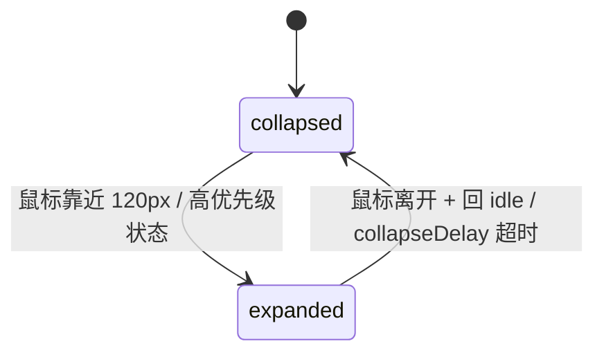
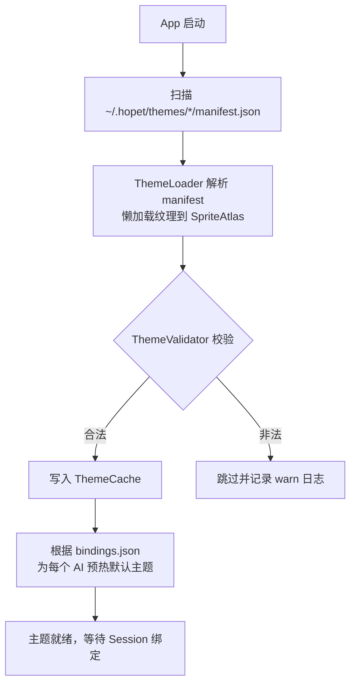

# Hopet 详细功能文档 v0.1

> 版本：0.1 (初版)
> 最后更新：2026-04-24
> 状态：Draft — 与 [architecture.md](./architecture.md) 同步交付

---

## 1. 用户画像与使用场景

### 1.1 核心用户

- **AI Pair Programmer**：长时间与 Claude Code / Codex 配合工作的开发者，常开多个终端多个会话。
- **Side-by-Side 工作者**：在 IDE 或浏览器工作时，AI 会话窗口被遮盖，希望不切换窗口就能知道 AI 状态。
- **Ritual 偏好者**：享受桌面陪伴物的开发者，把工具装饰化作为工作仪式感的一部分。

### 1.2 典型场景

| 场景 | 现状痛点 | Hopet 解决方式 |
| --- | --- | --- |
| AI 正在跑一个长任务，用户去看文档 | 不时切回终端检查进度 | 宠物一直"回复中"动画；完成时播放"完成"动画并可弹通知 |
| AI 问用户 AskUserQuestion | 用户没注意到终端已停等待 | 宠物切到"询问"专属动画 + 刘海条文字提醒 + （可选）通知 |
| 需要权限确认（Bash/Edit） | 长任务里夹杂多次权限弹窗，容易错过 | 宠物切到"权限请求"动画；刘海条高亮 |
| 多个会话并发（`cc-1` / `cc-2` / codex） | 哪个在跑、哪个卡住不清楚 | 每个会话独立宠物，位置互不重叠 |

---

## 2. 功能总览

### 2.1 功能矩阵

| 模块 | v0.1 | v0.2 | v0.3 |
| --- | --- | --- | --- |
| 状态感知动画（Claude Code，全部 8 态） | ✅ 含 ask-user（通过 AskUserQuestion tool 路由） | ✅ | ✅ |
| 状态感知动画（Codex） | ⚠️ 实验性"完成通知"（基于 `notify`） | ✅ 完整生命周期 | ✅ |
| 刘海屏 Dynamic Notch | ✅ | ✅ | ✅ |
| 顶部悬浮条降级（无刘海） | ✅ | ✅ | ✅ |
| 桌面宠物（**每个 AI 工具一只**） | ✅ Claude / Codex 各 1 | ✅ | ✅ |
| 会话气泡（环绕宠物，每气泡 = 1 个活跃 session） | ✅ 显示 cwd 末层 / 标题 / 距上次状态变更耗时 | ✅ + 拖拽重排 | ✅ |
| 状态聚合（多 session → 单宠物按优先级） | ✅ 详见 [hooks-and-priority.md](./hooks-and-priority.md) | ✅ | ✅ |
| 点击宠物本体 → 启动新会话 | ⛔ 见 [architecture.md §12.5](./architecture.md#125-关于在气泡里自由输入消息v01-不做的功能) | TBD | TBD |
| 气泡上 PermissionRequest 决策（Allow / Deny / 交给终端） | ✅ hook socket 同步回包，跨所有宿主 | ✅ | ✅ |
| AskUserQuestion 触发 → 该气泡自动展开为答题卡，原位回答 | ✅ hook 回包 `updatedInput.answers`，跨所有宿主 | ✅ | ✅ |
| **气泡里自由打字注入消息**（在 idle / 任意状态 session 上） | ⛔ macOS 无干净通用注入路径，详见 [architecture.md §12.5](./architecture.md#125-关于在气泡里自由输入消息v01-不做的功能) | 评估 PTY wrapper / IDE 扩展 | TBD |
| 宠物管理面板 | ✅ 骨架 7 Tab | ✅ 完整 | ✅ |
| 主题系统 — 内置 Hopi 主题 | ✅ | ✅ | ✅ |
| 主题系统 — `.hopettheme` 导入 | ⛔ | ✅ 含 zip slip 防护 | ✅ |
| 主题 ↔ AI 工具绑定 | ⚠️ 全局单一主题（不分 AI） | ✅ 按 AI 绑定 | ✅ |
| Hook 安装向导 + Doctor | ✅ | ✅ | ✅ |
| `hopet` CLI | ⛔ | ✅ | ✅ |
| 声音 / 通知 | ✅ 通知（无声音） | ✅ + 主题声音 | ✅ |
| 自动更新（Sparkle + EdDSA） | ⛔ | ✅ | ✅ |

> 标注约定：`✅` = 必须交付；`⚠️` = 实验性 / 受限；`⛔` = 本期明确不交付（已与 architecture.md §1.2 / §13 对齐）。

### 2.2 非功能需求

- **启动时间** ≤ 1.5s 到宠物可见
- **单宠物闲置 CPU** ≤ 1%（Apple Silicon M1）
- **单宠物闲置内存** ≤ 80 MB
- **动画帧率**：60 fps；低电量模式自动降到 30 fps
- **IPC 端到端延迟** ≤ 50ms（hook 脚本 exec 到动画切换）

---

## 3. 核心功能详述

### 3.1 状态感知与动画映射

八种状态的完整映射（以内置 "Hopi" 小海豹主题为例）。**优先级**列用于多 session 聚合到单宠物时决定显示哪个状态（数字小=优先级高，详见 [hooks-and-priority.md §2](./hooks-and-priority.md#2-petstate-优先级)）：

| 优先级 | PetState | 触发事件 | 宠物动画（Hopi） | 刘海条文案 | 通知 | v0.1 |
| --- | --- | --- | --- | --- | --- | --- |
| **P0** | `ask-user` | Claude `PreToolUse` hook 且 `tool_name == AskUserQuestion`；`PostToolUse` 同条件触发 `ask_user_resolved` 切回 responding | 歪头 + 双鳍捧问号牌 | 「❓ 在等你回答」黄色 | ✅ 横幅 | ✅ + 该 session 气泡自动展开为对话气泡 |
| **P1** | `permission-prompt` | Claude `PermissionRequest` hook（主路径）；或 `Notification` 且 `notification_type == permission_prompt`（兼容回退） | 警觉抬身瞪眼 + 红色感叹号闪烁 | 「⚠️ 需要权限确认」红色 | ✅ 横幅 | ✅ |
| **P2** | `error-interrupted` | Claude `PostToolUseFailure` / `StopFailure` hook；Codex `notify` 带 `status=error` | 瘫软成一块麻薯 + 小闪电 | 「已中断」灰色 | 可配置 | ✅ |
| **P3** | `tool-use` | Claude `PreToolUse` hook（`tool_name != AskUserQuestion`） | 戴圆眼镜翻书/工具 icon 漂浮在鳍旁 | 「执行 Bash / Edit …」（≥ 30s 追加 elapsed timer） | — | ✅ |
| **P4** | `thinking` | responding 持续 ≥ 8s（Core 定时器主动判定） | 前鳍托腮，头顶省略号气泡闪烁 | 「深度思考中…」 | — | ✅ |
| **P5** | `responding` | Claude `UserPromptSubmit` hook | 两只前鳍交替拍小键盘 | 「正在回复…」+ 滚动光点 | — | ✅ |
| **P6** | `completed` | Claude `Stop` hook；Codex `notify` | 开心拍鳍 + 小跳（非循环，1s） | 「完成 ✓」 | 可配置 | ✅ |
| **P7** | `idle` | 无活跃 session / completed 后 2s | 趴坐眨眼，身体随呼吸起伏，偶尔轻拍短尾鳍 | 「Claude — Idle」 | — | ✅ |

**聚合规则**：宠物展示的是所有活跃 session（跨所有 AI 工具）中**优先级最高**的那个状态（权威定义见 [hooks-and-priority.md §2](./hooks-and-priority.md#2-petstate-优先级)）。Hopet 全局只有一只宠物，不再随 session 数量或工具数量增加。**leader session 的气泡边框会高亮**，让用户一眼看出当下宠物状态来自哪个 session。

动画切换采用 `AnimationController` 的 `cross-dissolve` 0.2s 过渡；`completed` → `idle` 为 `fade` 过渡。

**优先级**：同一时刻若有多个候选状态，按 `permission-prompt > ask-user > error-interrupted > tool-use > thinking > responding > completed > idle` 的优先级选择，刘海条始终只显示最高优先级的那一条。

### 3.2 刘海屏 Dynamic Notch

#### 3.2.1 三态设计



各态的视觉呈现：

| 态 | 尺寸 | 内容 | 触发 |
| --- | --- | --- | --- |
| **collapsed** | 与刘海像素对齐的黑色胶囊 | 一个小色点代表最高优先级状态色（绿/橙/红） | 默认态 |
| **expanded** | 最大 560×44 | AI 名称 + 当前状态文案 + 计时器 | 鼠标靠近 120px 内 或 出现 permission-prompt / ask-user |

#### 3.2.2 吸附与动效

- 定位：使用 `NSScreen.auxiliaryTopLeftArea`（macOS 14+）获得刘海精确 rect，`NotchWindow` 严格对齐其下边缘。
- 伸展动效：高度 0 → 44，宽度 按内容撑开到最大 560；`spring(response: 0.35, damping: 0.85)`。
- Level：`.statusBar + 1`，跨所有 Space、不进入 Mission Control。
- 多屏：仅在"主屏幕"渲染刘海条；外接显示器上宠物本体正常显示，仅无刘海条。

#### 3.2.3 降级策略（无刘海机型）

- 无 `safeAreaInsets.top > 0` 的 Mac → 启用 `FallbackTopBarWindow`：
  - 屏幕顶部中央悬浮一条 280×28 的胶囊
  - 与刘海条具备相同的三态能力
  - 默认关闭，可在偏好中开启（避免遮挡菜单栏）
- 用户亦可在偏好里强制切换为"仅宠物，不要顶部条"。

---

### 3.3 桌面宠物本体

Hopet **全局只有一只**宠物，所有 AI 工具（Claude / Codex / 未来其它）的所有活跃 session 共用之。宠物状态 = 所有活跃 session 中最高优先级的那个 session 状态（聚合规则见 [hooks-and-priority.md §2-3](./hooks-and-priority.md#2-petstate-优先级)）。

#### 3.3.1 窗口行为

- `NSPanel` + `.nonactivatingPanel` + `.fullSizeContentView`：点击宠物不抢走当前 App 焦点
- `collectionBehavior = [.canJoinAllSpaces, .stationary, .ignoresCycle]`：跨所有 Space、不出现在 `⌘Tab`
- `level = .floating + 1`：浮于普通窗口之上，但低于系统弹窗
- 背景完全透明；宠物本体与气泡分别响应点击（HitTestProxy 按 alpha > 0.1 判定）

#### 3.3.2 位置与拖拽

- 启动时从 `config.json` 读取 `lastPosition`；首次启动宠物默认在主屏右下
- 长按 0.2s 进入拖拽态；松开吸附到最近的屏幕边缘（可关闭吸附）
- 拖动宠物时**会话气泡跟随移动**（保持环绕几何）
- 拖出屏幕时自动 clamp 回可见区

#### 3.3.3 无活跃 session 时

宠物保持显示为 idle（作为"看一眼当前状态"的窗口），可在偏好里设为"无 session 时隐藏"。

#### 3.3.4 交互反馈

| 操作 | 反馈 |
| --- | --- |
| 鼠标悬停（≥400ms） | 宠物头顶显示小 tooltip：当前 leader session 标题 + 当前聚合状态 |
| 左键单击宠物本体 | v0.1 无操作（曾用于"新开 session"，已移除） |
| 右键点击宠物 | 弹出 context menu：显示/隐藏宠物、切换主题、关闭所有 session、打开管理面板 |
| 长按（≥0.2s） | 进入拖拽 |
| 鼠标悬停某个气泡 | 气泡放大 1.1×、显示完整 cwd 路径 tooltip |
| **左键单击气泡** | 气泡展开为只读状态卡（标题/cwd/状态/耗时）；Permission/AskUserQuestion 挂起时自动展开为可交互卡片（见 §3.4.1 / §3.4.2） |
| 右键点击气泡 | 关闭该 session / 打开 cwd / 打开终端窗口 / 复制 sessionId |

---

### 3.4 输入入口

v0.1 只有两个用户输入入口，都建立在 **Claude 主动开口**（hook 同步等待）的前提上。**不**提供"在 idle 气泡上打字给 Claude"，也**不**提供"点击宠物本体启动新会话"——后者本质是同一类问题（详见 [architecture.md §12.5](./architecture.md#125-关于在气泡里自由输入消息v01-不做的功能)）。

| 触发 | 含义 | 走的路径 |
| --- | --- | --- |
| **PermissionRequest 自动展开**（Claude 主动） | 回答工具调用是否允许 | §3.4.1 |
| **AskUserQuestion 自动展开**（Claude 主动） | 回答 Claude 的提问 | §3.4.2 |

启动新会话的方式：用户照常在自己的终端 / Cursor / VS Code / IDE 内嵌终端里打 `claude` / `codex`，Hopet 通过 hook 自动感知，新气泡随 SessionStart 事件出现。

#### 3.4.1 PermissionRequest 自动展开

当 Claude 触发 `PermissionRequest` hook（如要执行 Bash/Edit 等需要权限的工具）：

1. hopet-emit 通过 socket 把请求转给 Hopet，**Claude 进程被挂起等响应**（30s 超时）
2. 该 session 的气泡**自动从环绕态展开**为 360×160 的决策卡，显示工具名 + 命令/路径预览
3. 用户点 **允许** / **拒绝** / **交给终端**
4. 决策通过同一条挂起的 socket 回写：`{ "hookSpecificOutput": { "hookEventName": "PermissionRequest", "decision": { "behavior": "allow"|"deny" } } }`
5. Claude 拿到决策继续工具调用循环；如选"交给终端"则回 `{}`，Claude 自走它的 TUI 弹窗

跨 iTerm / Apple Terminal / VS Code / Cursor 内嵌终端 / Ghostty / Warp 等所有宿主工作——这条路是协议级的，跟终端注入路径无关。

#### 3.4.2 AskUserQuestion 自动展开

`AskUserQuestion` 是 Claude Code 的内置工具，每次调用走标准 `PermissionRequest` hook（Hopet 通过 `tool_name=="AskUserQuestion"` 在该 hook 上分流）。

1. hopet-emit 把 `tool_input.questions` 透传给 Hopet
2. 气泡**自动展开**为 360×220 的答题卡：标题/序号 + 提问 + 选项按钮（来自 `tool_input.options`） + 自定义文本框
3. 多问题时分页填写，每题必填一项再下一页
4. 最后一页提交时一次性回包：

   ```json
   {
     "hookSpecificOutput": {
       "hookEventName": "PermissionRequest",
       "decision": {
         "behavior": "allow",
         "updatedInput": {
           "questions": [...原 questions],
           "answers": { "问题文案 A": "回答 A", "问题文案 B": "回答 B" }
         }
       }
     }
   }
   ```

5. Claude 用 `updatedInput` 重跑 AskUserQuestion 工具，工具识别 `answers` 字段直接把它当结果返回

宠物动画同步切到 `ask-user` 态。**这条路同样跨所有宿主工作**——不依赖 PTY 注入或终端自动化。

#### 3.4.3 关于"自由打字给 Claude"和"点击宠物启动新会话"

两个看起来理应有的功能，v0.1 都不做：

- **气泡里自由打字给 Claude**：macOS 没有可靠的反向 stdin 注入路径（详见 [architecture.md §12.5](./architecture.md#125-关于在气泡里自由输入消息v01-不做的功能)）
- **点击宠物本体启动新会话**：本质是同一类问题——即使弹一个目录选择器 + 输入框，命令也只能复制到剪贴板让用户自己粘贴，Hopet 没有持有这个新 session 的 stdin。这种"看似引导实则脱节"的体验已从 v0.1 移除

两类都不打算用 PTY wrapper / IDE 扩展暴力实现——前者要求改启动方式，后者要求装额外组件，都偏离了 Hopet "感知层 + 协议层"的定位。

要给 Claude 发新消息：照常在自己的终端 / Cursor / VS Code / IDE 内嵌终端里打字。Hopet 只负责通过 hook 把状态变化映射成桌面动画，不替代输入 UI。

---

### 3.5 会话气泡（Session Bubbles）

宠物周围环绕若干圆形气泡，每个气泡 = 一个活跃 session（跨 AI 工具）。气泡是宠物身份信息的最小载体，提供 cwd / 标题 / 距上次状态变更耗时等关键元信息；来源工具通过气泡上的 chip 区分。

#### 3.5.1 默认显示内容

气泡处于折叠态时（默认）显示三行信息：

```
┌────────────────────┐
│   📁 Hopet         │   ← cwd 仅显示最后一层目录
│   ▶ 写架构文档…    │   ← 会话标题（`Session.title` 由首条 prompt 截 32 字符派生，气泡再截 18 字符显示）
│   ⏱ 12s           │   ← 距上次状态变更的耗时（实时刷新）
└────────────────────┘
```

气泡边框颜色 = 该 session 当前状态色（与 §3.1 表中"动画"列的颜色映射一致）。

#### 3.5.2 视觉规格

| 元素 | 规格 |
| --- | --- |
| 气泡尺寸 | 64×64 px（内圆半径 32 px） |
| 气泡-宠物间距 | 16 px |
| 第 N 环轨道半径 | `R_pet + gap + (2N+1) × R_bubble + N × gap` |
| 单环最多气泡 | 6（超出进入第二环，每外环旋转 30° 错位） |
| 气泡内文字 | SF Pro Rounded 9pt（cwd / title / elapsed 各一行，省略号截断） |
| 边框宽度 | 普通 1.5 px / leader 2.5 px |
| 阴影 | 4 px blur, 30% opacity，模拟悬浮感 |

详细布局算法见 [architecture.md §12.4](./architecture.md#124-会话气泡布局算法)。

#### 3.5.3 Leader 高亮

宠物的聚合状态由"最高优先级 session"驱动（详见 [hooks-and-priority.md §3](./hooks-and-priority.md#3-聚合算法)）。该 session 对应的气泡：

- 边框加粗（1.5 px → 2.5 px）
- 边框色 = 当前宠物状态色（与宠物动画状态同步）
- 一条细弧线连接气泡到宠物头顶（视觉指向，0.5 px 50% 透明）

用户因此能一眼看出"哪个 session 是当下宠物状态的来源"。

#### 3.5.4 Hover 与展开行为

| 操作 | 反馈 |
| --- | --- |
| 鼠标悬停 ≥ 200ms | 气泡放大 1.1×；显示完整 cwd 路径 tooltip 在气泡下方 |
| 左键单击 | 气泡展开为 280×80 只读状态卡（标题 / cwd / 状态徽章 / 耗时） |
| PermissionRequest 挂起 | 气泡**自动**展开为 360×160 决策卡（详见 [§3.4.1](#341-permissionrequest-自动展开)） |
| AskUserQuestion 触发 | 气泡**自动**展开为 360×220 答题卡（详见 [§3.4.2](#342-askuserquestion-自动展开)） |
| 右键单击 | context menu：关闭 session / 打开 cwd / 打开终端 / 复制 sessionId |

#### 3.5.5 屏幕边缘适应

宠物靠近屏幕边缘时，环绕气泡可能跑到屏幕外。Hopet 自动：

- 优先把屏幕外角度区间收缩到屏幕内（不均匀分布，但保持环形）
- 极限情况（宠物贴角）退化为半圆环或扇形布局
- 用户拖动宠物到新位置时，气泡布局过渡 0.3s 平滑重排

#### 3.5.6 气泡数量上限

- v0.1 单只宠物 ≤ 12 个气泡（两环×6）；超出时第三环开始用更小尺寸（48×48），最多三环 18 个
- 超过 18 时压缩为"+N more" 气泡，点击展开管理面板的 Sessions 列表
- 实践中很少同时跑 18 个 Claude session，此限制是兜底

---

### 3.6 宠物管理面板

标准 macOS 偏好窗口（`NSWindow` + `NSToolbar`），含以下 Tab：

#### 3.6.1 Overview

- 全局宠物卡片：缩略图、聚合状态徽章、活跃 session 数、可见性开关、定位按钮（让宠物闪烁 2s）
- 下方 Sessions 列表：每个 session 一行（cwd / title / state / elapsed），可关闭某个 session
- 空状态提示 + "如何开始" 链接（跳到 Hook 安装 Tab）

#### 3.6.2 Themes

- 已安装主题网格：240×240 预览图 + 名称 + 作者 + 版本
- 选中主题右侧显示详情 + 动画预览（悬停时自动切换 8 种状态动画）
- 底部按钮：「导入 `.hopettheme`…」「打开主题目录」「卸载」
- v0.1 只显示默认 "Hopi" 主题

#### 3.6.3 Bindings（AI ↔ 主题）

- 表格：每行一个 AI 工具，右列下拉选择主题
- v0.1 全局单一主题（所有 AI 共用），表格灰显
- v0.2 起开放每个 AI 单独绑定

#### 3.6.4 Hooks

- Claude Code / Codex 的安装状态卡片（Healthy / Not Installed / Broken）
- 一键「安装」「重新安装」「卸载」按钮
- 展示诊断日志（`HookDoctor` 输出）
- 已写入的 settings 片段可折叠预览

#### 3.6.5 Behavior

- **开机自启**：登录项（开/关）
- **刘海条**：刘海条开关 / 降级顶条开关 / 无操作多久后 collapse
- **无 session 时隐藏宠物**：开/关
- **动画帧率**：60 / 30 / 省电随系统
- **Prompt 摘要记录**：开关

#### 3.6.6 Notifications

- 分类开关：permission-prompt / ask-user / completed / error-interrupted
- 声音：无 / 系统默认 / 主题自带（v0.2）
- 免打扰：自动与 macOS Focus 模式对齐

#### 3.6.7 About

- 版本号、构建号、更新通道（v0.2+）、反馈入口、许可证、致谢

---

### 3.7 主题系统

#### 3.7.1 主题加载流程



#### 3.7.2 导入 `.hopettheme`

入口：
- 拖入 App Dock 图标
- Themes Tab 的「导入」按钮
- `open` 命令对接 `.hopettheme` UTI（`com.hopet.theme`）

流程：
1. 解压到 `~/.hopet/themes/_staging/<uuid>/`
2. 校验（见架构文档 9.3）
3. 显示主题卡片预览 + 「安装」/「取消」
4. 安装即 move 到 `~/.hopet/themes/<theme.id>/`，失败清理 staging

#### 3.7.3 自定义主题简要指南（完整版见 v0.2 发布的《主题作者指南》）

1. 复制内置 `hopi.default` 作为模板
2. 替换 `sprites/<state>/` 目录下的帧图片（保持 PNG 透明背景、尺寸一致）
3. 编辑 `manifest.json`：改 id / name / fps / loop
4. 目录打包为 zip，改扩展名为 `.hopettheme`
5. 拖入 Hopet 即可测试

**帧规范**：
- PNG-24 with alpha，建议 256×256 @ 1x / 512×512 @ 2x
- 每个 state 建议 8–24 帧；loop 动画尾首帧衔接自然
- 锚点位于人物脚底（0.5, 0.0）

---

## 4. 内置主题清单（v0.1）

### 4.1 Hopi — 圆滚滚的小海豹

- `id`：`hopi.default`
- 风格：像素 + 轻微抗锯齿，Cute 向；主体是一只身体呈水滴形、胖乎乎、短尾鳍的小海豹
- 动画总量：8 种状态 × 平均 12 帧 ≈ 96 PNG
- 单只宠物纹理总体积 ≤ 3 MB（打包后）
- 色调：主色 `#B8C7D4`（海豹灰蓝），腹白 `#F5F7FA`，描边 `#2A3A4A`，强调色 `#F4A258`（用于眼睛高光与完成动画）
- 动画设计要点：
  - `idle`：趴坐姿，身体随呼吸轻微起伏，每 3s 眨一次大眼睛，偶尔轻拍一下短尾鳍
  - `responding`：两只前鳍交替拍打虚拟键盘，1s 一个循环，脑袋轻微左右摆
  - `thinking`：用一只前鳍抵着下巴做托腮状，头顶问号/省略号气泡忽明忽暗
  - `tool-use`：戴上小圆眼镜，鳍边漂浮扳手/书本等工具图标
  - `permission-prompt`：警觉抬身、瞪大眼睛，头顶红色感叹号闪烁
  - `ask-user`：歪头，两只前鳍合捧起一枚黄色问号牌
  - `completed`：开心拍鳍 + 原地小跳一下，头顶撒出小星星（非循环 1s）
  - `error-interrupted`：整只软塌塌摊成一块麻薯，上方飘着小黑电雷

### 4.2 设计文件组织

- 源文件：Figma（交付时随主题包附 `.fig` 链接 README）
- 导出：每帧 PNG + `manifest.json` 由 `scripts/build-theme.sh` 自动生成

---

## 5. Hook 安装与卸载流程

### 5.1 首次安装（Claude Code）

面板"Hooks → Claude Code → 安装"时：

1. 检测 `~/.claude/settings.json` 是否存在，不存在则创建空 `{}`
2. 备份为 `~/.claude/settings.json.hopet.bak`（带时间戳）
3. Merge 架构文档 8.4 所列的 hook 条目；遇到已有同名 hook 则 **append**（保留用户既有 hook）
4. 将 `hopet-emit` 从 bundle 资源拷贝到 `~/.hopet/bin/hopet-emit` 并 `chmod +x`
5. 调用 `HookDoctor`：
   - settings.json 语法正确
   - `~/.hopet/bin/hopet-emit` 存在且可执行
   - socket 路径能被触达（App 正在运行）
6. UI 显示 Healthy 勾

### 5.2 卸载

- 反向移除 Hopet 添加的条目，保留用户其它 hook
- 可选择恢复到最近一次 `.hopet.bak`
- 保留 `~/.hopet/bin/hopet-emit` 以便随时重装；彻底卸载选项删除整个 `~/.hopet/bin/`

### 5.3 升级

- App 升级时如 `hopet-emit` 版本低于 bundle 版本，自动替换二进制（不改 settings.json）

### 5.4 故障排查（HookDoctor 输出示例）

```
✓ ~/.claude/settings.json 存在且合法
✓ 已发现 7 个 Hopet 注入的 hook 条目
✗ ~/.hopet/run/hopetd.sock 不存在
  → 请确认 Hopet.app 正在运行
✓ ~/.hopet/bin/hopet-emit 可执行 (mode 0755, 1.4 MB)
```

---

## 6. 偏好设置项一览

完整键值表（对应 `~/.hopet/config.json`）：

| 键 | 类型 | 默认 | 说明 |
| --- | --- | --- | --- |
| `general.launchAtLogin` | Bool | false | 登录项 |
| `general.showInDock` | Bool | false | 是否显示 Dock 图标（默认仅菜单栏） |
| `notch.enabled` | Bool | true | 刘海条总开关 |
| `notch.fallbackBarEnabled` | Bool | false | 无刘海机型降级顶条 |
| `notch.collapseDelayMs` | Int | 4000 | 无操作多久后 collapse |
| `pet.maxConcurrent` | Int | 2 | 同时显示宠物上限（v0.1 = Claude + Codex 各 1）；架构上不设硬上限，未来 `AITool.custom` 接入会扩展 |
| `pet.animationFps` | Enum | auto | `60` / `30` / `auto`（跟随省电） |
| `pet.snapToEdge` | Bool | true | 拖拽松手吸附屏幕边缘 |
| `pet.clickToOpenBubbleOnIdle` | Bool | true | idle 单击打开气泡 |
| `bubble.defaultTool` | Enum | claude-code | 菜单栏气泡的默认目标 |
| `bubble.preferredTerminal` | Enum | Terminal.app | 新开终端类型 |
| `bubble.defaultCwd` | String | (empty) | 空=跟随前台 Finder；否则用该路径 |
| `bubble.recordPromptSummary` | Bool | true | 是否保留 256 字符摘要 |
| `notifications.permissionPrompt` | Bool | true | 权限请求横幅 |
| `notifications.askUser` | Bool | true | 问询横幅 |
| `notifications.completed` | Bool | false | 完成通知 |
| `notifications.error` | Bool | true | 错误通知 |
| `notifications.soundEnabled` | Bool | false | 声音（v0.2） |
| `theme.defaultThemeId` | String | `hopi.default` | 默认主题 id |
| `advanced.logLevel` | Enum | info | `error` / `warn` / `info` / `debug` |
| `advanced.keepLogsDays` | Int | 3 | 日志保留天数 |

---

## 7. 快捷键

| 快捷键 | 作用 | 范围 |
| --- | --- | --- |
| `⌘⇧H` | 显示/隐藏所有宠物 | 全局 |
| `⌘,` | 打开偏好面板 | App active 时 |
| `⌘W` | 关闭当前窗口 | App active 时 |
| `Esc` | 关闭气泡展开 / 取消拖拽 | 气泡 active |
| `↩` | 提交 Permission 决策 / AskUserQuestion 答题 | 对应卡片 active |

### 7.1 录制与冲突处理

- **录制 UI**：Behavior Tab 提供快捷键录制器（基于 `KeyboardShortcuts` 库或自实现），用户可自定义两个全局快捷键
- **保留快捷键禁止**：禁止录制系统级保留键（`⌘Q` / `⌘Tab` / `⌘Space` 等），录制时实时反馈"已被系统占用"
- **注册失败处理**：调用 `RegisterEventHotKey` 失败（通常因被其它 App 抢占）时：
  1. 菜单栏图标显示 warning 小角标
  2. Behavior Tab 该快捷键行高亮黄色 + 提示文案 "已被其它 App 占用，建议改键"
  3. 提供「重新录制」「禁用此快捷键」两个按钮
  4. 不重试注册（避免循环），直到用户手动操作
- **冲突可观测**：偏好底部"诊断"按钮的输出包含两个全局快捷键的当前注册状态
- **关闭**：每个全局快捷键都可独立关闭，关闭后菜单栏入口与 App 内的"打开偏好"按钮仍然可达

### 7.2 终极兜底

无论全局快捷键状态如何，菜单栏图标始终是 100% 可达入口：左键单击展开菜单（"快速询问…" / "显示宠物" / "偏好…" / "退出"）。

---

## 8. 权限与首次引导

### 8.1 Onboarding 页面（首次启动）

流程为 5 步向导：

1. **欢迎** — 短动画演示一次完整状态流
2. **选择默认 AI 工具** — Claude Code / Codex（可多选）
3. **安装 Hooks** — 一键安装，失败给出手动指引
4. **授予权限**（按需请求）：
   - 通知（必选推荐）
5. **完成** — 显示第一只宠物，触发一次 `completed` 动画作为 welcome

### 8.2 权限缺失时的降级

- 无通知权限：仅宠物动画 + 刘海条，无系统横幅
- Permission / AskUserQuestion 答题不依赖任何 macOS 权限（hook 通道是协议级）
- 任一关键权限缺失时，菜单栏图标显示小红点，点击后显示修复入口

---

## 9. 错误与降级处理

### 9.1 运行时错误

| 错误场景 | 行为 |
| --- | --- |
| Socket 创建失败（地址被占） | 自动 unlink 残留 socket 重试 3 次；仍失败则菜单栏红点 + 日志 |
| Hook 事件 JSON 解析失败 | 记录 warn 日志，丢弃该事件，不影响其它事件 |
| 主题加载失败 | 回退到内置 `hopi.default`；弹窗提示用户 |
| 帧图缺失 | 该状态动画用静态首帧兜底 |
| 多显示器变化（外接拔插） | 0.5s debounce 后重新计算刘海 rect 与宠物位置 |
| 深色/浅色模式切换 | 刘海条与面板自动跟随；宠物主题可自行声明 `variantDark` |
| 系统省电模式 | 动画降到 30fps；刘海条动效弱化 |
| Accessibility 权限被撤销 | 下次使用 A 模式时降级并提示 |
| App 升级后所有权限被系统遗忘 | 未签名分发的固有限制（TCC 按签名绑定）；首次启动检测到权限全失时，显示一次性的再次引导页，一键跳转至对应系统设置 |

### 9.2 用户可见错误

- 偏好面板 Behavior Tab 底部有"诊断"按钮，一键执行 HookDoctor、socket 自检、权限自检、主题校验，结果可复制到剪贴板便于 issue 提交
- `~/.hopet/logs/hopet.log` 始终保留最近 3 天日志，可在 Advanced 中打开日志目录

### 9.3 崩溃恢复

- App 崩溃后重启：从 `state/sessions.json` 恢复最近 10 分钟内的会话，显示为 `idle` 灰度；后续事件触发时自动"醒来"
- 超过 10 分钟则视为过期不恢复

---

## 10. 后续版本功能规划

v0.2 / v0.3 完整范围由 [architecture.md §13](./architecture.md#13-里程碑路线) 维护，本节不重复列举。从用户视角的关键期待：

- **v0.2**：外部启动的 session 也能原位输入（Accessibility 路径）；首批第三方主题导入；Codex 细粒度状态；自动更新与声音反馈
- **v0.3**：主题作者工具链与文档；可自定义"状态 → 动画"映射；多显示器；iCloud 同步偏好

### 长期愿景（v1.0+）

- 主题商店（需要后端）
- 跨机器"宠物形象"跟随（扫码配对）
- 与 IDE 插件联动（Cursor / VS Code），展示 AI 侧边栏状态
- 社区协作：多只宠物之间的互动（例如一只完成时把任务交给另一只）

---

## 文档关联

- 技术实现细节请见 [architecture.md](./architecture.md)
- 协议/schema/脚本样例在 architecture.md 第 8、9 章附录
